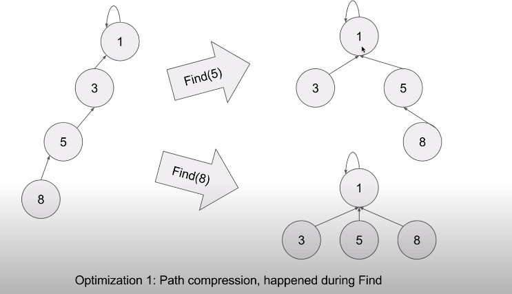
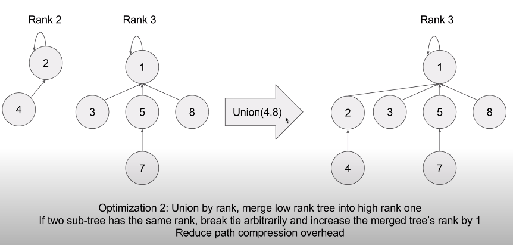

## 1. 基本框架

```
Pseudo code:

class UnionFindSet:
  func UnionFindSet():
    parents = [1...n]
    ranks = [0...0](n zeros)
  
  func find(x):
    if x != parents[x]:
      parents[x] = find(parents[x])
    return parents[x]
    
  func Union(x, y):
    px, py = find(x), find(y)
    if ranks[px] > ranks[py]: parents[py] = px
    if ranks[py] > ranks[px]: parents[px] = py
    if ranks[py] == ranks[px]:
      parents[py] = px
      ranks[px] ++
```

## 2. 基本原理

  
<br />
  

## 3. 例题

[399](https://leetcode.com/problems/evaluate-division/)
