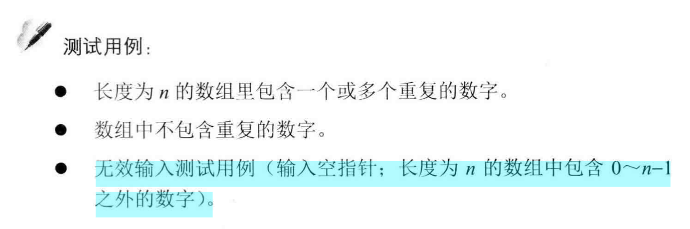
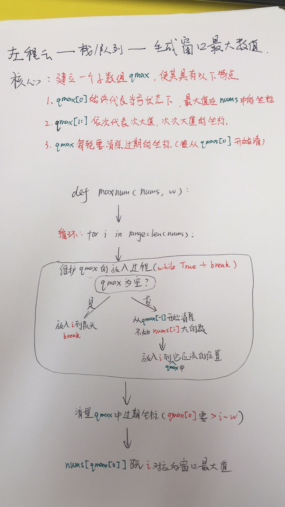
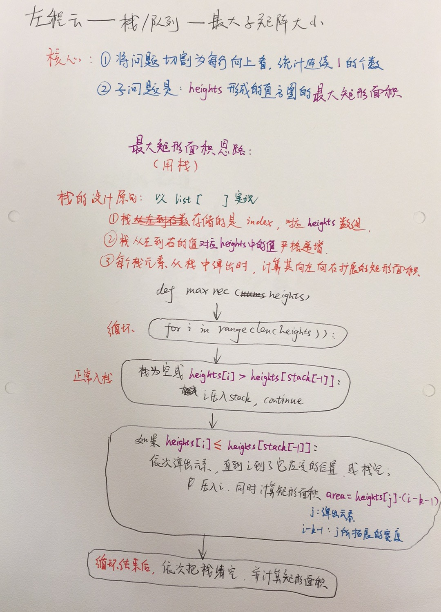
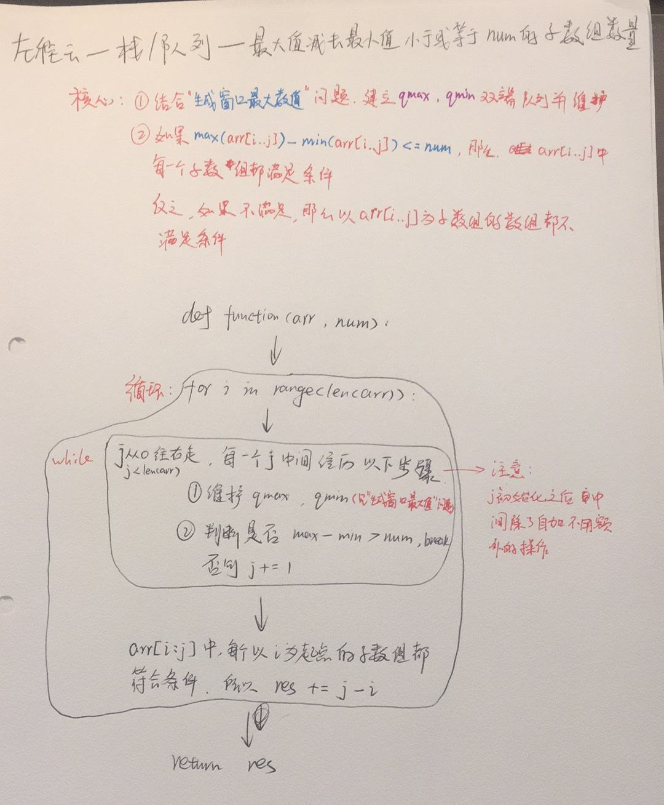
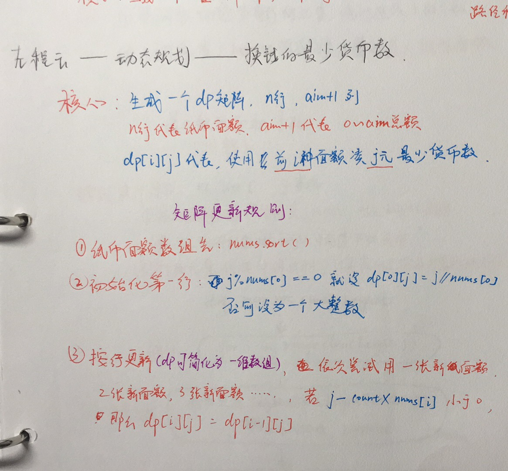

# 剑指OFFER，左程云
[TOC]
# 剑指Offer
## 字符串--替换空格(插入顺序)
此处需注意，替换字符串时不能用str.replace()函数，因为该函数会将所有相同的字符都替换掉，而我们只需要替换特定位置的字符。
下面方法将字符串在要替换的位置切片，三段拼接（前半段字符串，要替换的字符，后半段字符串）
注：或者也可先将字符串转换为list, 进行特定位置赋值操作后，再转换为字符串。如我们想将下标为index_new处字符替换为"0"
```python=
list_s = list(s)
list_s[index_new]="0"
s = "".join(list_s)
```
```python=
# -*- coding:utf-8 -*-
class Solution:
    # s 源字符串
    def replaceSpace(self,s):
        original_len = len(s)
        num_blank = 0
        for i in range(len(s)):
            if s[i] == " ":
                num_blank += 1
        new_length = original_len + num_blank * 2
        index_original = original_len - 1
        index_new = new_length - 1
        s = s + num_blank * 2 * " "
        while index_original >= 0 and index_new > index_original:
            if s[index_original] == " ":
                s = s[0:index_new] + "0" + s[index_new+1:]
                index_new -= 1
                s = s[0:index_new] + "2" + s[index_new+1:]
                index_new -= 1
                s = s[0:index_new] + "%" + s[index_new+1:]
                index_new -= 1
            else:
                s = s[0:index_new] + s[index_original] + s[index_new+1:]
                index_new -= 1
            index_original -= 1
        return s
```
## 字符串--正则表达式匹配

 
```python=
class Solution:
    # s, pattern都是字符串
    def match(self, s, p):
        # 判断匹配规则是否为空
        if p == "":
            # p为空的时候，判断s是否为空，则知道返回True 或 False
            return s == ""
        # 判断匹配规则是否只有一个
        if len(p) == 1:
            # 判断匹配字符串长度是否为1，和两者的第一个元素是否相同，或匹配规则使用.
            return len(s) == 1 and (s[0] == p[0] or p[0] == '.')
        # 匹配规则的第二个字符串不为*，当匹配字符串不为空的时候
        # 返回 两者的第一个元素是否相同，或匹配规则使用. and 递归新的字符串(去掉第一个字符的匹配字符串 和 去掉第一个字符的匹配规则)
        if p[1] != "*":
            if s == "":
                return False
            return (s[0] == p[0] or p[0] == '.') and self.match(s[1:], p[1:])
        # 当匹配字符串不为空 and (两者的第一个元素是否相同 or 匹配规则使用.)
        while s and (s[0] == p[0] or p[0] == '.'):
            # 到了while循环，说明p[1]为*，所以递归调用匹配s和p[2:](*号之后的匹配规则)
            # 用于跳出函数，当s循环到和*不匹配的时候，则开始去匹配p[2:]之后的规则
            if self.match(s, p[2:]):
                return True
            # 当匹配字符串和匹配规则*都能匹配的时候，去掉第一个字符成为新的匹配字符串，循环
            s = s[1:]
        # 假如第一个字符和匹配规则不匹配，则去判断之后的是否匹配
        return self.match(s, p[2:])
```
## 栈和队列--用两个栈实现队列
书上的思路
```python=
class Solution:
    def __init__(self):
        self.stack1 = []
        self.stack2 = []
    def push(self, node):
        # write code here
        self.stack1.append(node)
    def pop(self):
        # return xx
        if len(self.stack2) == 0:
            while len(self.stack1) != 0:
                self.stack2.append(self.stack1.pop())
        return self.stack2.pop()
```
## 查找和排序--旋转数组的最小数字
不知道为啥，递归通不过，所以只能用while了
```python=
class Solution:
    def minNumberInRotateArray(self, nums):
        # write code here
        if len(nums) == 0:
            return 0
        if len(nums) == 1:
            return nums[0]
        l = 0
        r = len(nums) - 1
        mid = 0
        while nums[l] >= nums[r]:# 这个判断条件是为了判断是不是没旋转过
            if r - l == 1:
                return min(nums[l], nums[r])
            mid = (l + r)//2
            if nums[mid] == nums[l] and nums[l] == nums[r]:# 针对[1, 0, 1, 1, 1]和[1, 1, 1, 0, 1]这两种混淆情况
                return min(nums)
            if nums[mid] >= nums[l]:
                l = mid
                continue
            elif nums[mid] <= nums[l]:
                r = mid
                continue
```

## 链表--从尾到头打印链表（注意是否要求修改链表）（栈）（一行反转）（list反转）
先进后出的顺序，可以用栈，递归就是栈，但是这种写法时间复杂度存疑，因为list的加操作不知道耗费多少步骤
```python=
class Solution:
    # 返回从尾部到头部的列表值序列，例如[1,2,3]
    def printListFromTailToHead(self, listNode):
        # write code here
        if listNode == None: 
            return []
        return self.printListFromTailToHead(listNode.next) + [listNode.val]
```
insert()方法
```python=
class Solution:
    # 返回从尾部到头部的列表值序列，例如[1,2,3]
    def printListFromTailToHead(self, listNode):
        # write code here
        l = []
        head = listNode
        while head:
            l.insert(0, head.val)
            head = head.next
        return l
````

如果允许修改，先反转再打印，反转操作只需一行
```python=
class Solution:
    # 返回从尾部到头部的列表值序列，例如[1,2,3]
    def printListFromTailToHead(self, listNode):
        # write code here
        l = []
        rev = None
        while listNode:
            rev, rev.next, listNode = listNode, rev, listNode.next
            
        while rev:
            l.append(rev.val)
            rev = rev.next
        return l
```
或者可以在结果那里翻转
```python=
class Solution:
    # 返回从尾部到头部的列表值序列，例如[1,2,3]
    def printListFromTailToHead(self, listNode):
        # write code here

        l = []
        while listNode:
            l.append(listNode.val)
            listNode = listNode.next
        return l[::-1]
```
## 链表--删除链表中重复的节点
非递归方法，写的有点啰嗦
```python=
class Solution:
    def deleteDuplication(self, pHead):
        # write code here
        if pHead == None or pHead.next == None:
            return pHead
        dummy = ListNode('fake')
        dummy.next = pHead #把开始位置前移一位
        res = dummy2 = dummy # dummy用来检查有没有重复，dummy2用来跳过重复的元素
        while dummy.next.next:
            if dummy.val != dummy.next.val and dummy.next.val != dummy.next.next.val:
                dummy2.next = dummy.next
                dummy2 = dummy2.next
            dummy = dummy.next
        if dummy.val != dummy.next.val:
            dummy2.next = dummy.next
        else:
            dummy2.next = None
        return res.next
```
leetcode讨论区答案（82题）
```python=
def deleteDuplicates(self, head):
    dummy = pre = ListNode(0)
    dummy.next = head
    while head and head.next:
        if head.val == head.next.val:
            while head and head.next and head.val == head.next.val:
                head = head.next
            head = head.next
            pre.next = head
        else:
            pre = pre.next
            head = head.next
    return dummy.next
```
leetcode上的递归写法
```python=
class Solution:
    def deleteDuplication(self, pHead):
        # write code here
        if pHead == None or pHead.next == None:
            return pHead
        if pHead.val == pHead.next.val:
            while pHead.next and pHead.val == pHead.next.val:
                pHead = pHead.next
            return self.deleteDuplication(pHead.next)
        else:
            pHead.next = self.deleteDuplication(pHead.next)
            return pHead
```
## 递归和循环--斐波那契数列（递归爆炸）（O(logn)）
logn解法：本质是，矩阵的幂次方都可以用二分法来求
```python=
class Solution:
    def multi(self, a11, a12, a22, n):
        if n == 1:
            return a11, a12, a22
        else:
            if n%2 == 0:
                a11, a12, a22 = self.multi(a11, a12, a22, n/2)
                return a11*a11 + a12*a12, a11*a12 + a12*a22, a12*a12 + a22*a22
            else:
                a11, a12, a22 = self.multi(a11, a12, a22, (n-1)/2)
                # 再乘一次[[1,1],[1,0]]
                return a11*a11 + a12*a12 + a11*a12 + a12*a22, \
                       a11*a11 + a12*a12,  a11*a12 + a12*a22
    def Fibonacci(self, n):
        if n == 0:
            return 0
        if n == 1:
            return 1
        ans, _, _ = self.multi(1, 1, 0, n-1)
        return ans
```
再进一步，使用矩阵特征值分解计算矩阵连乘说不定可以得到O(1)的解法？
## 递归和循环--跳台阶（递归爆炸）
## 递归和循环--变态跳台阶
## 递归和循环--矩形覆盖（斐波那契）
## 代码的完整性--数值的整数次方
书上的方法，用位运算真的心累
```python=
class Solution:
    def Power(self, base, e):
        # write code here
        exponent = abs(e)
        if exponent == 0: return 1
        if exponent == 1: return base
        if base == 0: return 0
        r = base
        exponent -= 2
        while exponent:
            r *= r
            if exponent & 1 == 1:
                r *= base
            exponent = exponent >> 1
        if e < 0:
            return 1/r
        else:
            return r
```
常规方法
```python=
class Solution:
    def Power(self, base, exponent):
        result = 1
        for i in range(abs(exponent)):
            result *= base
        if exponent < 0:
            result = 1/result
        return result
```
## 代码的鲁棒性--反转链表
## 代码的鲁棒性--合并两个排序的链表
## 面试思路--二叉树的镜像
## 时间空间效率的平衡--第一个只出现一次的字符位置（256数组哈希）（普通哈希）
## 时间空间效率的平--两个链表的第一个公共结点
## 知识迁移能--二叉树的深度
## 发散思维能--求1+2+3+...+n
## 树--重建二叉树
递归写法，但是中间注释掉的异常输入检测代码（输入的前序和中序对应不上）不知道对不对
```python=
class Solution:
    # 返回构造的TreeNode根节点
    def reConstructBinaryTree(self, pre, tin):
        # write code here
        if len(pre) == 0: #递归退出条件
            return None
        ''' # 异常检测
        if len(pre) != len(tin):
            print('Input Wrong')
        if len(pre) == 1 and pre[0] != tin[0]:
            print('Input Wrong')
        '''
        root = TreeNode(pre[0])
        for i in range(len(tin)): #在后序中查找根节点位置
            if tin[i] == pre[0]:
                break
        ''' # 异常检测
        if i == len(tin) - 1 and pre[0] != tin[-1]:
            print('Input Wrong')
        '''
        root.left = self.reConstructBinaryTree(pre[1:i+1], tin[:i])
        root.right = self.reConstructBinaryTree(pre[i+1:], tin[i+1:])
        return root
```
## 树--二叉树的下一个节点
书上的思路，待简化
```python=
class Solution:
    def GetNext(self, pNode):
        # write code here
        if not pNode: return None
        if pNode.right != None: #先判断右结点存不存在
            search = pNode.right
            while search.left != None: #搜索最左子节点
                search = search.left
            return search
        else: #如果右结点不存在
            if pNode.next == None: #看看父节点存不存在
                return None
            else:
                if pNode.next.left is pNode: #如果自己本身是左节点
                    return pNode.next
                else: #如果自己是右结点
                    dummy = pNode
                    while (pNode.next != None) and (pNode.next.left is not pNode): #搜索，直到自己不是右节点
                        pNode = pNode.next
                if dummy is pNode or pNode.next == None:
                    return None
                else:
                    return pNode.next
```
逻辑分支简化后：
```python=
class Solution:
    def GetNext(self, pNode):
        # write code here
        if not pNode: return None
        if pNode.right != None: #先判断右结点存不存在
            search = pNode.right
            while search.left != None: #搜索最左子节点
                search = search.left
            return search
        else: #如果右结点不存在
            while (pNode.next != None) and (pNode.next.left is not pNode): #搜索，直到自己不是右节点
                pNode = pNode.next
            return pNode.next
```
## 树--对称的二叉树
## 数组--数组中重复的数字（排序O(nlogn)）（哈希O(n)）

(1)提个问题，为什么下面代码没检测边界条件（如有负值或空值），但还是能通过？
(2)第二个问题，sort()函数可以直接用吗？需要靠考虑sort()本身复杂度吗？
(3)第三个问题，在第三种数组法中，倒数第二行
```python=
numbers[i], numbers[numbers[i]] = numbers[numbers[i]], numbers[i]
```
把顺序调换一下为什么就提示超时了？

*(1)空值的情况其实包括在这代码里面了，当numbers为[]，依然可以运行。其他无效输入没检测出来可能是test case里面没包含这些
*(2)list.sort()在内置里面可以直接用的，它会直接改变数组的顺序。sorted(list)同样的效果，但是不改变数组顺序。复杂度应该是O(nlogn)，和快排一样
*(3)突然发现这是python这样赋值的一个注意点
，就是赋值变量之间存在依赖关系的话要注意
```python=
>>> num = [1,2,3,4,5,6]
>>> num
[1, 2, 3, 4, 5, 6]
>>> i = 3
>>> i
3
>>> num[i], num[num[i]] = num[num[i]], num[i]
>>> num
[1, 2, 3, 5, 5, 4]
```
通过上面这个例子发现，左侧的赋值顺序也是从左到右。在赋值给左边的时候，先赋num[i]的话，num[i]的值已然发生变化，所以num[num[i]==4]就变成了num[num[i]==5]。这里是个坑
:::info
异常case
```python=
for i in range(len(numbers)):
    if numbers[i] < 0 or numbers[i] > len(numbers) - 1:
        return False
```
:::
            
排序法
```python=
class Solution:
    # 这里要特别注意~找到任意重复的一个值并赋值到duplication[0]
    # 函数返回True/False
    def duplicate(self, numbers, duplication):
        numbers.sort()
        for i in range(1, len(numbers)):
            if numbers[i] == numbers[i-1]:
                duplication[0] = numbers[i]
                return True
        return False
```
哈希
```python=
class Solution:
    # 这里要特别注意~找到任意重复的一个值并赋值到duplication[0]
    # 函数返回True/False
    def duplicate(self, numbers, duplication):
        d = set()
        for num in numbers:
            if num in d:
                duplication[0] = num
                return True
            else:
                d.add(num)
        return False
```
数组，空间复杂度O(1)
```python=
class Solution:
    # 这里要特别注意~找到任意重复的一个值并赋值到duplication[0]
    # 函数返回True/False
    def duplicate(self, numbers, duplication):
        for i in range(len(numbers)):
            if numbers[i] == i:
                continue
            else:
                if numbers[numbers[i]] == numbers[i]:
                    duplication[0] = numbers[i]
                    return True
                else:
                    numbers[numbers[i]], numbers[i] = numbers[i], numbers[numbers[i]]
        return False
```

不修改数组方法--二分查找：时间O(logn)，空间O(n)，注意，和上一题题目描述不一样，所以牛客网的在线编程没法检验代码对不对
## 数组--二维数组中的查找（起始位置很重要）
```python=
class Solution:
    # array 二维列表
    def Find(self, target, array):
        # write code here
        if len(array) == 0: return False
        row = 0
        col = len(array[0]) - 1
        while row <= len(array) - 1 and col >= 0: #查找的终点在左下角
            if array[row][col] == target:
                return True
            elif array[row][col] > target:
                col -= 1
            else:
                row += 1
        return False
    
```
```python=
class Solution:
    # array 二维列表
    def Find(self, target, array):
        # write code here
        found = False
        num_rows = len(array)
        num_cols = len(array[0])
        if num_rows > 0 and num_cols > 0:
            row = 0
            col = num_cols -1 
            while row < num_rows and col >= 0:
                if array[row][col] == target:
                    found = True
                    break
                elif array[row][col] > target:
                    col -= 1
                else:
                    row += 1
        return found
```    
## 回溯法--矩阵中的路径
非递归法，很麻烦
```python=
class Solution:
    def hasPath(self, matrix, rows, cols, path):
        # write code here
        # 转换matrix为二维数组
        tmp = list(matrix)
        matrix = []
        for i in range(rows):
            matrix.append(tmp[ i *cols: ( i +1 ) *cols])
            
        start_list = [] # 存储初始点
        direction = [(-1, 0), (1, 0), (0, -1), (0, 1)]
        for i in range(rows): #查找所有初始点
            for j in range(cols):
                if matrix[i][j] == path[0]:
                    start_list.append((i ,j))

        if len(start_list) == 0: return False
        print(len(start_list))

        for row, col in start_list:
            boolmap = [[True ] *cols for _ in range(rows)]
            boolmap[row][col] = False
            stack = [(row, col, 0)] # 用来存储多种路径
            stack2 = [] #与stack配合，找到以前的支路
            while len(stack) != 0:
                row, col, index = stack[-1]
                pre_len = len(stack)
                if index == len(path) - 1:
                    return True
                index += 1
                for bias1, bias2 in direction:
                    if 0 <= row+bias1 <= rows-1 and 0 <= col+bias2 <= cols-1 and matrix[row+bias1][col+bias2] == path[index] and boolmap[row+bias1][col+bias2] == True:
                        stack.append((row+bias1, col+bias2, index))
                        boolmap[row+bias1][col+bias2] = False
                if len(stack) == pre_len: #搜索之后发现四个方向都没法走
                    tmp = stack.pop()
                    stack2.append(tmp)
                    if len(stack) != 0 and tmp[-1] == stack[-1][-1]: #上一个支路的位置
                        while len(stack2) != 0:
                            tmp2 = stack2.pop()
                            boolmap[tmp2[0]][tmp2[1]] = True

        return False
```
leetcode讨论区的DFS方法，和书上的很像，但是可读性比书上好，要注意matrix索引是[row*cols + cols]，不要写错了
```python=
class Solution:
    def dfs(self, matrix, rows, cols, path, row, col, boolmap):

        if len(path) == 0: return True
        if row < 0 or row >= rows or col < 0 or col >= cols or \
                matrix[row*cols+col] != path[0] or boolmap[row*cols+col] == False:
            return False
        boolmap[row*cols + col] = False
        res = self.dfs(matrix, rows, cols, path[1:], row - 1, col, boolmap) or \
              self.dfs(matrix, rows, cols, path[1:], row + 1, col, boolmap) or \
              self.dfs(matrix, rows, cols, path[1:], row, col - 1, boolmap) or \
              self.dfs(matrix, rows, cols, path[1:], row, col + 1, boolmap)
        boolmap[row*cols+col] = True #当某条大支路走不通，依次把boolmap相应位置恢复成True
        return res


    def hasPath(self, matrix, rows, cols, path):
        # write code here
        for i in range(rows):
            for j in range(cols):
                boolmap = [True] * (rows * cols)
                if self.dfs(matrix, rows, cols, path, i, j, boolmap):
                    return True
        return False
```
## 回溯法--机器人的运动范围
书上的思路
```python=
class Solution:
    def movingCount(self, threshold, rows, cols):
        # write code here
        boolmap = [[False]*cols for _ in range(rows)]
        ans = self.core(threshold, rows, cols, 0, 0, boolmap)
        return ans
    
    def core(self, threshold, rows, cols, r, c, boolmap):
        if self.check(threshold, rows, cols, r, c, boolmap):
            boolmap[r][c] = True
            ans = 1 + self.core(threshold, rows, cols, r-1, c, boolmap) +\
                      self.core(threshold, rows, cols, r+1, c, boolmap) +\
                      self.core(threshold, rows, cols, r, c-1, boolmap) +\
                      self.core(threshold, rows, cols, r, c+1, boolmap)
        else:
            ans = 0
        return ans
    def check(self, threshold, rows, cols, r, c, boolmap):
        if 0 <= r < rows and 0 <= c < cols and \
            sum(map(int, list(str(r)))) + sum(map(int, list(str(c)))) <= threshold and \
            boolmap[r][c] == False:
            return True
        else:
            return False
```
# 经典算法
## 排序

```python=
import random

nums = list(range(-10, 10)) + list(range(4,7))
random.shuffle(nums)
print('original   :', nums)

def bubblesort(arr):
    for i in range(len(arr) - 1):
        for j in range(len(arr) - i - 1):
            if arr[j] > arr[j+1]:
                arr[j], arr[j+1] = arr[j+1], arr[j]
    return arr

def quicksort_1(arr):
    if len(arr) == 0:
        return []
    pivot = arr[-1]
    left = []
    right = []
    for i in range(len(arr) - 1):
        if arr[i] > pivot:
            right.append(arr[i])
        else:
            left.append(arr[i])
    return quicksort_1(left) + [pivot] + quicksort_1(right)

def quicksort_2(arr): #in_place method
    if len(arr) == 1 or len(arr) == 0:
        return arr
    pivot = arr[0]
    i = 0 #必须从0开始，因为如果从1开始，arr[0]本身就是最小值的话会出bug
    j = len(arr) - 1
    while i < j:
        while i < j and arr[j] > pivot:
            j -= 1
        while i < j and arr[i] <= pivot: #这个等号不加的话会进入死循环，例如arr = [1,1]
            i += 1
        arr[i], arr[j] = arr[j], arr[i]
    arr[0], arr[i] = arr[i], arr[0]
    return quicksort_2(arr[:i]) + [arr[i]] + quicksort_2(arr[i+1:])

def mergesort(arr):
    if len(arr) < 2:
        return arr

    m = len(arr)//2
    l = arr[:m]
    r = arr[m:]
    return merge(mergesort(l), mergesort(r))

def merge(left, right):
    result = []
    i = 0
    j = 0
    while i < len(left) and j < len(right):
        if left[i] < right[j]:
            result.append(left[i])
            i += 1
        else:
            result.append(right[j])
            j += 1
    result += left[i:] if j == len(right) else right[j:]
    return result


# print('bubble_sort:', bubblesort(nums[:]))
# print('quicksort_1:', quicksort_1(nums[:]))
# print('quicksort_2:', quicksort_2(nums[:]))
print('mergesort  :', mergesort(nums[:]))
print('answer     :', sorted(nums))
```

## 查找
### 顺序查找
### 二分查找

```python=
def binary_search(alist, item):
    """二分查找 非递归方式"""
    n = len(alist)
    start = 0
    end = n - 1
    while start <= end:
        mid = (start + end) // 2
        if alist[mid] == item:
            return True
        elif item < alist[mid]:
            end = mid - 1
        else:
            start = mid + 1
    return False


def binary_search_2(alist, item):
    """二分查找 递归方式"""
    n = len(alist)
    if 0 == n:
        return False
    mid = n // 2
    if alist[mid] == item:
        return True
    elif item < alist[mid]:
        return binary_search_2(alist[:mid], item)
    else:
        return binary_search_2(alist[mid + 1:], item)


if __name__ == '__main__':
    li = [17, 20, 26, 31, 44, 54, 55, 77, 93]
    # print(binary_search(li, 55))
    # print(binary_search(li, 100))
    print(binary_search_2(li, 55))
    print(binary_search_2(li, 100))
```
### 哈希表查找
### 二叉排序树查找
## 二叉树遍历
### 前序
### 中序
### 后序
### 层遍历

# 左程云算法书
# 第1章--栈和队列
## getMin栈（155）
方案一
```python=
class MinStack:

    def __init__(self):
        """
        initialize your data structure here.
        """
        self.stack = []
        self.stackMin = []

    def push(self, x: int) -> None:
        self.stack.append(x)
        if len(self.stackMin) == 0 or self.stackMin[-1] >= x:
            self.stackMin.append(x)
    def pop(self) -> None:
        if len(self.stack) == 0:
            return None
        else:
            value = self.stack.pop()
            if value == self.stackMin[-1]:
                self.stackMin.pop()
            return value

    def top(self) -> int:
        if len(self.stack) == 0:
            return None
        else:
            return self.stack[-1]

    def getMin(self) -> int:
        if len(self.stackMin) == 0:
            return None
        else:
            return self.stackMin[-1]
```
方案二
## 生成窗口最大值数组


```python=
import sys
line = sys.stdin.readline().strip().split()
w = int(line[1])
nums = []
line = sys.stdin.readline().strip().split()
for v in line:
    nums.append(int(v))

def maxnum(nums, w):
    qmax = []
    n = len(nums)
    res = []
    for i in range(n):
        while True:
            if qmax == []:
                qmax.append(i)
                break
            else:
                if nums[qmax[-1]] > nums[i]:
                    qmax.append(i)
                    break
                else:
                    qmax.pop()
        while qmax[0] <= i-w:
            del qmax[0]
        res.append(nums[qmax[0]])
    return res[w-1:]

res = maxnum(nums, w)
ans = ''
for i in res:
    ans += str(i) + ' '
print(ans[:-1])
```
## 求最大子矩阵大小


通过率75%，不知道是不是python的缘故超时
```python=
import sys
line = sys.stdin.readline().strip().split()
n, m = int(line[0]), int(line[1])
matrix = []
for i in range(n):
    line = sys.stdin.readline().strip().split()
    matrix.append(list(map(int, line)))
# print(n, m, matrix)

def maxrec(heights):
    stack = []
    sq = 0
    for i in range(len(heights)):
        # print(stack)
        if stack == []:
            stack.append(i)
            continue
        elif heights[i] > heights[stack[-1]]:
            stack.append(i)
            continue
        else:
            while True:
                if stack == [] or heights[stack[-1]] < heights[i]:
                    stack.append(i)
                    break
                else:
                    index = stack.pop()
                    k = -1 if stack == [] else stack[-1]
                    # print(index, i ,k)
                    sq = max(sq, heights[index]*(i - k - 1))
    while stack != []:
        index = stack.pop()
        k = -1 if stack == [] else stack[-1]
        sq = max(sq, heights[index]*(i - k - 1))
    return sq


heights = [0 for _ in range(m)]
ans = 0
for i in range(n):
    for j in range(m):
        heights[j] = 0 if matrix[i][j] == 0 else heights[j] + 1
    ans = max(ans, maxrec(heights))
    # print(ans)
print(ans)
```
## 最大值减去最小值小于或等于num的子数组数量


通过率80%，剩余的案例超时
```python=
import sys
from collections import deque
line = sys.stdin.readline().strip().split()
n, num = int(line[0]), int(line[1])
arr = list(map(int, sys.stdin.readline().strip().split()))
# print(n, num, arr)

def maintain_qmax(qmax, arr, i, j):
    if not qmax:
        qmax.append(j)
        return qmax
    while True:
        if not qmax or arr[qmax[-1]] > arr[j]:
            qmax.append(j)
            break
        else:
            qmax.pop()
    while qmax[0] < i:
        qmax.popleft()
    return qmax

def maintain_qmin(qmin, arr, i, j):
    if not qmin:
        qmin.append(j)
        return qmin
    while True:
        if not qmin or arr[qmin[-1]] < arr[j]:
            qmin.append(j)
            break
        else:
            qmin.pop()
    while qmin[0] < i:
        qmin.popleft()
    return qmin

if __name__ == "__main__":
    res = 0
    for i in range(len(arr)):
        j = i
        qmax = deque() 
        qmin = deque() 
        while j < len(arr):
            qmax = maintain_qmax(qmax, arr, i, j)
            qmin = maintain_qmin(qmin, arr, i, j)
            diff = arr[qmax[0]] - arr[qmin[0]]
            # print('diff', diff)
            if diff > num:
                break
            else:
                j += 1
        res += j - i #j == 合法子数组右端+1
    print(res)
```
# 第2章--链表问题
## 删除链表倒数第k个节点(l-19)
```python=
class Solution(object):
    def removeNthFromEnd(self, head, n):
        """
        :type head: ListNode
        :type n: int
        :rtype: ListNode
        """
        # if head == None:
        #     return head
        dummy = fast = slow = ListNode(0)
        fast.next = head
        for i in range(n):
            fast = fast.next
        while fast.next != None:
            fast = fast.next
            slow = slow.next
        slow.next = slow.next.next
        return dummy.next
```
# 第3章--二叉树问题
# 第4章--递归和动态规划
## 矩阵的最小路径和
必须得使用一维数组来做备忘录，不然复杂度就超了
```python=
import sys
line = sys.stdin.readline().strip().split()
n = int(line[0])
m = int(line[1])
matrix = [[] for _ in range(n)]
for i in range(n):
    matrix[i] = list(map(int, sys.stdin.readline().strip().split()))
# print(matrix, n, m)

dp = matrix[0]
for j in range(1, m): # 先生成第一行的dp备忘录
    dp[j] += dp[j-1] 
for i in range(1, n):
    dp[0] = matrix[i][0] + dp[0]
    for j in range(1, m):
        dp[j] = min(dp[j], dp[j-1]) + matrix[i][j]
print(dp[-1])
```
## 换钱最少货币数


通过70%，其他超时
```python=
import sys
aim = int(sys.stdin.readline().strip().split()[1])
nums = list(map(int, sys.stdin.readline().strip().split()))

n = len(nums)
dp = [0 for _ in range(aim + 1)]
nums.sort()
for i in range(1, aim+1):
    if i%nums[0] == 0:
        dp[i] = i//nums[0]
    else:
        dp[i] = 1000000
for i in range(1, n):
    for j in range(1, aim + 1):
        ans = dp[j]
        count = 1
        while j - count*nums[i] >= 0:
            ans = min(ans, count + dp[j - count*nums[i]])
            count += 1
        dp[j] = ans
if dp[-1] == 1000000:
    print(-1)
else:
    print(dp[-1])

```
# 第5章--字符串问题
# 第6章--大数据和空间限制
# 第7章--位运算
# 第8章--数组和矩阵问题
# 第9章--其他问题
# 面试遇到的实际问题
## 二进制字符串相加
输入：a ="1010", b= "1011"
输出“10101”

方法一：直接字符串操作
```python=
def addbin(a="11", b="1"):
    a_reverse = a[::-1]
    b_reverse = b[::-1]
    if len(a) > len(b):
        b_reverse += (len(a)-len(b))*"0"
    else:
        a_reverse += (len(b)-len(a))*"0"
    c = ""
    plus = 0
    for i in range(len(a_reverse)):
        if plus == 0:
            if a_reverse[i] == '1' and b_reverse[i] == '1':
                c += "0"
                plus = 1
            elif a_reverse[i] == '0' and b_reverse[i] == '0':
                c += "0"
            else:
                c += "1"
        elif plus == 1:
            if a_reverse[i] == '1' and b_reverse[i] == '1':
                c += "1"
            elif a_reverse[i] == '0' and b_reverse[i] == '0':
                c += "1"
                plus = 0
            else:
                c += "0"
    if plus == 1:
        c += "1"
    c_reverse = c[::-1]
    return c_reverse
```
方法二：变成数字相加，除2取整数商（待完成 ）
