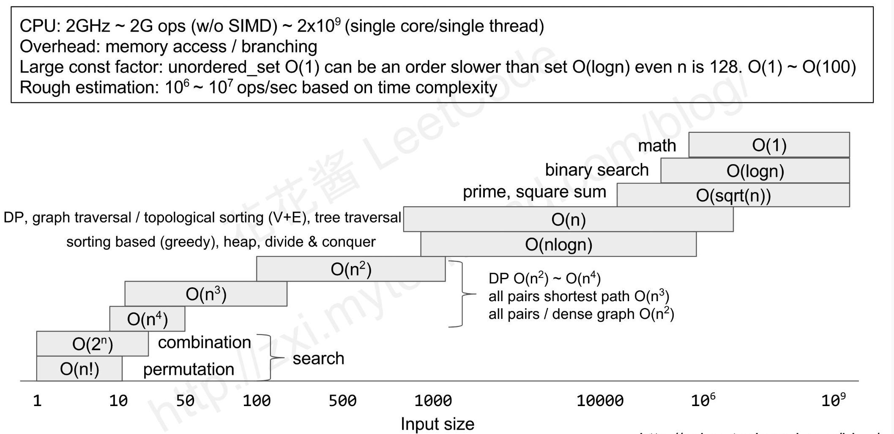
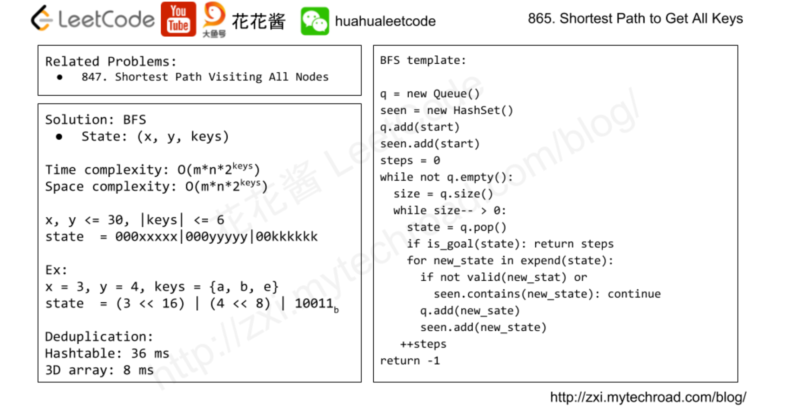
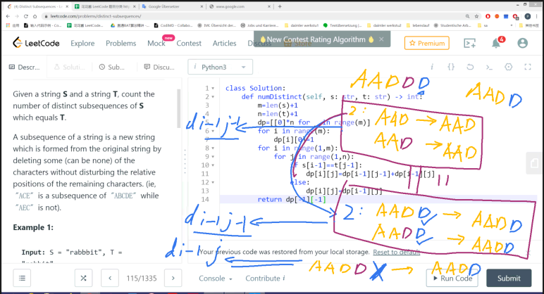
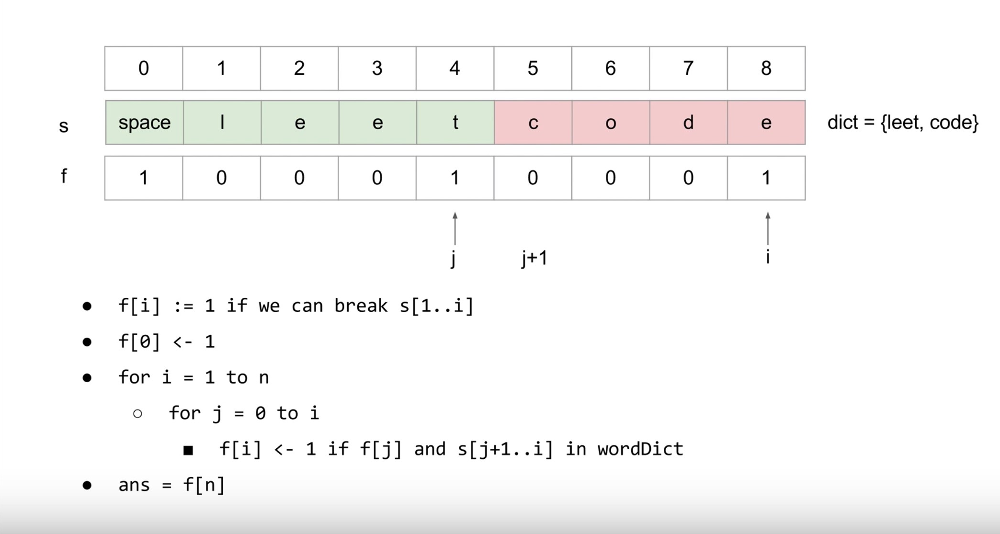
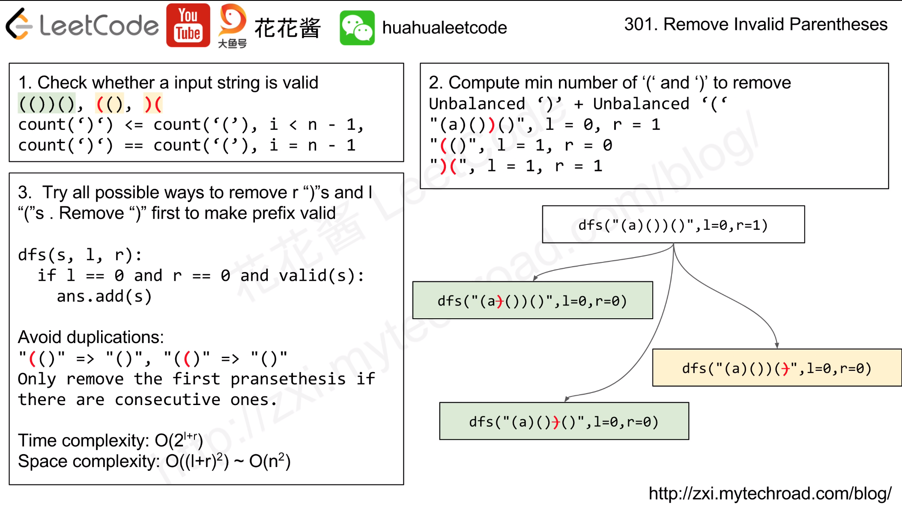

Solved Questions

DP：Dynamic Programming
BT：Backtracking

[TOC]
# 输入代码示例
```python=
import sys
n = sys.stdin.readline().split()
n = int(n[0])
#a = [ [] for _ in range(n)]
a = []
for i in range(n):
    line = sys.stdin.readline().split()
    for j in line:
        #a[i].append(int(j))
        a.append(int(j))
print(a)
```
# 讲过的题
## 2019/12/15
[39](#39-dfs解经典组合问题)， [127](#127-Word-Ladder)， [46](#46-排列组合)
## 2019/12/17
[93](#93-ip地址分段)，[994](#994-BFS腐烂橘子传播问题)，[78](#78（穷举所有子集）（DP？）), [90](#90（穷举所有子集带重复）)
## 2020/01/07
[79](#79-矩阵中找单词-(DFS)), [698](#698-数组分成和相等的小段), [77](#77-组合中特定长度的集合)
## 2020/01/09
[212](#212-word-search-类似79-棋盘寻找多个单词-(DFS+Trie)), [688](#688-♦“马”在棋盘上的概率（DP）), [542](#542-找到矩阵中各元素到0的距离(BFS))
## 2020/01/12
[139](#139-分词（搜索做会超时，应该用DP）), [64](#64-矩阵左上走到右下最短路径和), [995](#995-连续翻转01数字问题)
## 2020/01/14
[996](#996-相邻平方数排列问题), [198](#198-抢劫不相邻的房子(DP)),[300](#300-最长递增子序列)
## 2020/01/17
[72](#72-Edit-distance-from-word1-to-word2-(DP双输入)), [673](#673-Number-of-Longest-Increasing-Subsequence), [823](#823-乘积二叉树)
## 2020/01/21
[312](#312-扎气球问题-O(n^3)-一维输入-dp问题), [121](#121-买卖股票（单买单卖）), [712](#712-删除字母以匹配，并求ASCII之和（DP）)
## 2020/01/25
[115](#-115-O(m*n)dp-最长subsequence数目), [207](#207-课程表（graph-+-DFS）), [11](#11（最大蓄水问题）（两点法）)
## 2020/01/28
[133](#133-Clone-graph(BFS深拷贝无向图)), [785](#785-二分染色图), [210](#210-课程表2), [802](#802-找到安全状态（grap）)
# 代码框架总结
## DFS
#### Combination模板
```python=
nums=[...]
ans=[]
m=len(nums)
nums.sort()

# C(m,n)
func dfs(n,d,s,cur):
    if d==n:
        ans.append(cur[0:d])
        return
    for i=s to m-1:
        if i>s and nums[i]==nums[i-1]:
            continue        #去重
        cur[d]=nums[i]
        dfs(n,d+1,i+1,cur)
        #cur[d]=None    没有必要回溯，因为下次赋值会直接覆盖当前值且最终append的值是cur[0:d]
        ##hin: append&pop() 回溯不如直接赋值的回溯节省时间
        
for i=0 to m:        #调用dfs
    dfs(i,0,0,[None]*i)
```
-----------------------------------------------------------分割线-------------------------------
#### Permutation模板
```python=
nums=[...]
ans=[]
m=len(nums)
nums.sort()
used=[False]*m

# P(m,n)
func dfs(n,cur):
    if cur.size()==n:
        ans.append(cur)
        return
    
    for i=0 to m-1:
        if used[i]:    continue
        used[i]=True
        cur.append(nums[i])
        dfs(n,cur)
        cur.pop()
        used[i]=False
        
for i=0 to nums.size():
    dfs(i,[])
```
-----------------------------------------------------------分割线-------------------------------
#### 顺序填充棋盘问题 dfs模板
（输入为一个列表，dfs函数被要求直接在输入上进行数值填充）

leetcode 37 数独问题解答样例：
```python=
class Solution:
    def solveSudoku(self, board: List[List[str]]) -> None:
        """
        Do not return anything, modify board in-place instead.
        """
        def isValid(x,y): #判定函数，判断该格子填充是否合法
            tmp=board[x][y]
            board[x][y]='d'
            for i in range(9):
                if board[i][y]==tmp:
                    return False
                if board[x][i]==tmp:
                    return False
            for i in range(3):
                for j in range(3):
                    if board[int(x/3)*3+i][int(y/3)*3+j]==tmp:
                        return False
            board[x][y]=tmp
            return True
        
        def dfs(): #双重for循环遍历棋盘，dfs函数本身返回True or False
            for i in range(9):
                for j in range(9):
                    if board[i][j]=='.':
                        for k in '123456789':
                            board[i][j]=k
                            if isValid(i,j) and dfs():
                                return True
                            board[i][j]='.'
                        return False
                            
            return True   # 重要：边界条件的控制不再发生在头部，而是放在最后。如果边界条件在dfs()开头控制，棋盘最末尾的格子如果是先天填充好的会出错
        dfs()             
```
代码模板：
```python=
func valid(x,y,z):
    judge if it is valid to fill board[x][y] with value z
dfs():
    for i in row:
        for j in column:
            if board[i][j] should be filled: #判断该格子是否需要被填充
                for k in all possible filled value: #遍历所有可能填充值
                    if isvalid(x,y,k):
                        fill operation
                        if dfs(): #dfs调用+判断
                            return True
                        backtracking
                    return False #所有可能填充值都无法发展成合法的解，return false并在上一层调用中回溯
    return True #双重for循环全部结束，说明全部填充完毕，return True
                    
```
-----------------------------------------------------------分割线-------------------------------
#### 棋盘搜索问题 dfs模板
 （在已经填充好的棋盘上进行搜索，什么情况下用dfs：
 1）只需要单独解，找到一个解立刻返回即可，无需求出所有解
 2）已经知道解的长度，即已知dfs发展的层数
 在符合1） 2）两条件下应用dfs其时间复杂度和bfs相同，而且其空间复杂度优于bfs）
 leetcode 79 Word Search解答样例：
```python=
class Solution:
    def exist(self, board: List[List[str]], word: str) -> bool:
        xn=len(board)
        yn=len(board[0])
        n=len(word)
----------------------------------------------------------------------------
        def search(x,y,d):
            if x<0 or y<0 or x>=xn or y>=yn or board[x][y]!=word[d]: #x y超出边界或者当前xy数值不符合word，都是False
                return False
            if d==n-1: #通过上一个if的考验，且层数d达到n-1，那么return True
                return True
            tmp=board[x][y]
            board[x][y]=-1 #trick：先把当前数值赋值不合法的数，这样搜索不会走回头路
            
            flag=search(x-1,y,d+1) \
            or search(x+1,y,d+1) \
            or search(x,y+1,d+1) \
            or search(x,y-1,d+1)
            
            board[x][y]=tmp
            
            return flag #浅层递归的边界条件控制
----------------------------------------------------------------------------   
        for i in range(xn):
            for j in range(yn):
                if search(i,j,0): return True
        return False           
```
## BFS
#### 花花酱模板


```python=
q = new HashSet()
seen = new HashSet()
q.add(start)
steps = 0
while not q.empty():
    size = q.size()
    while size-- >0: 
        state=q.pop()
        if is_goal(state):
            return steps
        for new_state in expend(state):
            if not valid(new_state):
                continue
            q.add(new_state)
            seen.add(new_state)
    ++steps
return -1
```
#### 普通模板 127
```python=
class Solution:
    def ladderLength(self, beginWord: str, endWord: str, wordList: List[str]) -> int:
        wordList=set(wordList)
        q=[]
        q.append([beginWord,1])
        while q:
            word,step=q[0]
            del q[0]
            if word==endWord:
                return step
            for i in range(len(word)):
                for c in 'abcdefghijklmnopqrstuvwxyz':
                    nextWord=word[:i]+c+word[i+1:]
                    if nextWord in wordList:
                        wordList.remove(nextWord)
                        q.append([nextWord,step+1])
        return 0
```

#### 棋盘问题模板
```python=
994 BFS腐烂橘子传播问题
class Solution:
    def orangesRotting(self, grid: List[List[int]]) -> int:
        m=len(grid)
        n=len(grid[0])
        fresh=0
        q=[]
        for i in range(m):
            for j in range(n):
                if grid[i][j]==1:
                    fresh+=1
                elif grid[i][j]==2:
                    q.append([j,i])
                    
        dirs=[1,0,-1,0,1]
        days=0
        while q and fresh:
            for j in range(len(q)):
                x,y=q[0]
                del q[0]
                for i in range(4):
                    dx=x+dirs[i]
                    dy=y+dirs[i+1]
                    if dx<0 or dy<0 or dx>=n or dy>=m or grid[dy][dx]!=1:
                        continue
                    fresh-=1
                    grid[dy][dx]=2
                    q.append([dx,dy])
            days+=1
        
        return -1 if fresh>0 else days

-----------------------------------------------------------------
 542 找到矩阵中各元素到0的距离

class Solution:
    def updateMatrix(self, matrix):
        """
        :type matrix: List[List[int]]
        :rtype: List[List[int]]
        """
        h = len(matrix)
        w = len(matrix[0])
        queue = []
        count = 0
        for i in range(h):
            for j in range(w):
                if matrix[i][j] == 0:
                    queue.append((i,j))
                else:
                    matrix[i][j] = float("inf")
                    count +=1
        for row, col in queue:
            if count == 0:
                break
            dist = matrix[row][col] + 1
            for dy, dx in [(-1, 0), (1, 0), (0, -1), (0, 1)]:
                r = row + dy
                c = col + dx
                if 0 <= r < h and 0 <= c < w and dist < matrix[r][c]:
                    matrix[r][c] = dist
                    queue.append((r,c))
                    count -= 1

        return matrix
```

## DP
#### 复杂二维DP 复杂度O(2^n) (dfs复杂度O(n!)+prunning)
```python=
#第一步：构建图中两两节点之间的联系，建立一个nxn的二维list，g[i][j]代表i节点之后跟j节点所需要花费的cost
for i in range(n):
    for j in range(n): #双向图
    for j in range(i+1,n): #无向图
        g[i][j]......
        
#第二步：构建dp二维list，大小是(1<<n)x(n),行数代表所有的状态数，列数代表每个状态下最后一位是哪个节点，初始化dp的时候，一般只需要初始化dp[1<<i][i]=1/-1/0/sys.maxsize
for i in range(n):
    if A[i]!=A[i-1] or i==0: #去重起点
        dp[1<<i][i]=1 or xxxxxx #初始化所有起点
        
#第三步：三重for循环 核心
for s: #第一重循环状态
    for i: #第二重循环s状态下最后一个节点
        #一般在该环节要pruning，把不在s状态里面的i节点continue跳过；有时候是把dp[s][i]=0的状态剪枝掉，因为说明根据第一步构建的g图来看，该状态路径永远不可能达成
        for j: #第三重循环，s状态下并且以i作为最后一个节点的情况下，下一个节点j的可能性操作：包括:
            if g[i][j] not working, continue
            if j already in status s, continue
            if j>0 and A[j-1]==A[j] and (the node j-1 not in status s) continue #去重，在众多相同值中只使用第一个A[j]
                dp[s|(1<<j)]=... #进行操作
                
#第四步：根据题目要求提取最后一个状态s=(1<<n)-1进行操作(对dp[s][0]--dp[s][n-1]进行操作)
```
#### 一维DP：记忆化递归或DP列表记录状态  O(n)复杂度 一维
```python=

```

#### 一维DP：记忆化递归或DP列表记录状态  O(n^2)复杂度 一维  （139 818）
例子139 DP方法 DP开辟数组分割 开辟f数组记录从0到每一个状态是否可分割
```python=
class Solution:
    def wordBreak(self, s: str, wordDict: List[str]) -> bool:
        n=len(s)
        s=" "+s
        f=[0]*(n+1)
        f[0]=1
        
        for i in range(1,n+1):
            for j in range(i):
                if f[j]==1:
                    if s[j+1:i+1] in wordDict:
                        f[i]=1
                        break
                        
        return f[-1]
```
例139 记忆化递归 m字典来记忆每一步递归函数得到的结果
```python=
class Solution:
    def wordBreak(self, s: str, wordDict: List[str]) -> bool:
        def canBreak(s,wordDict,m):
            
            if s in wordDict:
                m[s]=True
                return True
            if s in m:
                return m[s]
            for i in range(1,len(s)):
                l=s[:i]
                if l in wordDict and canBreak(s[i:],wordDict,m):
                    m[s]=True
                    return True
            m[s]=False
            return False
        return canBreak(s,wordDict,{})
``` 
一维输入 复杂度O(n^2) DP模板：
```python=
Template

dp =new int[n]                # init DP array
for i=1 to n:                 # problem size
    for j=1 to i-1:           # sub-problem size
        # IMPORTANT
        dp[i]=max/min(dp[i], f(dp[j]))    # find the opt sol from all opt sols of smaller problems
return dp[n]
``` 
#### 双一维输入 复杂度O(n*m)
一维DP，双输入，一个输入m长数组，一个输入n长数组，需要建立m x n大小的dp列表
例子：Leetcode 72
```python=
class Solution:
    def minDistance(self, word1: str, word2: str) -> int:
        l1=len(word1)+1
        l2=len(word2)+1
        dp=[[0]*l2 for _ in range(l1)]
        for i in range(l1):
            dp[i][0]=i
        for j in range(l2):
            dp[0][j]=j
        for i in range(1,l1):
            for j in range(1,l2):
                if word1[i-1]==word2[j-1]:
                    dp[i][j]=dp[i-1][j-1]
                else:    
                    dp[i][j]=1+min(dp[i-1][j],dp[i-1][j-1],dp[i][j-1])
        return dp[-1][-1]
```

关键是推出dp[i][j]=f(dp[i-1][j],dp[i][j-1],dp[i-1][j-1])关系
以及初始化所有dp[0][j],dp[i][0]
一维DP双输入模板：
```clike=
dp=new int[][]        #init DP array
for i=1 to n:         #problem size of input1
  for j=1 to m:        #problem size of input2
    dp[i][j]=f(dp[i-1][j],dp[i][j-1],dp[i-1][j-1])
return dp[n][m]
``` 
#### 一维输入 复杂度O(n^3)
例312 扎气球问题 一维输入 三重循环 时间复杂度O(n^3)
```python=
class Solution:
    def maxCoins(self, nums: List[int]) -> int:
        n=len(nums)
        nums=[1]+nums+[1]
        dp=[[0]*(n+2) for _ in range(n+2)]
        for l in range(1,n+1):
            for i in range(1,n-l+2):
                j=i+l-1
                if i==j:
                    dp[i][j]=nums[i]*nums[i-1]*nums[i+1]
                for k in range(i,j+1):
                    dp[i][j]=max(dp[i][j],dp[i][k-1]+dp[k+1][j]+nums[k]*nums[i-1]*nums[j+1])
                    
        return dp[1][n]
            
``` 
DP: 一维输入 三重循环 时间复杂度O(n^3) 模板：
```python=
Template

dp = new int[n][m]                # init a 2D array
for l = 1 to n:                   # problem size
    for i = 1 to n-l+1:           # sub-problem start
        j = i + l - 1             # sub-problem end
        for k = i to j:           # try all possible break points
            # 递推公式这句最重要，注意下标k因题而异
            dp[i][j] = max(dp[i][j], f(dp[i][k], dp[k][j]))    # merge two subproblems  IMPORTANT
return dp[1][n]
``` 
# Leetcode
## 1（Two Sum）
## 2 链表表示的两个数相加
```python=
class Solution:
    def addTwoNumbers(self, l1: ListNode, l2: ListNode, add = 0) -> ListNode:
        if l1 == None:
            return self.addTwoNumbers(ListNode(1), l2) if add == 1 else l2
        if l2 == None:
            return self.addTwoNumbers(l1, ListNode(1)) if add == 1 else l1
        
        res = ListNode((l1.val + l2.val + add)%10)
        add = (l1.val + l2.val + add)//10
        res.next = self.addTwoNumbers(l1.next, l2.next, add)
        return res
```
## 3 无重复子串最大长度
滑动窗口法
```python=
class Solution:
    def lengthOfLongestSubstring(self, s: str) -> int:
        if len(s) == 0:
            return 0
        begin = 0
        d = dict()
        length = 0
        for i, value in enumerate(s):
            if value in s[begin:i]:
                length = max(length, i - begin)
                begin = d[value] + 1
            d[value] = i
        return max(length, i - begin + 1)
```
再优化：
```python=
class Solution(object):
    def lengthOfLongestSubstring(self, s):
        """
        :type s: str
        :rtype: int
        """
        if len(s) < 2:
            return len(s)
        d = dict()
        begin = 0
        length = 0
        for i in range(len(s)):
            if s[i] in d and d[s[i]] >= begin:
                if i - begin > length:
                    length = i - begin
                begin = d[s[i]] + 1
            d[s[i]] = i
        return max(length, i - begin + 1)
```
## ■4 求两个有序数组结合后的中位数 
## ■5 最长回文子串
## ■6（字符串转换成Z型）
## 11（最大蓄水问题）（两点法）
两端为起点往中间聚拢
```python=
class Solution(object):
    def maxArea(self, height):
        """
        :type height: List[int]
        :rtype: int
        """
        water = 0
        i = 0
        j = len(height) - 1
        while i < j:
            water = max(water, min(height[i], height[j])*(j-i))
            if height[i] > height[j]: # move the shorter side
                j -= 1
            else:
                i += 1
        return water
```
## 15（3个数相加为0）（两点法）

This is the answer from @caikehe and all the comments below

The main idea is to iterate every number in nums.
We use the number as a target to find two other numbers which make total zero.
For those two other numbers, we move pointers, l and r, to try them.

l start from left to right
r start from right to left

First, we sort the array, so we can easily move i around and know how to adjust l and r.
If the number is the same as the number before, we have used it as target already, continue. [1]
We always start the left pointer from i+1 because the combination of 0~i has already been tried. [2]

Now we calculate the total:
If the total is less than zero, we need it to be larger, so we move the left pointer. [3]
If the total is greater than zero, we need it to be smaller, so we move the right pointer. [4]
If the total is zero, bingo! [5]
We need to move the left and right pointers to the next different numbers, so we do not get repeating result. [6]

We do not need to consider i after nums[i]>0, since sum of 3 positive will be always greater than zero. [7]
We do not need to try the last two, since there are no rooms for l and r pointers.
You can think of it as The last two have been tried by all others. [8]

For time complexity
Sorting takes O(NlogN)
Now, we need to think as if the 'nums' is really really big
We iterate through the 'nums' once, and each time we iterate the whole array again by a while loop
So it is O(NlogN+N\^2)~=O(N^2)

For space complexity
We didn't use extra space except the 'res'
Since we may store the whole 'nums' in it
So it is O(N)
N is the length of 'nums'
```python=
#Code
class Solution(object):
	def threeSum(self, nums):
		res = []
		nums.sort()
		length = len(nums)
		for i in xrange(length-2): #[8]
			if nums[i]>0: break #[7]
			if i>0 and nums[i]==nums[i-1]: continue #[1]

			l, r = i+1, length-1 #[2]
			while l<r:
				total = nums[i]+nums[l]+nums[r]

				if total<0: #[3]
					l+=1
				elif total>0: #[4]
					r-=1
				else: #[5]
					res.append([nums[i], nums[l], nums[r]])
					while l<r and nums[l]==nums[l+1]: #[6]
						l+=1
					while l<r and nums[r]==nums[r-1]: #[6]
						r-=1
					l+=1
					r-=1
		return res
```
## 16 最接近3SUM的数
我的解法
```python=
class Solution(object):
    def threeSumClosest(self, nums, target):
        """
        :type nums: List[int]
        :type target: int
        :rtype: int
        """
        nums.sort()
        i = 0
        rest = target - (nums[0] + nums[1] + nums[-1])
        ans = abs(rest)
        plus = True if rest >= 0 else False
        while i < len(nums):
            curr = nums[i]
            s = i + 1
            e = len(nums) - 1
            while s < e:
                rest = target - nums[i] - nums[s] - nums[e]
                if abs(rest) < ans:
                    ans = abs(rest)
                    plus = True if rest >= 0 else False
                if rest > 0:
                    s += 1
                elif rest < 0:
                    e -= 1
                else:
                    return target
            i += 1
        target -= ans if plus == True else -ans
        return target
```

## 17（手机九宫格映射字符串）
```python=
class Solution(object):
    def letterCombinations(self, digits):
        """
        :type digits: str
        :rtype: List[str]
        """
        # 我的解法
        # if len(digits) == 0: return None
        # m = ['abc','def','ghi','jkl','mno','pqrs','tuv','wxyz']
        # res = ['']
        # for num in digits:
        #     pre = res[:]
        #     res = []
        #     for letter in m[int(num) - 2]:
        #         for i in range(len(pre)):
        #             res.append(pre[i] + letter)
        # return res
        
        
        # 简短解法
        if digits == '': return None
        
        mapping = {'2':'abc',
                   '3':'def',
                   '4':'ghi',
                   '5':'jkl',
                   '6':'mno',
                   '7':'pqrs',
                   '8':'tuv',
                   '9':'wxyz'}
        ans = ['']
        for num in digits:
            ans = [x+y for x in ans for y in mapping[num]]
        return ans
```
## 18 4SUM
我的解法
```python=
class Solution(object):
    def threeSum(self, nums, target):
        res = set()
        for i in range(len(nums)):
            s = i + 1
            e = len(nums) - 1
            while s < e:
                rest = target - nums[s] - nums[e] - nums[i]
                if rest > 0:
                    s += 1
                elif rest < 0:
                    e -= 1
                else:
                    res.add((nums[i], nums[s], nums[e]))
                    s += 1
        return res
    def fourSum(self, nums, target):
        """
        :type nums: List[int]
        :type target: int
        :rtype: List[List[int]]
        """
        res = set()
        nums.sort()
        for i in range(len(nums) - 1):
            three = self.threeSum(nums[i+1:], target - nums[i])
            # print(three)
            for l in three:
                res.add((nums[i], l[0], l[1], l[2]))
        return res
```
## 19（去掉链表倒数第n个节点）
## 20（前后括号对应问题）（栈）
```python=
class Solution(object):
    def isValid(self, s):
        stack = []
        mapping = {")": "(", "}": "{", "]": "["}

        for char in s:
            if char in mapping:
                top_element = stack.pop() if stack else '#'
                if mapping[char] != top_element:
                    return False
            else:
                stack.append(char)
        return not stack
    # if stack is empty, it is Flase, not stack is True
```
## 21（合并两个有序链表）
```python=
# Definition for singly-linked list.
# class ListNode:
#     def __init__(self, x):
#         self.val = x
#         self.next = None
# 答案虽然比较简单， 但是算法原理还是没看懂，待商讨。。
class Solution:
    def mergeTwoLists(self, a, b):
        if a and b:
            if a.val > b.val:
                a, b = b, a
            a.next = self.mergeTwoLists(a.next, b)
        return a or b #返回非None的值，如果a,b都不是None，返回a
```
非递归方法
```python=
class Solution(object):
    def mergeTwoLists(self, l1, l2):
        """
        :type l1: ListNode
        :type l2: ListNode
        :rtype: ListNode
        """
        ans = dummy = ListNode(0) #dummy, ans 都是辅助节点
        while l1 and l2:
            if l1.val < l2.val:
                dummy.next = l1
                l1 = l1.next
            else:
                dummy.next = l2
                l2 = l2.next
            dummy = dummy.next
        dummy.next = l1 or l2 # 取l1,l2中不为None的那个
        return ans.next
```
## 22 括号（）的排列组合
宽度优先
```python=
class Solution(object):
    def generateParenthesis(self, n):
        """
        :type n: int
        :rtype: List[str]
        """
        # 宽度优先搜索
        from collections import deque
        if n == 0:
            return []
        ans = []
        que = deque([('(', 1)]) #第二个数字是左括号和右括号的差值
        while que:
            s, diff = que.popleft()
            if len(s) < 2*n:
                if diff > 0:
                    que.append((s+ ')', diff - 1))
                if (len(s) + diff)//2 < n: # [n_(] + [n_)] = len(s); [n_(] - [n_)] = diff
                    que.append((s+ '(', diff + 1))
            else:
                ans.append(s)
        return ans
```
深搜
```python=
class Solution:
    def generateParenthesis(self, n: int) -> List[str]:
        res = []
        def dfs(string, left, right):
            if len(string) == 2*n:
                res.append(string)
            else:
                if left < n:
                    dfs(string + "(", left + 1, right)
                if left > right:
                    dfs(string + ")", left, right + 1)
        
        dfs("", 0, 0)
        return res
```
## 24（链表节点两两交换）
```python=
class Solution:
    def swapPairs(self, head: ListNode) -> ListNode:
        if head == None:
            return None
        dummy = ListNode(0)
        pre = dummy
        dummy.next = head
        while pre.next and pre.next.next:
            node1 = pre.next
            node2 = pre.next.next
            pre.next = node2
            node1.next = node2.next
            node2.next = node1
            pre = pre.next.next
        return dummy.next
```
## 26（去掉有序列表中重复的数）
```python=
class Solution:
    def removeDuplicates(self, nums: List[int]) -> int:
        len_ = 1
        if len(nums)==0:
            return 0
        for i in range(1,len(nums)):
            if nums[i] != nums[i-1]:
                nums[len_] = nums[i]
                len_ +=1
        return len_
# 算法看懂了， 但还是不明白，为什么函数里return一个int,结果调用时候却返回了list
```
相似解法
```python=
class Solution:
    def removeDuplicates(self, nums: List[int]) -> int:
        if len(nums) < 2:
            return len(nums)
        fast = 1
        slow = 0
        while fast < len(nums):
            if nums[fast] != nums[fast-1]:
                slow += 1
                nums[slow] = nums[fast]
            fast += 1
        return slow + 1
```
## 27 移除nums中指定数值
```python=
class Solution:
    def removeElement(self, nums: List[int], val: int) -> int:
        l = len(nums)
        slow = -1
        for i in range(l):
            if nums[i] != val:
                slow += 1
                nums[slow] = nums[i]
        return slow + 1
```
## 28 查找字符串中指定子串
```python=
class Solution:
    def strStr(self, haystack: str, needle: str) -> int:
        nl = len(needle)
        hl = len(haystack)
        if nl == 0:
            return 0
        for i in range(hl):
            if haystack[i] == needle[0] and i + nl <= hl and haystack[i:i+nl] == needle:
                return i
        return -1
```
## 31（下一个排列组合数）
题目的意思是：多个数字（0~9）可以通过排列组合组成不同大小的整数，要求找到：输入的整数的下一个比它稍大的整数
```python=
class Solution(object):
    def nextPermutation(self, nums):
        """
        :type nums: List[int]
        :rtype: None Do not return anything, modify nums in-place instead.
        """
        if len(nums) == 0: return None
        if len(nums) == 1: return nums
        i = len(nums) - 2
        while i >= 0 and nums[i] >= nums[i+1]: #从右开始找到：从右往左的纯递增序列
            i -= 1
        if i == -1:
            nums.sort()
        else:
            j = len(nums) - 1
            while j > i and nums[j] <= nums[i]: #找到右边的递增序列中比nums[i]稍大的数，随后交换
                j -= 1
            nums[i], nums[j] = nums[j], nums[i]
            l = i+1
            r = len(nums) - 1
            while l < r: #reverse右边那段序列
                nums[l], nums[r] = nums[r], nums[l]
                l += 1
                r -= 1
```
## 35 搜索插入位置
```python=
class Solution:
    def searchInsert(self, nums: List[int], target: int) -> int:
        if len(nums) == 1:
            return 0 if nums[0] >= target else 1
        l = 0
        r = len(nums) - 1
        while l < r:
            mid = (l+r)//2
            if nums[mid] == target:
                return mid
            elif nums[mid] > target:
                r = mid
            else:
                l = mid + 1
        return l if nums[l] >= target else l + 1
    

```
## 37 9x9棋盘数独
Solution1 dfs:
```python=
class Solution:
    def solveSudoku(self, board: List[List[str]]) -> None:
        """
        Do not return anything, modify board in-place instead.
        """
        n=len(board)
        def check(x,y,a):
            if a in board[x]:
                return False
            for i in range(n):
                if a==board[i][y]:
                    return False
            numx=int(x/3)
            numy=int(y/3)
            for i in range(numx*3,numx*3+3):
                for j in range(numy*3,numy*3+3):
                    if board[i][j]==a:
                        return False
            return True
        
        def dfs(d,l,n):
            #if d==n-1 and l==n-1:   在开头进行边界条件控制没有必要
                #return True
            for i in range(n):
                for j in range(n):
                    if board[i][j]=='.':
                        for k in '123456789':
                            if check(i,j,k):
                                board[i][j]=k
                                if dfs(i,j,n):
                                    return True
                                #dfs(i,j,n)
                                board[i][j]='.'
                        return False
            return True       #边界条件控制   
        dfs(0,0,n)
                    
```
## 39 dfs解经典组合问题
```python=
class Solution:
    def combinationSum(self, candidates: List[int], target: int) -> List[List[int]]:#此部分为主函数，调用一次dfs函数即可
        candidates.sort()
        ans=[]
        self.dfs(candidates,target,0,[],ans)
        return ans
    
    def dfs(self,candidates,target,s,cur,ans):
        if target==0:#
            #ans.append(cur[:]) 此处注意如果cur是每次用append来追加新元素的话，需要加[:]
            ans.append(cur)
            return
        for i in range(s,len(candidates)):
            if candidates[i]>target:
                break
            #cur.append(candidates[i])
            self.dfs(candidates,target-candidates[i],i,cur+[candidates[i]],ans)
            #cur.pop()
            
```
XPY解法
```python=
class Solution(object):
    def combinationSum(self, candidates, target):
        candidates.sort()
        ans = []
        n = len(candidates)
        
        def dfs(curr, target, starter): # starter 用来防止重复取之前的元素
            if target == 0:
                ans.append(curr[:])
            for i in range(starter, n):
                if candidates[i] <= target:
                    dfs(curr + [candidates[i]], target - candidates[i], i)
                else:
                    break
        curr = []  
        starter = 0
        dfs(curr[:], target, starter)
        return ans
```
## 45（跳跃游戏2：最短次数到最后）
```python=
class Solution(object):
    def jump(self, nums):
        """
        :type nums: List[int]
        :rtype: int
        """
        jump, currFar, currEnd = 0, 0, 0
        for i in range(len(nums)-1): #!!!此处注意索引范围
            currFar = max(currFar, i + nums[i])
            if i == currEnd:
                jump += 1
                currEnd = currFar
                print(currEnd)
        return jump
```

## 46 排列组合
XPY解法
```python=
class Solution(object):
    def permute(self, nums):
        """
        :type nums: List[int]
        :rtype: List[List[int]]
        """
        ans = []
        def dfs(curr, nums):
            if len(nums) <= 1:
                ans.append(curr + nums)
            else:
                for i in range(len(nums)):
                    dfs(curr + [nums[i]], nums[:i] + nums[i+1:])
        dfs([], nums)
        return ans
```
YJC
```python=
class Solution:
    def permute(self, nums: List[int]) -> List[List[int]]:

        """
        :type nums: List[int]
        :rtype: List[List[int]]
        """
        if len(nums)<=1:
            return [nums]
        res = []
        for i in range(len(nums)):
            rest = nums[:i]+nums[i+1:]
            for p in self.permute(rest):
                res.append([nums[i]]+p)
        return res 
```
JP 普通dfs
```python=
class Solution:
    def permute(self, nums: List[int]) -> List[List[int]]:
        n=len(nums)
        ans=[]
        visited=[0]*n
        self.dfs(nums,n,0,visited,[],ans)
        return ans
    
    def dfs(self,nums,n,d,visited,cur,ans):
        if d==n:
            ans.append(cur[:])
            return
        for i in range(n):
            if visited[i]==1:
                continue
            visited[i]=1
            cur.append(nums[i])
            self.dfs(nums,n,d+1,visited,cur,ans)
            cur.pop()
            visited[i]=0
```
## 48（图片旋转90^o^)（补码索引）（zip）
我的解法，层层旋转，但是index容易算错
```python=
class Solution(object):
    def rotate(self, matrix):
        """
        :type matrix: List[List[int]]
        :rtype: None Do not return anything, modify matrix in-place instead.
        """
        
        n = len(matrix)
        layers = n//2
        for layer in range(layers):
            for i in range(0, n - 2*layer - 1):
                # print(matrix[layer][i+layer], matrix[layer+i][n-layer-1], matrix[n-layer-1][n-layer-1-i], matrix[n-layer-1-i][layer])
                matrix[layer][i+layer], matrix[layer+i][n-layer-1], matrix[n-layer-1][n-layer-1-i], matrix[n-layer-1-i][layer] = \
                matrix[n-layer-1-i][layer], matrix[layer][i+layer], matrix[layer+i][n-layer-1], matrix[n-layer-1][n-layer-1-i]
```
讨论区改进的index方法，更加简洁
~i：i的补码，既取i的相反数后再减1，[\~i] == [n-1-i],镜面对称的位置
```python=
class Solution:
    def rotate(self, A):
        n = len(A)
        for i in range(n/2):
            for j in range(n-n/2):
                A[i][j], A[~j][i], A[~i][~j], A[j][~i] = \
                         A[~j][i], A[~i][~j], A[j][~i], A[i][j]
```
使用zip，一行搞定，zip的作用和转置很像
```python=
# >>> a = zip([1,2,3],[4,5,6])
# >>> list(a)
# [(1, 4), (2, 5), (3, 6)]
class Solution:
    def rotate(self, A):
        A[:] = zip(*A[::-1])
```
类似zip转置的操作：
```python=
class Solution:
    def rotate(self, A):
        A[:] = [[row[i] for row in A[::-1]] for i in range(len(A))]
```
## 51 放置皇后问题
Solution1 dfs:
```python=
class Solution:
    def solveNQueens(self, n: int) -> List[List[str]]:
        board=[]
        def check(row,col):
            for i in range(row):
                if board[i]==col or abs(board[i]-col)==abs(row-i):
                    return False
            return True
        ans=[]       
        def solve(d,res):
            if d==n:
                ans.append(res)
                return
            for i in range(n):
                if check(d,i):
                    board.append(i)
                    ds='.'*n
                    solve(d+1,res+[ds[:i]+'Q'+ds[i+1:]])
                    board.pop()
        solve(0,[])
        return ans
                    
```
Solution 2: 优化方法1中的check函数，每走一步不需要再check之前的每行，用col，diag1，diag2记录该格子valid与否
```python=
class Solution:
    def solveNQueens(self, n: int) -> List[List[str]]:
        col=[0]*n
        diag1=[0]*(2*n-1)
        diag2=[0]*(2*n-1)
        board=['.'*n]*n
        ans=[]
        def nqueen(n,d):
            if n==d:
                ans.append(board[:])
                return
            for i in range(n):
                if isvalid(i,d):
                    board_update(i,d,1)
                    nqueen(n,d+1)
                    board_update(i,d,0)
        
        def isvalid(x,y):
            return col[x]==0 and diag1[x+y]==0 and diag2[x-y+n-1]==0
        
        def board_update(x,y,bol):
            col[x]=bol
            diag1[x+y]=bol
            diag2[x-y+n-1]=bol
            board[y]='.'*x+'Q'+'.'*(n-x-1) if bol else '.'*n
            
        nqueen(n,0)
        return ans
```
## 52 放置皇后问题2
dfs
```python=
class Solution:
    def totalNQueens(self, n: int) -> int:
        board=[]
        def check(x,y):
            for i in range(x):
                if board[i]==y or abs(i-x)==abs(board[i]-y):
                    return False
            return True
        
        self.count=0
        
        def solve(d):
            if d==n:
                self.count+=1
                return
            for i in range(n):
                if check(d,i):
                    board.append(i)
                    solve(d+1)
                    board.pop()
        solve(0)
        return self.count
```

## 53（最大子串sum）（DP）
动态规划问题
```python=
for i in range(1, len(nums)):
        if nums[i-1] > 0:
            nums[i] += nums[i-1]
    return max(nums)
```
## 55（跳跃游戏：跳到最后一位）
```python
class Solution(object):
    def canJump(self, nums):
        """
        :type nums: List[int]
        :rtype: bool
        """
        # 我的解法,从左到右检查每个点是否可以被到达
        # if len(nums) == 1: return True
        # for i in range(1, len(nums)):
        #     j = i - 1
        #     res = False
        #     while j >= 0:
        #         if nums[j] >= (i-j):
        #             res = res or True
        #         j -= 1
        #         if res == True:
        #             break
        #     if res == False:
        #         return False
        # return res
        
        # 讨论区解法，时间复杂度更小
        # m = 0
        # for i, n in enumerate(nums):
        #     if i > m:
        #         return False #index i cannot reach
        #     m = max(m, i+n)
        # return True
        
        #讨论区解法2
        goal = len(nums) - 1
        for i in range(len(nums))[::-1]:
            if i + nums[i] >= goal:
                goal = i
        return not goal
```
## 61（轮转链表）
## 62 机器人走格子路径数（DP）
```python=
class Solution(object):
    def uniquePaths(self, m, n):
        """
        :type m: int
        :type n: int
        :rtype: int
        """
        dp = [1 for _ in range(n)]
        for i in range(1, m):
            for j in range(1, n):
                dp[j] = dp[j] + dp[j-1]
        return dp[-1]
```
## 63 机器人走格子路径数(带障碍）（DP）
```python=
class Solution(object):
    def uniquePathsWithObstacles(self, grid):
        """
        :type obstacleGrid: List[List[int]]
        :rtype: int
        """
        n = len(grid)
        m = len(grid[0])
        if grid[0][0] == 1:
            return 0
        dp = [[0 for i in range(m)] for _ in range(n)]
        
        for i in range(n):
            if grid[i][0] == 1:
                break
            dp[i][0] = 1
        
        for j in range(m):
            if grid[0][j] == 1:
                break
            dp[0][j] = 1
            
        for i in range(1, n):
            for j in range(1, m):
                dp[i][j] = (dp[i-1][j] + dp[i][j-1]) if grid[i][j] == 0 else 0
        return dp[-1][-1]
```
## 64 矩阵左上走到右下最短路径和
Solution 1: dp列表
```python=
class Solution():
    def minPathSum(self, grid):
        m = len(grid)
        n = len(grid[0])
        for i in range(1, n):
            grid[0][i] += grid[0][i-1]
        for i in range(1, m):
            grid[i][0] += grid[i-1][0]
        for i in range(1, m):
            for j in range(1, n):
                grid[i][j] += min(grid[i-1][j], grid[i][j-1])
        return grid[-1][-1]
```
Solution 2: 记忆化递归
```python==
class Solution:
    def minPathSum(self, grid: List[List[int]]) -> int:
        m=len(grid)
        n=len(grid[0])
        s=[[-1]*n for _ in range(m)]
        def memory(x,y):
            if x==0 and y==0:
                #s[x][y]=grid[x][y]
                return grid[x][y]
            if x<0 or y<0:
                return sys.maxsize
            if s[x][y]!=-1:
                return s[x][y]
            ans=grid[x][y]+min(memory(x-1,y),memory(x,y-1))
            s[x][y]=ans
            return ans
        return memory(m-1,n-1)

```
## 66
## 70 (爬楼梯 climbing stairs)
```python=
此问题是动态规划问题，然而结果是斐波那契数列(Fibonacci Number)
class Solution:
    def climbStairs(self, n):
        a, b = 1, 1
        for i in range(n):
            a, b = b, a + b
        return a
```
## 72 Edit distance from word1 to word2 (DP双输入)
dp方法如下
```python=
class Solution:
    def minDistance(self, word1: str, word2: str) -> int:
        l1=len(word1)+1
        l2=len(word2)+1
        dp=[[0]*l2 for _ in range(l1)]
        for i in range(l1):
            dp[i][0]=i
        for j in range(l2):
            dp[0][j]=j
        for i in range(1,l1):
            for j in range(1,l2):
                if word1[i-1]==word2[j-1]:
                    dp[i][j]=dp[i-1][j-1]
                else:    
                    dp[i][j]=1+min(dp[i-1][j],dp[i-1][j-1],dp[i][j-1])
        return dp[-1][-1]
```
## 77 组合中特定长度的集合
方法1：DFS，照着模板修改
```python=
class Solution(object):
    def combine(self, n, k):
        """
        :type n: int
        :type k: int
        :rtype: List[List[int]]
        """
        res = []
        self.dfs(range(1, n+1), 0, k, [], res)
        return res

    def dfs(self, nums, index, k, temp, res):
        if k == 0:
            res.append(temp)
            return
        for i in range(index, len(nums)):
            self.dfs(nums, i+1, k-1, temp+[nums[i]], res)
```
方法2：回溯法
```python=
class Solution(object):
    def combine(self, n, k):
        def backtrack(first = 1, curr = []):
            # if the combination is done
            if len(curr) == k:  
                output.append(curr[:]) # [:] is necessary rather than curr
                return
            for i in range(first, n + 1):
                # add i into the current combination
                curr.append(i)
                # use next integers to complete the combination
                backtrack(i + 1, curr)
                # backtrack
                curr.pop()
        
        output = []
        backtrack()
        return output
```
优化剪枝
```python=
class Solution(object):
    def combine(self, n, k):
        """
        :type n: int
        :type k: int
        :rtype: List[List[int]]
        """
        ans = []
        stack = []
        x = 1
        while True:
            l = len(stack)
            if l == k:
                ans.append(stack[:])
            if l == k or x > n - k + l + 1:
                if not stack:
                    return ans
                x = stack.pop() + 1
            else:
                stack.append(x)
                x += 1
```
## 78（穷举所有子集）（DP？）
方法一：DP？
```python=
class Solution(object):
    def subsets(self, nums):
        """
        :type nums: List[int]
        :rtype: List[List[int]]
        """
        res = [[]]
        for num in nums:
            for pre in res[:]: # [:] is necessary
                res.append(pre+[num])
        return res
```
方法二：DFS
```python=
class Solution(object):
    def subsets(self, nums):
        """
        :type nums: List[int]
        :rtype: List[List[int]]
        """
        res = []
        nums.sort()
        self.dfs(nums, 0, [], res)
        return res

    def dfs(self, nums, index, temp, res):
        res.append(temp)
        for i in range(index, len(nums)):
            self.dfs(nums, i+1, temp+[nums[i]], res)
```
## 79 矩阵中找单词 (DFS)
XPY
```python=
class Solution(object):
    def exist(self, board, word):
        """
        :type board: List[List[str]]
        :type word: str
        :rtype: bool
        """
        def dfs(string, n, m, boolmap):
            if len(string)==0:
                return True
            elif n <0 or n>=N or m<0 or m>=M or boolmap[n][m]==False or string[0] != board[n][m]:
                return False
            else:
                boolmap[n][m] = False
                ans = dfs(string[1:], n-1, m, boolmap) or \
                      dfs(string[1:], n+1, m, boolmap) or \
                      dfs(string[1:], n, m-1, boolmap) or \
                      dfs(string[1:], n, m+1, boolmap)
                boolmap[n][m] = True
            return ans
                
                
        N = len(board)
        M = len(board[0])
        boolmap = [[True for _ in range(M)] for _ in range(N)]
        res = False
        for i in range(N):
            for j in range(M):
                if word[0] == board[i][j]:
                    if dfs(word, i, j, boolmap):
                        return True
        return res
```
JP
```python=
class Solution:
    def exist(self, board: List[List[str]], word: str) -> bool:
        xn=len(board)
        yn=len(board[0])
        n=len(word)
        
        def search(x,y,d):
            if x<0 or y<0 or x>=xn or y>=yn or board[x][y]!=word[d]: #x y超出边界或者当前xy数值不符合word，都是False
                return False
            if d==n-1: #通过上一个if的考验，且层数d达到n-1，那么return True
                return True
            tmp=board[x][y]
            board[x][y]=-1 #trick：先把当前数值赋值不合法的数，这样搜索不会走回头路
            flag=search(x-1,y,d+1) or search(x+1,y,d+1) or search(x,y+1,d+1) or search(x,y-1,d+1)
            board[x][y]=tmp
            
            return flag #浅层递归的边界条件控制
        
        for i in range(xn):
            for j in range(yn):
                if search(i,j,0): return True
        return False
```
## 83
## 86
## 88
## 90（穷举所有子集带重复）
方法一：78题+set
```python=
class Solution(object):
    def subsetsWithDup(self, nums):
        """
        :type nums: List[int]
        :rtype: List[List[int]]
        """
        res = [[]]
        nums.sort()
        for num in nums:
            for pre in res[:]: # [:] is necessary
                res.append(pre+[num])
        ans = set()
        for com in res:
            ans.add(tuple(com))
        return ans

```
方法二：DFS
```python= 
class Solution(object):
    def subsetsWithDup(self, nums):
 
        res = []
        nums.sort()
        self.dfs(nums, 0, [], res)
        return res

    def dfs(self, nums, index, temp, res):
        res.append(temp)
        for i in range(index, len(nums)):
            if nums[i] == nums[i-1] and i > index:
                continue
            self.dfs(nums, i+1, temp+[nums[i]], res)
```
## 91
## 93 ip地址分段
三种写法
方法一：
```python=
def restoreIpAddresses(self, s: str) -> List[str]:
    res = []
    self.restoreHelper(res, s, '', 0)
    return res

def restoreHelper(self, result, s, current, field):
    if field == 4 and len(s) == 0:
        result.append(current[1:])
        # return result
    elif len(s)!=0 and field < 4:
        self.restoreHelper(result, s[1:], current+"."+s[0], field+1)
        if s[0] != "0" and len(s) > 1:
            self.restoreHelper(result, s[2:], current+"."+s[0:2], field +1)
            if len(s) > 2 and int(s[0:3])<=255:
                self.restoreHelper(result, s[3:], current+"."+s[0:3], field+1)
```
方法二：
```python=
def restoreIpAddresses(self, s: str) -> List[str]:
     res = []
     self.restoreHelper(res, s, 0, '', 0)
     return res
def restoreHelper(self, result, s, index,  curr, field):
    if field == 4:
        if index == len(s):
            result.append(curr[1:])
        return result

    for i in range(1,4):
        if index + i > len(s):
            break
        if i!=1 and s[index] == "0":
            break
        temp = s[index:index+i]
        val = int(temp)
        if val <= 255:
            self.restoreHelper(result, s, index + i, curr + "." + temp, field + 1)
```
方法三，for循环暴力：
```python=
def restoreIpAddresses(self, s):
# """
# :type s: str
# :rtype: List[str]
# """
    res = []
    for a in range(1,4):
        for b in range(1,4):
            for c in range(1,4):
                for d in range(1,4):
                    if a+b+c+d == len(s):
                        A = s[0:a]
                        if len(A) > 1 and A[0] == '0':
                            continue
                        B = s[a:a+b]
                        if len(B) > 1 and B[0] == '0':
                            continue
                        C = s[a+b:a+b+c]
                        if len(C) > 1 and C[0] == '0':
                            continue
                        D = s[a+b+c:a+b+c+d]
                        if len(D) > 1 and D[0] == '0':
                            continue
                        if int(A) <= 255 and int(B) <= 255 and int(C) <= 255 and int(D) <= 255:
                            res.append(str(A)+"."+str(B)+"."+str(C)+"."+str(D))
    return res
```
## 94
## 98 二叉搜索树的判断
lower_boundary和upper_boundary的应用
```python=
class Solution(object):
    def isValidBST(self, root):
        """
        :type root: TreeNode
        :rtype: bool
        """
        return self.helper(root, -float('inf'), float('inf'))
    
    def helper(self, node, lower_bound, upper_bound):
        if node == None:
            return True
        if node.val <= lower_bound or node.val >= upper_bound:
            return False
        left = self.helper(node.left, lower_bound, node.val)
        right = self.helper(node.right, node.val, upper_bound)
        return left and right
```
还有一种方法是通过中序遍历，可以得到排序数组，如果得到的不是排序数组，那么就不是二叉搜索树
```python= 
'''
利用数组储存inorder过的数，如果出现重复，或者数组不等于sorted(arr)，证明不是Valid Tree
这个解法比较易读，如果对Space Complexity要求不严格，可以通过比对数组里面的数而不是sorted(arr)来达到O(N)时间复杂。
'''
class Solution(object):
    def isValidBST(self, root):
        self.arr = []
        self.inorder(root)
        return self.arr == sorted(self.arr) and len(self.arr) == len(set(self.arr))
    
    def inorder(self, root):
        if not root: return
        self.inorder(root.left)
        self.arr.append(root.val)
        self.inorder(root.right)
'''
O(1) Space解法：
在上面的算法里进行了优化，每次只需要将当前root.val和上次储存的self.last比对即可知道是否满足条件。然后设立self.flag用于返回。
'''
class Solution(object):
    def isValidBST(self, root):
        self.last = -float('inf')
        self.flag = True
        self.inorder(root)
        return self.flag
    
    def inorder(self, root):
        if not root: return
        self.inorder(root.left)
        if self.last >= root.val:
            self.flag = False
        self.last = root.val
        self.inorder(root.right)
```
## 100
## 101
## 102 二叉树的宽度遍历
```python=
class Solution(object):
    def levelOrder(self, root):
        """
        :type root: TreeNode
        :rtype: List[List[int]]
        """
        from collections import deque
        if root == None:
            return []
        deq = deque([(root, 0)])
        res = []
        while len(deq) != 0:
            term = deq.popleft()
            node, depth = term[0], term[1]
            if node.left:
                deq.append((node.left, depth + 1))
            if node.right:
                deq.append((node.right, depth + 1))
            if len(res) < depth + 1:
                res.append([node.val])
            else:
                res[depth].append(node.val)
        return res
```
## 103 二叉树Z型遍历
只比宽度遍历多了一步
```python=
class Solution(object):
    def zigzagLevelOrder(self, root):
        """
        :type root: TreeNode
        :rtype: List[List[int]]
        """
        from collections import deque
        if root == None:
            return []
        deq = deque([(root, 0)])
        res = []
        while len(deq) != 0:
            term = deq.popleft()
            node, depth = term[0], term[1]
            if node.left:
                deq.append((node.left, depth + 1))
            if node.right:
                deq.append((node.right, depth + 1))
            if len(res) < depth + 1:
                res.append([node.val])
            else:
                res[depth].append(node.val)
        for i in range(len(res)):
            if i % 2 == 1:
                res[i] = res[i][::-1]
        return res
```
## 104 二叉树深度
```python=
class Solution(object):
    def maxDepth(self, root):
        """
        :type root: TreeNode
        :rtype: int
        """
        if root == None:
            return 0
        return 1 + max(self.maxDepth(root.left), self.maxDepth(root.right))
```
## 105 已知先序中序重构二叉树
```python=
# 炫技解法，注意preorder只提供根值的作用
def buildTree(self, preorder, inorder):
    if inorder:
        ind = inorder.index(preorder.pop(0))
        root = TreeNode(inorder[ind])
        root.left = self.buildTree(preorder, inorder[0:ind])
        root.right = self.buildTree(preorder, inorder[ind+1:])
        return root
```
我的解法，比较慢
```python=
class Solution(object):
    def buildTree(self, preorder, inorder):
        """
        :type preorder: List[int]
        :type inorder: List[int]
        :rtype: TreeNode
        """
        if len(preorder) == 0:
            return None
        
        rootval = preorder[0]
        node = TreeNode(rootval)
        i = 0
        while inorder[i] != rootval:
            i += 1
        node.left = self.buildTree(preorder[1:i+1], inorder[:i])
        node.right = self.buildTree(preorder[i+1:], inorder[i+1:])
        return node
```

## 107
## 112 二叉树路径和
```python=
class Solution(object):
    def hasPathSum(self, root, sum):
        """
        :type root: TreeNode
        :type sum: int
        :rtype: bool
        """
        if root == None:
            return False
        def helper(root, now, sum):
            if now == sum and root.left == None and root.right == None:
                return True
            else:
                l = False if root.left == None else helper(root.left, now+root.left.val, sum)
                r = False if root.right == None else helper(root.right, now+root.right.val, sum)
                return l or r
            
        return helper(root, root.val, sum)
```
## 113 二叉树路径和Ⅱ
## 115 O(m*n)dp 最长subsequence数目


```python=
class Solution:
    def numDistinct(self, s: str, t: str) -> int:
        m=len(s)+1
        n=len(t)+1
        dp=[[0]*n for _ in range(m)]
        for i in range(m):
            dp[i][0]=1
        for i in range(1,m):
            for j in range(1,n):
                if s[i-1]==t[j-1]:
                    dp[i][j]=dp[i-1][j-1]+dp[i-1][j]
                else:
                    dp[i][j]=dp[i-1][j]
        return dp[-1][-1]
```
## 118
```python=
class Solution:
    def numDistinct(self, s: str, t: str) -> int:
        m=len(s)+1
        n=len(t)+1
        dp=[[0]*n for _ in range(m)]
        for i in range(m):
            dp[i][0]=1
        for i in range(1,m):
            for j in range(1,n):
                if s[i-1]==t[j-1]:
                    dp[i][j]=dp[i-1][j-1]+dp[i-1][j]
                else:
                    dp[i][j]=dp[i-1][j]
        return dp[-1][-1]
```
class Sol
## 119
## 120 三角形和(DP)
```python=
class Solution(object):
    def minimumTotal(self, triangle):
        """
        :type triangle: List[List[int]]
        :rtype: int
        """
        for i in range(0, len(triangle)-1)[::-1]:
            for j in range(len(triangle[i])):
                triangle[i][j] += min(triangle[i+1][j], triangle[i+1][j+1])
        return triangle[0][0]
```
## 121 买卖股票（单买单卖）
```python=
class Solution:
    def maxProfit(self, prices: List[int]) -> int:
        if prices == []:
            return 0        
        min_price = prices[0]
        max_profit = 0
        for i in range(1,len(prices)):
            min_price = min(min_price, prices[i])
            max_profit = max(max_profit, prices[i] - min_price)
        
        return max_profit
```
## 122
## 127 Word Ladder
XPY
```python=
class Solution(object):
    def ladderLength(self, beg, end, wordl):
        """
        :type beginWord: str
        :type endWord: str
        :type wordList: List[str]
        :rtype: int
        """
        # # 单向宽度搜索
        # wordl = set(wordl)
        # q = collections.deque([[beg, 1]])
        # while q:
        #     word, deep = q.popleft()
        #     if word == end:
        #         return deep
        #     for i in range(len(word)):
        #         for c in 'abcdefghijklmnopqrstuvwxyz':
        #             nex = word[:i] + c + word[i+1:]
        #             if nex in wordl:
        #                 wordl.remove(nex)
        #                 q.append([nex, deep + 1])
        # return 0
        
        # 剪枝版单向宽度优先搜索，缩小了搜索范围
        from collections import deque, defaultdict
        all_combons = defaultdict(list)
        if end not in wordl:
            return 0
        for word in wordl:
            for i in range(len(word)):
                all_combons[word[:i] + "*" + word[i+1:]].append(word) # 这个语句如果不用defaultdict会报错
        q = deque([(beg, 1)])
        visited = set(beg)
        while q:
            curr_word, deep = q.popleft()
            for i in range(len(curr_word)):
                middle_words = all_combons[curr_word[:i] + "*" + curr_word[i+1:]]
                for word in middle_words:
                    if word == end:
                        return deep + 1 # +1是因为：如果hit -> hot，那么长度为2
                    if word not in visited:
                        visited.add(word)
                        q.append((word, deep+1))
        return 0

        # 双向宽度优先搜索
        
        
# from collections import defaultdict
# class Solution(object):
#     def __init__(self):
#         self.length = 0
#         # Dictionary to hold combination of words that can be formed,
#         # from any given word. By changing one letter at a time.
#         self.all_combo_dict = defaultdict(list)

#     def visitWordNode(self, queue, visited, others_visited):
#         current_word, level = queue.popleft()
#         for i in range(self.length):
#             # Intermediate words for current word
#             intermediate_word = current_word[:i] + "*" + current_word[i+1:]

#             # Next states are all the words which share the same intermediate state.
#             for word in self.all_combo_dict[intermediate_word]:
#                 # If the intermediate state/word has already been visited from the
#                 # other parallel traversal this means we have found the answer.
#                 if word in others_visited:
#                     return level + others_visited[word]
#                 if word not in visited:
#                     # Save the level as the value of the dictionary, to save number of hops.
#                     visited[word] = level + 1
#                     queue.append((word, level + 1))
#         return None

#     def ladderLength(self, beginWord, endWord, wordList):
#         """
#         :type beginWord: str
#         :type endWord: str
#         :type wordList: List[str]
#         :rtype: int
#         """

#         if endWord not in wordList or not endWord or not beginWord or not wordList:
#             return 0

#         # Since all words are of same length.
#         self.length = len(beginWord)

#         for word in wordList:
#             for i in range(self.length):
#                 # Key is the generic word
#                 # Value is a list of words which have the same intermediate generic word.
#                 self.all_combo_dict[word[:i] + "*" + word[i+1:]].append(word)


#         # Queues for birdirectional BFS
#         queue_begin = collections.deque([(beginWord, 1)]) # BFS starting from beginWord
#         queue_end = collections.deque([(endWord, 1)]) # BFS starting from endWord

#         # Visited to make sure we don't repeat processing same word
#         visited_begin = {beginWord: 1}
#         visited_end = {endWord: 1}
#         ans = None

#         # We do a birdirectional search starting one pointer from begin
#         # word and one pointer from end word. Hopping one by one.
#         while queue_begin and queue_end:

#             # One hop from begin word
#             ans = self.visitWordNode(queue_begin, visited_begin, visited_end)
#             if ans:
#                 return ans
#             # One hop from end word
#             ans = self.visitWordNode(queue_end, visited_end, visited_begin)
#             if ans:
#                 return ans

#         return 0
```
JP
```python=
class Solution:
    def ladderLength(self, beginWord: str, endWord: str, wordList: List[str]) -> int:
        Map={}
        wordList=set(wordList)
        for i in wordList:
            for j in range(len(i)):
                Map_word=i[:j]+'*'+i[j+1:]
                if Map_word not in Map:
                    Map[Map_word]=[]
                Map[Map_word].append(i)
        
        q=[]
        q.append([beginWord,1])
        while q:
            curr_word,deep=q[0]
            del q[0]
            if curr_word==endWord:
                return deep
            for i in range(len(curr_word)):
                map_word=curr_word[:i]+'*'+curr_word[i+1:]
                if map_word in Map:
                    for k in Map[map_word]:
                        if k in wordList:
                            q.append([k,deep+1])
                            wordList.remove(k)
        return 0
```
```python=
class Solution:
    def ladderLength(self, beginWord: str, endWord: str, wordList: List[str]) -> int:
        wordList=set(wordList)
        q=[]
        q.append([beginWord,1])
        while q:
            word,step=q[0]
            del q[0]
            if word==endWord:
                return step
            for i in range(len(word)):
                for c in 'abcdefghijklmnopqrstuvwxyz':
                    nextWord=word[:i]+c+word[i+1:]
                    if nextWord in wordList:
                        wordList.remove(nextWord)
                        q.append([nextWord,step+1])
        return 0
```
## 133 Clone graph(BFS深拷贝无向图)
```python=
"""
# Definition for a Node.
class Node:
    def __init__(self, val = 0, neighbors = []):
        self.val = val
        self.neighbors = neighbors
"""
class Solution:
    def cloneGraph(self, node: 'Node') -> 'Node':
        if not node:
            return None
        
        queue = collections.deque()
        queue.append(node)
        
        visited = {}
        rtn = Node(node.val, [])
        visited[node] = rtn
        
        while queue:
            curNode = queue.popleft()
            copyNode = visited[curNode]
            for n in curNode.neighbors:
                if n not in visited:
                    queue.append(n)
                    nNode = Node(n.val, [])
                    copyNode.neighbors.append(nNode)
                    visited[n] = nNode
                else:
                    nNode = visited[n]
                    copyNode.neighbors.append(nNode)
        return rtn
```
## 136（找出只出现了一次的数）（异或）
```python=
class Solution(object):
    def singleNumber(self, nums):
        """
        :type nums: List[int]
        :rtype: int
        """
        return reduce(operator.xor, nums)
```
## 139 分词（搜索做会超时，应该用DP）

DP--1
```python=
class Solution(object):
    def wordBreak(self, s, wordDict):
        """
        :type s: str
        :type wordDict: List[str]
        :rtype: bool
        """
        s = " " + s
        l = len(s)
        dp = [0 for _ in range(l)]
        dp[0] = 1
        words = set(wordDict)
        
        for i in range(1, l):
            for j in range(i):
                if dp[j] == 1:
                    if s[j+1:i+1] in words:
                        dp[i] = 1
                        break
        return bool(dp[-1])
```
DP--2
```python=
class Solution(object):
    def wordBreak(self, s, wordDict):
        """
        :type s: str
        :type wordDict: List[str]
        :rtype: bool
        """
        n = len(s)
        dp = [True] + [False] * n
        for i in range(1, n+1): 
            for word in wordDict: 
                w = len(word)
                if i-w>=0 and dp[i-w] and s[(i-w):i]==word: 
                    dp[i] = True
                    break 
        return dp[-1]
```
JP DP开辟数组分割 开辟f数组记录从0到每一个状态是否可分割
```python=
class Solution:
    def wordBreak(self, s: str, wordDict: List[str]) -> bool:
        n=len(s)
        s=" "+s
        f=[0]*(n+1)
        f[0]=1
        
        for i in range(1,n+1):
            for j in range(i):
                if f[j]==1:
                    if s[j+1:i+1] in wordDict:
                        f[i]=1
                        break
                        
        return f[-1]
```
JP 记忆化递归 m字典来记忆每一步递归函数得到的结果
```python=
class Solution:
    def wordBreak(self, s: str, wordDict: List[str]) -> bool:
        def canBreak(s,wordDict,m):
            
            if s in wordDict:
                m[s]=True
                return True
            if s in m:
                return m[s]
            for i in range(1,len(s)):
                l=s[:i]
                if l in wordDict and canBreak(s[i:],wordDict,m):
                    m[s]=True
                    return True
            m[s]=False
            return False
        return canBreak(s,wordDict,{})
```
## 141
## 144
## 145
## 153 旋转数组找最小值(无重复项)
```python=
class Solution(object):
    def findMin(self, nums):
        """
        :type nums: List[int]
        :rtype: int
        """
        if nums[0] < nums[-1]:
            return nums[0]
        else:
            l = 0
            r = len(nums) - 1
            while l < r:
                mid = l + (r - l)/2 # 防溢出
                if nums[mid] >= nums[r]:
                    l = mid + 1
                else:
                    r = mid
            return nums[l]
```
## 154 旋转数组找最小值(有重复项)

## 155（getMin栈）
## 160
## 167
## 169
## 189
## 198 抢劫不相邻的房子(DP)
```python=
class Solution:
    def rob(self, nums: List[int]) -> int:
        if len(nums) == 0:
            return 0
        dp2 = 0
        dp1 = 0
        for i in range(len(nums)):
            dp = max(dp2 + nums[i], dp1) # dp: max money after visiting house[i]
            dp2 = dp1
            dp1 = dp
        return dp
```
最关键是理解递推条件，递推条件有三种情况，需要分别考虑（格式对应问题详见左边代码）:
i-3 i-2 i-1 i
0   1
    1   0   ?
  
0   1
    0   1   ?
  
1   0
    0   1   ?

三种情况下递推条件都可以总结为: dp[i]=max(dp[i-2]+nums[i],dp[i-1])

Solution 1 from JP:DP 列表法求解
```python=
class Solution:
    def rob(self, nums: List[int]) -> int:
        
        n=len(nums)
        if not nums or n==0:
            return 0
        nums=[0,0]+nums
        
        for i in range(2,n+2):
            nums[i]=max(nums[i-2]+nums[i],nums[i-1])    
        return nums[-1]
```
Solution 2 from JP:记忆化递归
```python=
class Solution:
    def rob(self, nums: List[int]) -> int:
        if not nums:
            return 0
        m=[-1]*len(nums)
        def memory(i):
            if i==0:
                m[i]=nums[0]
                return nums[0]
            if i==1:
                m[i]=max(nums[0],nums[1])
                return max(nums[0],nums[1])
            if m[i]>=0:
                return m[i]
            ans=max(memory(i-2)+nums[i],memory(i-1))
            m[i]=ans
            return ans
        return memory(len(nums)-1)
```
## 200 岛屿数量计数（map的骚操作）
map执行深搜
```python=
class Solution(object):
    def numIslands(self, grid):
        """
        :type grid: List[List[str]]
        :rtype: int
        """
        def sink(i, j):
            if 0 <= i < len(grid) and 0 <= j < len(grid[0]) and grid[i][j] == "1":
                grid[i][j] = "0"
                list(map(sink, (i+1, i-1, i, i), (j, j, j+1, j-1)))
                return 1
            return 0
        return sum(sink(i, j) for i in range(len(grid)) for j in range(len(grid[0])))
```
普通深搜
```python=
class Solution(object):
    def dfs(self, grid, i, j):
        if i < 0 or i >= len(grid) or j < 0 or j >= len(grid[0]) or grid[i][j] != "1":
            return 
        else:
            grid[i][j] = "0"
            self.dfs(grid, i+1, j)
            self.dfs(grid, i-1, j)
            self.dfs(grid, i, j+1)
            self.dfs(grid, i, j-1)

    def numIslands(self, grid):
        count = 0
        for i in range(len(grid)):
            for j in range(len(grid[0])):
                if grid[i][j] == "1":
                    self.dfs(grid, i, j)
                    count += 1
        return count
```
PJ 遇到一整块岛屿就击沉它把他变成水，然后ans++
```python=
class Solution:
    def numIslands(self, grid: List[List[str]]) -> int:
        if not grid or not grid[0]:
            return 0
        m=len(grid)
        n=len(grid[0])
        ans=0
        for i in range(m):
            for j in range(n):
                if grid[i][j]=='1':
                    self.dfs(i,j,grid,m,n)
                    ans+=1
        return ans
    
    def dfs(self,i,j,grid,m,n):
        if i<0 or j<0 or i>=m or j>=n or grid[i][j]=='0' :
            return
        grid[i][j]='0'
        self.dfs(i+1,j,grid,m,n)
        self.dfs(i-1,j,grid,m,n)
        self.dfs(i,j+1,grid,m,n)
        self.dfs(i,j-1,grid,m,n)
```
## 203
## 206
## 207 课程表（graph + DFS）
```python=
class Solution:
    def canFinish(self, numCourses: int, prerequisites: List[List[int]]) -> bool:
        self.graph = [[] for _ in range(numCourses)]
        visit = [0 for _ in range(numCourses)]
        for x, y in prerequisites:
            self.graph[x].append(y)
        for i in range(numCourses):
            if self.dfs(i, visit):
                return False
        return True
    
    def dfs(self, curr, v):
        if v[curr] == 1: return True # visiting, 有环
        if v[curr] == 2: return False # visited, 无环

        v[curr] = 1
        for i in self.graph[curr]:
            if self.dfs(i, v): return True
        v[curr] = 2
        return False
```
## 210 课程表2
```python=
class Solution:
    def findOrder(self, numCourses: int, prerequisites: List[List[int]]) -> List[int]:
        self.graph = [[] for _ in range(numCourses)]
        visit = [0 for _ in range(numCourses)]
        for x, y in prerequisites:
            self.graph[x].append(y)
        self.res = []
        for i in range(numCourses):
            if self.dfs(i, visit):
                return None
        return self.res

    def dfs(self, curr, v):
        if v[curr] == 1: return True # visiting, 有环
        if v[curr] == 2: return False # visited, 无环

        v[curr] = 1
        for i in self.graph[curr]:
            if self.dfs(i, v): return True
        v[curr] = 2
        self.res.append(curr)
        return False
```
## 212 word search 类似79 棋盘寻找多个单词 (DFS+Trie)
```python=
class TrieNode:
    def __init__(self):
        self.dic={}
        self.word=""

class Solution:
    def findWords(self, board: List[List[str]], words: List[str]) -> List[str]:
        x=len(board)
        y=len(board[0])
        if not board or len(board)==0:
            return []
        res=[]
        used=[[False]*y for _ in range(x)]
        root=self.buildtrie(words)
        for i in range(x):
            for j in range(y):
                if board[i][j] in root.dic:
                    self.dfs(board,i,j,x,y,res,used,root)
        return res            
        
    def buildtrie(self,words):
        root=TrieNode()
        
        for word in words:
            cur=root
            #root=TrieNode()
            for letter in word:
                if letter not in cur.dic:
                    cur.dic[letter]=TrieNode()
                cur=cur.dic[letter]
            cur.word=word
        return root
    
    def dfs(self,board,i,j,x,y,res,used,root):
        if i<0 or j<0 or i>=x or j>=y or used[i][j]:
            return
        if board[i][j] not in root.dic:
            return
        root=root.dic[board[i][j]]
        if root.word:
            res.append(root.word)
            root.word=""
        used[i][j]=True
        for a,b in (i-1,j),(i+1,j),(i,j-1),(i,j+1):
            self.dfs(board,a,b,x,y,res,used,root)
        used[i][j]=False
```

## 217
## 219
## 234
## 237
## 241 不同括号位置的四则运算(分词)
```python=
class Solution(object):
    def __init__(self):
        self.memo = dict()
        
    def helper(self, m, n, op):
        if op == "+":
            return m + n
        if op == "-":
            return m - n
        if op == "*":
            return m * n
    
    def diffWaysToCompute(self, input):
        """
        :type input: str
        :rtype: List[int]
        """
        if input.isdigit(): #这个用来处理“11”这种情况
            return [int(input)]
        if input in self.memo:
            return self.memo[input]
        
        res = []
        for i in range(len(input)):
            if input[i] in "+-*":
                res1 = self.diffWaysToCompute(input[:i])
                res2 = self.diffWaysToCompute(input[i+1:])
                
                for j in res1:
                    for k in res2:
                        res.append(self.helper(j, k, input[i]))
        self.memo[input] = res
        
        return res
```    
## 268（找出缺失的某个数字）（异或）（set）
```python=
class Solution(object):
    def missingNumber(self, nums):
        """
        :type nums: List[int]
        :rtype: int
        """
        # 三种答法
        # missing = len(nums)
        # for i, num in enumerate(nums):
        #     missing ^= i ^ num
        # return missing
        
        # return reduce(operator.xor, nums + range(len(nums)+1))
        
        # return list(set(range(len(nums)+1)) - set(nums))[0]
```
## 283
## 300 最长递增子序列
O（n^2）
```python=
class Solution(object):
    def lengthOfLIS(self, nums):
        """
        :type nums: List[int]
        :rtype: int
        """
        l = len(nums)
        if l == 0:
            return 0
        
        dp = [1 for _ in range(l)]
        for i in range(1, l):
            for j in range(i):
                if nums[i] > nums[j] and dp[i] < dp[j]+1:
                    dp[i] = dp[j] + 1
        return max(dp)
```
O(nlogn)
```python=
class Solution(object):
    def lengthOfLIS(self, nums):
        """
        :type nums: List[int]
        :rtype: int
        """
        if len(nums) == 0:
            return 0
        
        # 此function用value替换掉稍比value大的数
        def bi_search(array, value):
            l = 0
            r = len(array)
            while l < r:
                mid = (l+r)//2
                if array[mid] == value:
                    return array
                elif array[mid] > value:
                    r = mid
                else:
                    l = mid + 1
            array[l] = value
            return array
        
        array = [nums[0]]
        for i in range(1, len(nums)):
            if nums[i] > array[-1]:
                array.append(nums[i])
            else:
                bi_search(array, nums[i])
        return len(array)
```
## 301 移除非法括号（待完成！！！）

## 312 扎气球问题 O(n^3) 一维输入 dp问题
PJ
每次选保留的气球k，k左右都是子问题，模板见dp模板
```python=
class Solution:
    def maxCoins(self, nums: List[int]) -> int:
        n=len(nums)
        nums=[1]+nums+[1]
        dp=[[0]*(n+2) for _ in range(n+2)]
        for l in range(1,n+1):
            for i in range(1,n-l+2):
                j=i+l-1
                if i==j:
                    dp[i][j]=nums[i]*nums[i-1]*nums[i+1]
                for k in range(i,j+1):
                    dp[i][j]=max(dp[i][j],dp[i][k-1]+dp[k+1][j]+nums[k]*nums[i-1]*nums[j+1])
                    
        return dp[1][n]
            
``` 
## 414
## 448（找出缺失的数字们）
```python=
    def findDisappearedNumbers(self, nums):
        """
        :type nums: List[int]
        :rtype: List[int]
        """
        # return list((set(range(1, len(nums)+1)) - set(nums)))
        
        for i in range(len(nums)):
            index = abs(nums[i]) - 1 #abs for numbers appears twice
            nums[index] = -abs(nums[index])
        return [i+1 for i in range(len(nums)) if nums[i] > 0]
```
## 532
## 542 找到矩阵中各元素到0的距离(BFS)
```python=
class Solution:
    def updateMatrix(self, matrix):
        """
        :type matrix: List[List[int]]
        :rtype: List[List[int]]
        """
        h = len(matrix)
        w = len(matrix[0])
        queue = []
        count = 0
        for i in range(h):
            for j in range(w):
                if matrix[i][j] == 0:
                    queue.append((i,j))
                else:
                    matrix[i][j] = float("inf")
                    count +=1
        for row, col in queue:
            if count == 0:
                break
            dist = matrix[row][col] + 1
            for dy, dx in [(-1, 0), (1, 0), (0, -1), (0, 1)]:
                r = row + dy
                c = col + dx
                if 0 <= r < h and 0 <= c < w and dist < matrix[r][c]:
                    matrix[r][c] = dist
                    queue.append((r,c))
                    count -= 1

        return matrix
```
## 547 朋友圈数量
搜索填充
```python=
class Solution(object):
    def findCircleNum(self, M):
        """
        :type M: List[List[int]]
        :rtype: int
        """
        def sink(index):
            if M[index][index] == 0:
                return
            else:
                M[index][index] = 0
                for other in range(len(M[0])):
                    if M[index][other] == 1:
                        M[index][other] = 0
                        M[other][index] = 0
                        sink(other)
        
        count = 0
        for i in range(len(M)):
            if M[i][i] == 1:
                sink(i)
                count += 1
        return count
```
利用邻接矩阵
```python=
import numpy as np

class Solution(object):
    def findCircleNum(self, M):
        return len(set(map(tuple, (np.matrix(M, dtype='bool')**len(M)).A)))
```
## 561
## 566
## 576 足球出界的路径数
```python=
class Solution:
    def findPaths(self, m: int, n: int, N: int, i: int, j: int) -> int:
        stride = [(1, 0), (0, 1), (-1, 0), (0, -1)]
        def helper(grid, count):
            new_grid = [[0 for _ in range(n)] for _ in range(m)]
            for si in range(m):
                for sj in range(n):
                    if grid[si][sj] != 0:
                        for mi, mj in stride:
                            if 0 <= si+mi < m and 0 <= sj+mj < n:
                                new_grid[si+mi][sj+mj] += grid[si][sj]
                            else:
                                count += grid[si][sj]
            return new_grid, count
        
        grid_map = [[0 for _ in range(n)] for _ in range(m)]
        grid_map[i][j] = 1
        count = 0
        for _ in range(N):
            grid_map, count = helper(grid_map, count)
        return count%1000000007
```
## 581（需要排序的最短子数组长度）（左PDF359页）
## 583
## 611 构成三角形的边（为什么只能锁定最长边？）
枚举最长边
```python=
class Solution(object):
    def triangleNumber(self, nums):
        """
        :type nums: List[int]
        :rtype: int
        """
        nums.sort(reverse = True)
        length = len(nums)
        ans = 0
        for i in range(length-2):
            l = i+1
            r = length-1
            while l < r:
                if nums[i] - nums[l] < nums[r]:
                    ans += (r - l)
                    l += 1
                else:
                    r -= 1
        return ans
```
枚举最短边可以么？？？存疑
## 654 构建最大二叉树(利用栈达到O(n))
O(nlogn) ~ O(n^2)
```python=
class Solution(object):
    def constructMaximumBinaryTree(self, nums):
        """
        :type nums: List[int]
        :rtype: TreeNode
        """
        if len(nums) == 0:
            return None
        if len(nums) == 1:
            return TreeNode(nums[0])
        value = max(nums)
        index = nums.index(value)
        
        root = TreeNode(value)
        root.left = self.constructMaximumBinaryTree(nums[:index])
        root.right = self.constructMaximumBinaryTree(nums[index+1:])
        
        return root
```
O(n)
```python=
class Solution(object):
    def constructMaximumBinaryTree(self, nums):
        """
        :type nums: List[int]
        :rtype: TreeNode
        """
        # 栈中元素始终递减
        if len(nums) == 0:
            return None
        
        stack = []
        last = None
        for num in nums:
            while stack and stack[-1].val<num:
                last = stack.pop()
                
            node = TreeNode(num)
            if stack:
                stack[-1].right = node
            if last:
                node.left = last
            stack.append(node)
            last = None
        
        return stack[0]
```


## 655 打印二叉树
```python=
class Solution(object):
    def printTree(self, root):
        """
        :type root: TreeNode
        :rtype: List[List[str]]
        """
        def getHeight(root):
            if root == None:
                return 0
            return 1 + max(getHeight(root.left), getHeight(root.right))
        
        def fill(root, matrix, height, l, r):
            if root == None:
                return
            mid = (l + r)//2
            matrix[height][mid] = str(root.val)
            fill(root.left, matrix, height+1, l, mid-1)
            fill(root.right, matrix, height+1, mid+1, r)
        
        h = getHeight(root)
        w = 2**h - 1
        matrix = [["" for _ in range(w)] for _ in range(h)]
        
        fill(root, matrix, 0, 0, w-1)
        return matrix
```
## 661（图像平滑算法）
```python=
        r = len(M)
        c = len(M[0])
        new = [[0]*(c) for _ in range(r)]
        
        for i in range(r):
            for j in range(c):
                neighbor = [M[x][y] for x in (i-1,i,i+1) for y in (j-1,j,j+1) if 0<=x<r and 0<=y<c]
                new[i][j] = sum(neighbor)//len(neighbor)
        return new
```
## 665（去掉一个元素使数组为升序）
```python=
class Solution(object):
    def checkPossibility(self, nums):
        """
        :type nums: List[int]
        :rtype: bool
        """
        # p = None
        # for i in range(1, len(nums)):
        #     if nums[i] < nums[i-1]:
        #         if not p:
        #             return False
        #         p = i-1
        # return (p == None or p == 0 or p == len(nums)-2 or nums[p+2]>=nums[p] or nums[p+1]>=nums[p-1])
        
        count = 0
        for i in range(len(nums) -1):
            if nums[i] > nums[i+1]:
                count += 1
                # judge sub array with length 4
                if i+2 < len(nums) and i > 0 and not (nums[i-1]<=nums[i+1] or nums[i]<= nums[i+2]):
                    return False
                
        return count <= 1
```
## 673 Number of Longest Increasing Subsequence
```python=
class Solution:
    def findNumberOfLIS(self, nums: List[int]) -> int:
        l = len(nums)
        if l <= 1: return l
        dp = [1 for _ in range(l)]
        counts = [1 for _ in range(l)]
        for i in range(1, l):
            for j in range(i):
                if nums[j] < nums[i]:
                    if dp[j] + 1 > dp[i]:
                        dp[i] = 1 + dp[j]
                        counts[i] = counts[j]
                    elif dp[j] + 1 == dp[i]:
                        counts[i] += counts[j]
        longest = max(dp)
        res = []
        for i in range(l):
            if dp[i] == longest:
                res.append(counts[i])
        return sum(res)
```
## 688 ♦“马”在棋盘上的概率（DP）
```python=
class Solution:
    def knightProbability(self, N: int, K: int, r: int, c: int) -> float:
        stride = [(1, 2), (2, 1), (2, -1), (1, -2), (-1, -2), (-2, -1), (-1, 2), (-2, 1)]
        def helper(grid):
            new_grid = [[0 for _ in range(N)] for _ in range(N)]
            for si in range(N):
                for sj in range(N):
                    if grid[si][sj] != 0:
                        for mi, mj in stride:
                            if 0 <= si+mi < N and 0 <= sj+mj < N:
                                new_grid[si+mi][sj+mj] += grid[si][sj]
            return new_grid
        
        grid_map = [[0 for _ in range(N)] for _ in range(N)]
        grid_map[r][c] = 1
        for _ in range(K):
            grid_map = helper(grid_map)
        return float(sum(map(sum, grid_map))/pow(8, K))
```
## 695 最大岛屿面积
```python=
class Solution(object):
    def maxAreaOfIsland(self, grid):
        """
        :type grid: List[List[int]]
        :rtype: int
        """
        def dfs(i ,j ,area):
            if i < 0 or i >= len(grid) or j < 0 or j >= len(grid[0]) or grid[i][j] == 0:
                return 0
            else:
                grid[i][j] = 0
                return 1 + dfs(i+1, j, area) \
                         + dfs(i-1, j, area) \
                         + dfs(i, j+1, area) \
                         + dfs(i, j-1, area)
        
        ans = 0    
        for i in range(len(grid)):
            for j in range(len(grid[0])):
                if grid[i][j] == 1:
                    ans = max(ans, dfs(i, j, 0))
                    print(i, j, ans)
        return ans
```
错误的方法！！！
```python=
class Solution(object):
    def maxAreaOfIsland(self, grid):
        """
        :type grid: List[List[int]]
        :rtype: int
        """
        def dfs(i ,j ,area):
            if i < 0 or i >= len(grid) or j < 0 or j >= len(grid[0]) or grid[i][j] == 0:
                return 0
            else:
                grid[i][j] = 0
                area += dfs(i+1, j, area)# 此处BUG
                area += dfs(i-1, j, area)# 此处BUG
                area += dfs(i, j+1, area)# 此处BUG
                area += dfs(i, j-1, area)# 此处BUG
                return 1 + area# 此处BUG
        
        ans = 0    
        for i in range(len(grid)):
            for j in range(len(grid[0])):
                if grid[i][j] == 1:
                    ans = max(ans, dfs(i, j, 0))
                    print(i, j, ans)
        return ans
```
## 698 数组分成和相等的小段
```python=
class Solution(object):
    def canPartitionKSubsets(self, nums, k):
        if k==1: return True

        self.n=len(nums)
        if k>self.n: return False

        total=sum(nums)
        if total%k != 0: return False

        self.target=total/k
        visit=[0]*self.n

        if nums[0] > self.target:
            return False
        
        nums.sort(reverse=True)
        def dfs(k,ind,sum):
            if k==1: return True
            if sum==self.target:
                return dfs(k-1,0,0)
            for i in range(ind,self.n):
                if (not visit[i]) and sum+nums[i]<=self.target:
                    visit[i]=1
                    if dfs(k,i+1,sum+nums[i]):
                        return True
                    visit[i]=0
            return False
        return dfs(k,0,0)
```
第二种
## 709
## 712 删除字母以匹配，并求ASCII之和（DP）
记忆化递归/DP
```python=
class Solution(object):
    def minimumDeleteSum(self, s1, s2):
        """
        :type s1: str
        :type s2: str
        :rtype: int
        """
        # l1 = len(s1)
        # l2 = len(s2)
        # m = [[float("inf") for _ in range(l2+1)] for _ in range(l1+1)]
        # def helper(s1, i, s2, j):
        #     if i == 0 and j == 0:
        #         return 0
        #     if m[i][j] != float("inf"):
        #         return m[i][j]
        #     if i == 0:
        #         m[i][j] = helper(s1, i, s2, j-1) + ord(s2[j-1])
        #         return m[i][j]
        #     if j == 0:
        #         m[i][j] = helper(s1, i-1, s2, j) + ord(s1[i-1])
        #         return m[i][j]
        #     if s1[i-1] == s2[j-1]:
        #         m[i][j] = helper(s1, i-1, s2, j-1)
        #         return m[i][j]
        #     m[i][j] = min(helper(s1, i-1, s2, j) + ord(s1[i-1]), helper(s1, i, s2, j-1) + ord(s2[j-1]))
        #     return m[i][j]
        # return helper(s1, l1, s2, l2)
        
        l1 = len(s1)
        l2 = len(s2)
        dp = [[0 for _ in range(l2+1)] for _ in range(l1+1)]
        
        for i in range(1, l1+1):
            dp[i][0] = dp[i-1][0] + ord(s1[i-1])
        for j in range(1, l2+1):
            dp[0][j] = dp[0][j-1] + ord(s2[j-1])
        for i in range(1, l1+1):
            for j in range(1, l2+1):
                if s1[i-1] == s2[j-1]:
                    dp[i][j] = dp[i-1][j-1]
                else:
                    dp[i][j] = min(dp[i-1][j] + ord(s1[i-1]), dp[i][j-1] + ord(s2[j-1]))
        return dp[l1][l2]
        
```
## 733 洪水漫灌
```python=
class Solution(object):
    def floodFill(self, image, sr, sc, newColor):
        """
        :type image: List[List[int]]
        :type sr: int
        :type sc: int
        :type newColor: int
        :rtype: List[List[int]]
        """
        origin = image[sr][sc]
        def dfs(i, j):
            if i < 0 or i >= len(image) or j < 0 or j >= len(image[0]) or image[i][j] != origin:
                return
            else:
                image[i][j] = newColor
                dfs(i+1, j)
                dfs(i-1, j)
                dfs(i, j+1)
                dfs(i, j-1)
        
        if origin != newColor: #很重要！不然会死循环
            dfs(sr, sc)
        return image
```


## 771
## 785 二分染色图
```python
class Solution(object):
    def isBipartite(self, graph):
        """
        :type graph: List[List[int]]
        :rtype: bool
        """
        visited = [0] * len(graph)# 0-not visited; 1-blue; 2-red;
        for i in range(len(graph)):
            if graph[i] and visited[i] == 0:
                visited[i] = 1
                q = collections.deque()
                q.append(i)
                while q:
                    v = q.popleft()#every point
                    for e in graph[v]:#every edge
                        if visited[e] != 0:
                            if visited[e] == visited[v]:
                                return False
                        else:
                            visited[e] = 3 - visited[v]
                            q.append(e)
        return True
```
## 802 找到安全状态（grap）
```python=
class Solution:
    def eventualSafeNodes(self, graph: List[List[int]]) -> List[int]:
        l = len(graph)
        ans = []
        states = ["UNKNOWN"] * l
        for i in range(l):
            if self.dfs(graph, i, states) == "SAFE":
                ans.append(i)
        ans.sort()
        return ans
    
    def dfs(self, graph, cur, states):
        if states[cur] == "VISITING":
            return "UNSAFE"
        if states[cur] != "UNKNOWN":
            return states[cur]
        states[cur] = "VISITING"
        for i in graph[cur]:
            if self.dfs(graph, i, states) == "UNSAFE":
                states[cur] = "UNSAFE"
                return states[cur]
        states[cur] = "SAFE"
        return states[cur]
```
## 823 乘积二叉树
```python=
class Solution(object):
    def numFactoredBinaryTrees(self, A):
        """
        :type A: List[int]
        :rtype: int
        """
        A.sort()
        B = set(A)
        dp = dict()
        for i in range(len(A)):
            dp[A[i]] = 1
            for j in range(i):
                if A[i] % A[j] == 0 and (A[i] / A[j] in B):
                    dp[A[i]] += dp[A[j]] * dp[A[i] / A[j]]
        ans = 0
        for it in dp:
            ans += dp[it]
        return ans % 1000000007
        
        # dp = {}
        # for a in sorted(A):
        #     dp[a] = sum(dp[b] * dp.get(a / b, 0) for b in dp if a % b == 0) + 1
        # return sum(dp.values()) % (10**9 + 7)
        
```
## 827 造个更大的岛
我的解答
```python=
class Solution(object):
    def largestIsland(self, grid):
        """
        :type grid: List[List[int]]
        :rtype: int
        """
        if len(grid) == 0:
            return 0
        
        if sum(map(sum, grid)) == 0:
            return 1
        
        n = len(grid)
        m = len(grid[0])
        
        def sink(i, j, value):
            if i < 0 or i >= len(grid) or j < 0 or j >= len(grid[0]) or grid[i][j] != 1:
                return 0
            else:
                grid[i][j] = value
                return 1 + sink(i+1, j, value) \
                         + sink(i-1, j, value) \
                         + sink(i, j+1, value) \
                         + sink(i, j-1, value)
        
        # fill color
        color = 2
        areas = {0: 0}
        for i in range(n):
            for j in range(m):
                if grid[i][j] == 1:
                    areas[color] = sink(i, j, color)
                    color += 1
        
        # change 0 to 1
        ans = areas[2]
        for i in range(n):
            for j in range(m):
                if grid[i][j] == 0:
                    around = set()
                    if i+1<n: around.add((grid[i+1][j], areas[grid[i+1][j]]))
                    if i-1>=0:around.add((grid[i-1][j], areas[grid[i-1][j]]))
                    if j+1<m: around.add((grid[i][j+1], areas[grid[i][j+1]]))
                    if j-1>=0:around.add((grid[i][j-1], areas[grid[i][j-1]]))

                    ans = max(ans, sum([a[1] for a in around])+1)
        return ans
```
## 841 钥匙与房间
我的解答
```python=
class Solution(object):
    def canVisitAllRooms(self, rooms):
        """
        :type rooms: List[List[int]]
        :rtype: bool
        """
        # collecting keys
        visited = set([0])
        keys = set(rooms[0])
        que = collections.deque(rooms[0])
        while que:
            nex = que.popleft()
            if nex in visited:
                continue
            else:
                for key in rooms[nex]:
                    keys.add(key)
                    que.append(key)
                visited.add(nex)
        
        keys.add(0)
        return len(keys) == len(rooms)
```
## 876
## ♣980 不同路径Ⅲ
暴力搜索
```python=
class Solution:
    def uniquePathsIII(self, grid: List[List[int]]) -> int:
        def dfs(i, j, n):
            if i < 0 or i >= N or j < 0 or j >= M or grid[i][j] == -1:
                return 0
            if grid[i][j] == 2:
                return n == 0
            grid[i][j] = -1
            path = dfs(i+1, j, n-1) + \
                   dfs(i-1, j, n-1) + \
                   dfs(i, j+1, n-1) + \
                   dfs(i, j-1, n-1)
            grid[i][j] = 0
            return path
            
        N = len(grid)
        M = len(grid[0]) 
        num0 = 0
        for i in range(N):
            for j in range(M):
                if grid[i][j] == 0:
                    num0 += 1

        for i in range(N):
            for j in range(M):
                if grid[i][j] == 1:
                    return dfs(i, j, num0+1)
```
## 994 BFS腐烂橘子传播问题
Solution 1:
```python=
class Solution:
    def orangesRotting(self, grid: List[List[int]]) -> int:
        m=len(grid)
        n=len(grid[0])
        fresh=0
        q=[]
        for i in range(m):
            for j in range(n):
                if grid[i][j]==1:
                    fresh+=1
                elif grid[i][j]==2:
                    q.append([j,i])
                    
        dirs=[1,0,-1,0,1]
        days=0
        while q and fresh:
            for j in range(len(q)):
                x,y=q[0]
                del q[0]
                for i in range(4):
                    dx=x+dirs[i]
                    dy=y+dirs[i+1]
                    if dx<0 or dy<0 or dx>=n or dy>=m or grid[dy][dx]!=1:
                        continue
                    fresh-=1
                    grid[dy][dx]=2
                    q.append([dx,dy])
            days+=1
        
        return -1 if fresh>0 else days
```
Solution 2:
```python=
class Solution:
    def orangesRotting(self, grid: List[List[int]]) -> int:
        m=len(grid)
        n=len(grid[0])
        fresh=0
        q=[]
        for i in range(m):
            for j in range(n):
                if grid[i][j]==1:
                    fresh+=1
                elif grid[i][j]==2:
                    q.append([j,i,0])
        if fresh==0:
            return 0
        dirs=[1,0,-1,0,1]
        #days=0
        while q and fresh:
            x,y,days=q[0]
            del q[0]
            for i in range(4):
                dx=x+dirs[i]
                dy=y+dirs[i+1]
                if dx<0 or dy<0 or dx>=n or dy>=m or grid[dy][dx]!=1:
                    continue
                grid[dy][dx]=2
                fresh-=1
                q.append([dx,dy,days+1])
        if q:
            days=q[-1][2]
            
        return -1 if fresh>0 else days
```
## 995 连续翻转01数字问题
Solution 1:
记忆翻转次数，只是虚拟记忆该位翻转过与否、以及该位在这一步是否要被翻转，并不真的每次把连续K位都反转
视频讲解地址：https://www.youtube.com/watch?v=bprYcBnlhhU
```python=
class Solution:
    def minKBitFlips(self, A: List[int], K: int) -> int:
        l=len(A)
        curr_fliped=0
        is_fliped_map=[0]*l
        time=0
        for i in range(l):
            if i>=K:
                curr_fliped^=is_fliped_map[i-K]
            if not curr_fliped^A[i] and i<=l-K:
                is_fliped_map[i]=1
                curr_fliped^=1
                time+=1
            if not curr_fliped^A[i]:
                return -1
        return time
```
Solution 2:
暴力求解C++可以通过，python超时 O(n*n)
```python=
class Solution:
    def minKBitFlips(self, A: List[int], K: int) -> int:
        l=len(A)
        flip=0
        for i in range(l-K+1):
            if A[i]==1:
                continue
            flip+=1
            for j in range(K):
                A[i+j]^=1
        
        for i in range(l-K+1,l):
            if A[i]==0:
                return -1
        return flip
```
## 996 相邻平方数排列问题
因为数据规模不够大，本题dfs解法速度更快，因为dfs可以在本题有比较多的pruning，一般情况下较大数据规模用解法二的dp解法比较好
Solution 1: dfs
```python=
class Solution:
    def numSquarefulPerms(self, A: List[int]) -> int:
        self.ans=0
        A.sort()
        n=len(A)
        visited=[0]*n
        self.dfs(A,n,0,visited,[])
        return self.ans
    
    def is_squ(self,a,b):
        v=int((a+b)**(1./2))
        return int(v**2)==int(a+b)
    
    def dfs(self,A,n,d,visited,cur):
        if n==d:
            self.ans+=1
            return
        for i in range(len(A)):
            if visited[i]==1:
                continue
            if i>0 and A[i-1]==A[i] and visited[i-1]==0:
                continue
            if cur and not self.is_squ(cur[-1],A[i]):
                continue
            visited[i]=1
            self.dfs(A,n,d+1,visited,cur+[A[i]])
            visited[i]=0
```
Solution 2: dp (参考代码模板dp)
```python=
class Solution:
    def numSquarefulPerms(self, A: List[int]) -> int:
        n=len(A)
        A.sort()
        g=[[0]*n for i in range(n)]
        for i in range(n):
            for j in range(i+1,n):
                if int(math.sqrt(A[i]+A[j]))**2==A[i]+A[j]:
                    g[j][i]=1
                    g[i][j]=1
                    
        dp=[[0]*n for i in range(1<<n)]
        for i in range(n):
            if i==0 or A[i-1]!=A[i]:
                dp[1<<i][i]=1
            
        for s in range(1<<n):
            for i in range(n):
                #if s&(1<<i)==0:
                 #   continue
                if dp[s][i]==0:
                     continue
                for j in range(n):
                    if not g[i][j]:
                        continue
                    if s&(1<<j):
                        continue
                    if j>0 and A[j]==A[j-1] and ~s&(1<<(j-1)):
                        continue
                    dp[s|(1<<j)][j]+=dp[s][i]
                    
        last=(1<<n)-1
        ans=0
        for i in range(n):
            ans+=dp[last][i]
        return ans
        
        
```
# 剑指OFFER,左程云分流链接
https://demo.codimd.org/7E2_M-inRrasZV9PwLqe3g
# 花花酱Leetcode 002
https://demo.codimd.org/DsCTKh85S0mmEtWkwE23oA#
