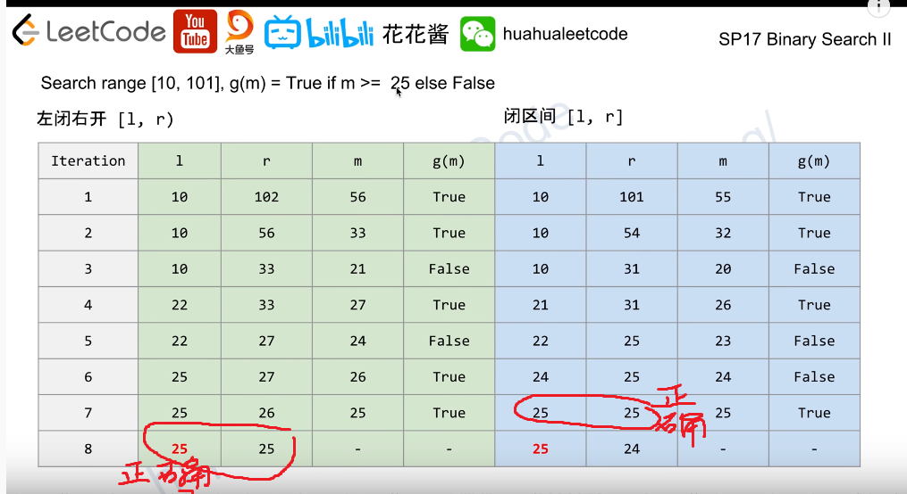

Solved Questions

DP：Dynamic Programming
BT：Backtracking

[TOC]
# 输入代码示例 002
```python=
import sys
n = sys.stdin.readline().split()
n = int(n[0])
#a = [ [] for _ in range(n)]
a = []
for i in range(n):
    line = sys.stdin.readline().split()
    for j in line:
        #a[i].append(int(j))
        a.append(int(j))
print(a)
```
# 讲过的题
## 2019/12/15 J
[39](#39-dfs解经典组合问题)， [127](#127-Word-Ladder)， [46](#46-排列组合)
## 2019/12/17
[93](#93-ip地址分段)，[994](#994-BFS腐烂橘子传播问题)，[78](#78（穷举所有子集）（DP？）), [90](#90（穷举所有子集带重复）)
## 2020/01/07
[79](#79-矩阵中找单词-（DFS）), [698](#698-数组分成和相等的小段), [77](#77-组合中特定长度的集合)
## 2020/01/09
[212](#212-word-search-类似79-棋盘寻找多个单词-（DFS-and-Trie）), [688](#688-♦“马”在棋盘上的概率（DP）), [542](#542-找到矩阵中各元素到0的距离（BFS）)
## 2020/01/12
[139](#139-分词（搜索做会超时，应该用DP）), [64](#64-矩阵左上走到右下最短路径和), [995](#995-连续翻转01数字问题)
## 2020/01/14
[996](#996-相邻平方数排列问题), [198](#198-抢劫不相邻的房子（DP）),[300](#300-最长递增子序列)
## 2020/01/17
[72](#72-Edit-distance-from-word1-to-word2-（DP双输入）), [673](#673-Number-of-Longest-Increasing-Subsequence), [823](#823-乘积二叉树)
## 2020/01/21
[312](#312-扎气球问题-O（n-3次方）-一维输入-dp问题), [121](#121-买卖股票（单买单卖）), [712](#712-删除字母以匹配，并求ASCII之和（DP）)
## 2020/01/25 J
[115](#115-O（mxn）dp-最长subsequence数目), [207](#207-课程表（graph-and-DFS）), [11](#11（最大蓄水问题）（两点法）)
## 2020/01/28 J
[133](#133-Clone-graph（BFS深拷贝无向图）), [785](#785-二分染色图), [210](#210-课程表2), [802](#802-找到安全状态（graph）)
## 2020/02/02
[997](#997-选法官（in-out-degrees）), [864](#864-迷宫找钥匙-（BFS-Dijkstra）), [743](#743-最大网络延时时间),[787](#787-最便宜机票（graph）)
## 2020/02/04
[864 dij解法](#864-迷宫找钥匙-（BFS-Dijkstra）), [332](#332-路线规划（graph-后序遍历）), [743 bellman解法](#743-最大网络延时时间)
## 2020/02/06
1192, [847](#847-最短路径遍历所有点), [743 (Floyd)](#743-最大网络延时时间)
## 2020/02/11
[959](#959-Regions-Cut-By-Slashes-（graph-和-union-set）), [684](#684-找出冗余的边（graph,-union-find）), 快排
## 2020/02/14
[94](#94-中序遍历), [98](#98-验证一棵树是否是二叉搜索树), [145](#145-后序遍历), [144](#144-前序遍历)
## 2020/02/15
复习 前三次
## 2020/02/18
100, [101](#101-镜像二叉树), [814](#814-二叉树剪枝), [655](#655-打印二叉树), [112](#112-树路径之和)
## 2020/02/21
968，[113](#113-树路径之和2)，105
## 2020/02/25
[297](#297-序列化与反序列化树)，508，124
## 2020/02/28
4, [378](#378-排序矩阵中第K小个数(BS)), 719
## 2020/03/08
99, 108
## DFS
#### Combination模板
```python=
nums=[...]
ans=[]
m=len(nums)
nums.sort()

# C(m,n)
func dfs(n,d,s,cur):
    if d==n:
        ans.append(cur[0:d])
        return
    for i=s to m-1:
        if i>s and nums[i]==nums[i-1]:
            continue        #去重
        cur[d]=nums[i]
        dfs(n,d+1,i+1,cur)
        #cur[d]=None    没有必要回溯，因为下次赋值会直接覆盖当前值且最终append的值是cur[0:d]
        ##hin: append&pop() 回溯不如直接赋值的回溯节省时间
        
for i=0 to m:        #调用dfs
    dfs(i,0,0,[None]*i)
```
-----------------------------------------------------------分割线-------------------------------
#### Permutation模板
```python=
nums=[...]
ans=[]
m=len(nums)
nums.sort()
used=[False]*m

# P(m,n)
func dfs(n,cur):
    if cur.size()==n:
        ans.append(cur)
        return
    
    for i=0 to m-1:
        if used[i]:    continue
        used[i]=True
        cur.append(nums[i])
        dfs(n,cur)
        cur.pop()
        used[i]=False
        
for i=0 to nums.size():
    dfs(i,[])
```
-----------------------------------------------------------分割线-------------------------------
#### 顺序填充棋盘问题 dfs模板
（输入为一个列表，dfs函数被要求直接在输入上进行数值填充）

leetcode 37 数独问题解答样例：
```python=
class Solution:
    def solveSudoku(self, board: List[List[str]]) -> None:
        """
        Do not return anything, modify board in-place instead.
        """
        def isValid(x,y): #判定函数，判断该格子填充是否合法
            tmp=board[x][y]
            board[x][y]='d'
            for i in range(9):
                if board[i][y]==tmp:
                    return False
                if board[x][i]==tmp:
                    return False
            for i in range(3):
                for j in range(3):
                    if board[int(x/3)*3+i][int(y/3)*3+j]==tmp:
                        return False
            board[x][y]=tmp
            return True
        
        def dfs(): #双重for循环遍历棋盘，dfs函数本身返回True or False
            for i in range(9):
                for j in range(9):
                    if board[i][j]=='.':
                        for k in '123456789':
                            board[i][j]=k
                            if isValid(i,j) and dfs():
                                return True
                            board[i][j]='.'
                        return False
                            
            return True   # 重要：边界条件的控制不再发生在头部，而是放在最后。如果边界条件在dfs()开头控制，棋盘最末尾的格子如果是先天填充好的会出错
        dfs()             
```
代码模板：
```python=
func valid(x,y,z):
    judge if it is valid to fill board[x][y] with value z
dfs():
    for i in row:
        for j in column:
            if board[i][j] should be filled: #判断该格子是否需要被填充
                for k in all possible filled value: #遍历所有可能填充值
                    if isvalid(x,y,k):
                        fill operation
                        if dfs(): #dfs调用+判断
                            return True
                        backtracking
                    return False #所有可能填充值都无法发展成合法的解，return false并在上一层调用中回溯
    return True #双重for循环全部结束，说明全部填充完毕，return True
                    
```
-----------------------------------------------------------分割线-------------------------------
#### 棋盘搜索问题 dfs模板
 （在已经填充好的棋盘上进行搜索，什么情况下用dfs：
 1）只需要单独解，找到一个解立刻返回即可，无需求出所有解
 2）已经知道解的长度，即已知dfs发展的层数
 在符合1） 2）两条件下应用dfs其时间复杂度和bfs相同，而且其空间复杂度优于bfs）
 leetcode 79 Word Search解答样例：
```python=
class Solution:
    def exist(self, board: List[List[str]], word: str) -> bool:
        xn=len(board)
        yn=len(board[0])
        n=len(word)
----------------------------------------------------------------------------
        def search(x,y,d):
            if x<0 or y<0 or x>=xn or y>=yn or board[x][y]!=word[d]: #x y超出边界或者当前xy数值不符合word，都是False
                return False
            if d==n-1: #通过上一个if的考验，且层数d达到n-1，那么return True
                return True
            tmp=board[x][y]
            board[x][y]=-1 #trick：先把当前数值赋值不合法的数，这样搜索不会走回头路
            
            flag=search(x-1,y,d+1) \
            or search(x+1,y,d+1) \
            or search(x,y+1,d+1) \
            or search(x,y-1,d+1)
            
            board[x][y]=tmp
            
            return flag #浅层递归的边界条件控制
----------------------------------------------------------------------------   
        for i in range(xn):
            for j in range(yn):
                if search(i,j,0): return True
        return False           
```

## BFS
#### 花花酱模板


```python=
q = new HashSet()
seen = new HashSet()
q.add(start)
steps = 0
while not q.empty():
    size = q.size()
    while size-- >0: 
        state=q.pop()
        if is_goal(state):
            return steps
        for new_state in expend(state):
            if not valid(new_state):
                continue
            q.add(new_state)
            seen.add(new_state)
    ++steps
return -1
```
#### 例题：迷宫找钥匙bfs leetcode864
#### 普通模板 127
```python=
class Solution:
    def ladderLength(self, beginWord: str, endWord: str, wordList: List[str]) -> int:
        wordList=set(wordList)
        q=[]
        q.append([beginWord,1])
        while q:
            word,step=q[0]
            del q[0]
            if word==endWord:
                return step
            for i in range(len(word)):
                for c in 'abcdefghijklmnopqrstuvwxyz':
                    nextWord=word[:i]+c+word[i+1:]
                    if nextWord in wordList:
                        wordList.remove(nextWord)
                        q.append([nextWord,step+1])
        return 0
```

#### 棋盘问题模板
```python=
994 BFS腐烂橘子传播问题
class Solution:
    def orangesRotting(self, grid: List[List[int]]) -> int:
        m=len(grid)
        n=len(grid[0])
        fresh=0
        q=[]
        for i in range(m):
            for j in range(n):
                if grid[i][j]==1:
                    fresh+=1
                elif grid[i][j]==2:
                    q.append([j,i])
                    
        dirs=[1,0,-1,0,1]
        days=0
        while q and fresh:
            for j in range(len(q)):
                x,y=q[0]
                del q[0]
                for i in range(4):
                    dx=x+dirs[i]
                    dy=y+dirs[i+1]
                    if dx<0 or dy<0 or dx>=n or dy>=m or grid[dy][dx]!=1:
                        continue
                    fresh-=1
                    grid[dy][dx]=2
                    q.append([dx,dy])
            days+=1
        
        return -1 if fresh>0 else days

-----------------------------------------------------------------
 542 找到矩阵中各元素到0的距离

class Solution:
    def updateMatrix(self, matrix):
        """
        :type matrix: List[List[int]]
        :rtype: List[List[int]]
        """
        h = len(matrix)
        w = len(matrix[0])
        queue = []
        count = 0
        for i in range(h):
            for j in range(w):
                if matrix[i][j] == 0:
                    queue.append((i,j))
                else:
                    matrix[i][j] = float("inf")
                    count +=1
        for row, col in queue:
            if count == 0:
                break
            dist = matrix[row][col] + 1
            for dy, dx in [(-1, 0), (1, 0), (0, -1), (0, 1)]:
                r = row + dy
                c = col + dx
                if 0 <= r < h and 0 <= c < w and dist < matrix[r][c]:
                    matrix[r][c] = dist
                    queue.append((r,c))
                    count -= 1

        return matrix
```

## DP

#### 复杂二维DP 复杂度O(2^n) (dfs复杂度O(n!)+prunning)
```python=
#第一步：构建图中两两节点之间的联系，建立一个nxn的二维list，g[i][j]代表i节点之后跟j节点所需要花费的cost
for i in range(n):
    for j in range(n): #双向图
    for j in range(i+1,n): #无向图
        g[i][j]......
        
#第二步：构建dp二维list，大小是(1<<n)x(n),行数代表所有的状态数，列数代表每个状态下最后一位是哪个节点，初始化dp的时候，一般只需要初始化dp[1<<i][i]=1/-1/0/sys.maxsize
for i in range(n):
    if A[i]!=A[i-1] or i==0: #去重起点
        dp[1<<i][i]=1 or xxxxxx #初始化所有起点
        
#第三步：三重for循环 核心
for s: #第一重循环状态
    for i: #第二重循环s状态下最后一个节点
        #一般在该环节要pruning，把不在s状态里面的i节点continue跳过；有时候是把dp[s][i]=0的状态剪枝掉，因为说明根据第一步构建的g图来看，该状态路径永远不可能达成
        for j: #第三重循环，s状态下并且以i作为最后一个节点的情况下，下一个节点j的可能性操作：包括:
            if g[i][j] not working, continue
            if j already in status s, continue
            if j>0 and A[j-1]==A[j] and (the node j-1 not in status s) continue #去重，在众多相同值中只使用第一个A[j]
                dp[s|(1<<j)]=... #进行操作
                
#第四步：根据题目要求提取最后一个状态s=(1<<n)-1进行操作(对dp[s][0]--dp[s][n-1]进行操作)
```
#### 一维DP：记忆化递归或DP列表记录状态  O(n)复杂度 一维
```python=

```

#### 一维DP：记忆化递归或DP列表记录状态  O(n^2)复杂度 一维  （139 818）
例子139 DP方法 DP开辟数组分割 开辟f数组记录从0到每一个状态是否可分割
```python=
class Solution:
    def wordBreak(self, s: str, wordDict: List[str]) -> bool:
        n=len(s)
        s=" "+s
        f=[0]*(n+1)
        f[0]=1
        
        for i in range(1,n+1):
            for j in range(i):
                if f[j]==1:
                    if s[j+1:i+1] in wordDict:
                        f[i]=1
                        break
                        
        return f[-1]
```
例139 记忆化递归 m字典来记忆每一步递归函数得到的结果
```python=
class Solution:
    def wordBreak(self, s: str, wordDict: List[str]) -> bool:
        def canBreak(s,wordDict,m):
            
            if s in wordDict:
                m[s]=True
                return True
            if s in m:
                return m[s]
            for i in range(1,len(s)):
                l=s[:i]
                if l in wordDict and canBreak(s[i:],wordDict,m):
                    m[s]=True
                    return True
            m[s]=False
            return False
        return canBreak(s,wordDict,{})
``` 
一维输入 复杂度O(n^2) DP模板：
```python=
Template

dp =new int[n]                # init DP array
for i=1 to n:                 # problem size
    for j=1 to i-1:           # sub-problem size
        # IMPORTANT
        dp[i]=max/min(dp[i], f(dp[j]))    # find the opt sol from all opt sols of smaller problems
return dp[n]
``` 
#### 双一维输入 复杂度O(n*m)
一维DP，双输入，一个输入m长数组，一个输入n长数组，需要建立m x n大小的dp列表
例子：Leetcode 72
```python=
class Solution:
    def minDistance(self, word1: str, word2: str) -> int:
        l1=len(word1)+1
        l2=len(word2)+1
        dp=[[0]*l2 for _ in range(l1)]
        for i in range(l1):
            dp[i][0]=i
        for j in range(l2):
            dp[0][j]=j
        for i in range(1,l1):
            for j in range(1,l2):
                if word1[i-1]==word2[j-1]:
                    dp[i][j]=dp[i-1][j-1]
                else:    
                    dp[i][j]=1+min(dp[i-1][j],dp[i-1][j-1],dp[i][j-1])
        return dp[-1][-1]
```

关键是推出dp[i][j]=f(dp[i-1][j],dp[i][j-1],dp[i-1][j-1])关系
以及初始化所有dp[0][j],dp[i][0]
一维DP双输入模板：
```clike=
dp=new int[][]        #init DP array
for i=1 to n:         #problem size of input1
  for j=1 to m:        #problem size of input2
    dp[i][j]=f(dp[i-1][j],dp[i][j-1],dp[i-1][j-1])
return dp[n][m]
``` 
#### 一维输入 复杂度O(n^3)
例312 扎气球问题 一维输入 三重循环 时间复杂度O(n^3)
```python=
class Solution:
    def maxCoins(self, nums: List[int]) -> int:
        n=len(nums)
        nums=[1]+nums+[1]
        dp=[[0]*(n+2) for _ in range(n+2)]
        for l in range(1,n+1):
            for i in range(1,n-l+2):
                j=i+l-1
                if i==j:
                    dp[i][j]=nums[i]*nums[i-1]*nums[i+1]
                for k in range(i,j+1):
                    dp[i][j]=max(dp[i][j],dp[i][k-1]+dp[k+1][j]+nums[k]*nums[i-1]*nums[j+1])
                    
        return dp[1][n]
            
``` 
DP: 一维输入 三重循环 时间复杂度O(n^3) 模板：
```python=
Template

dp = new int[n][m]                # init a 2D array
for l = 1 to n:                   # problem size
    for i = 1 to n-l+1:           # sub-problem start
        j = i + l - 1             # sub-problem end
        for k = i to j:           # try all possible break points
            # 递推公式这句最重要，注意下标k因题而异
            dp[i][j] = max(dp[i][j], f(dp[i][k], dp[k][j]))    # merge two subproblems  IMPORTANT
return dp[1][n]
``` 
## Binary Search
二分搜索本质：试图找到第一个（最小的那个）符合g(x)的值，一般最终应该返回的答案会是x或者x-1，模板如下，对于cpp和java推荐使用第二种左闭右闭的方法，以防止出现数值过大溢出的情况。

求解upper_bound和lower_bound函数：注意一点》》》在写upper_bound函数的时候，其中的r是A的长度len(A)而不是len(A)-1，(因为下图花花酱写upperlowerbound函数的方法实际上是用的上图图一中的左闭右开的方法，所以r是长度而不是最后一个元素的角标)

注意：非常重要，无论左闭右开还是左闭右闭，最终正确结果是l，最后一个符合条件的情况是l=r。对于左闭右开，返回l，此时r一定=l.对于左闭右闭，返回l，此时r一定不等于l，此时必须按照题目规则算出l==r时候各个参数才为符合条件最小的那个正确情况。对于python，比较好的选择是直接用左闭右开。


有时候不用左闭右开或者左闭右闭模板，直接用最原始的模板如下，之间判断是否符合return条件，比如33题》


## 关于位运算的理解

或运算一般是用来加数或赋值（比如000和010或运算来赋值）与运算一般用来清零或者取值（比如864题取低八位，a&0xff）异或运算一般用来反转位，和1异或是反转，和0是不反转

# Leetcode
## 4 二分法求中位数
```python=
class Solution(object):
    def findMedianSortedArrays(self, A, B):
        """
        :type A: List[int]
        :type BB: List[int]
        :rtype: float
        """
        m, n = len(A), len(B)
        if m>n:
            m,n=n,m
            A,B=B,A
        mid=int((m+n+1)/2)
        l,r=0,m
        while l<r:
            ma=int(l+(r-l)/2)
            mb=mid-ma
            if A[ma]>=B[mb-1]:
                r=ma
            else:
                l=ma+1
        ma,mb=l-1,mid-l-1 #ma: middle index of A, mb: middle index of B, so need to -1
        c1=max(A[ma] if ma>=0 else -float('inf'), B[mb] if mb>=0 else -float('inf'))
        if (m+n)%2:
            return c1
        c2=min(A[ma+1] if ma+1<m else float('inf'), B[mb+1] if mb+1<n else float('inf'))
        return (c1+c2)/2
```
## 11（最大蓄水问题）（两点法）
两端为起点往中间聚拢
```python=
class Solution(object):
    def maxArea(self, height):
        """
        :type height: List[int]
        :rtype: int
        """
        water = 0
        i = 0
        j = len(height) - 1
        while i < j:
            water = max(water, min(height[i], height[j])*(j-i))
            if height[i] > height[j]: # move the shorter side
                j -= 1
            else:
                i += 1
        return water
```
## 39 dfs解经典组合问题
```python=
class Solution:
    def combinationSum(self, candidates: List[int], target: int) -> List[List[int]]:#此部分为主函数，调用一次dfs函数即可
        candidates.sort()
        ans=[]
        self.dfs(candidates,target,0,[],ans)
        return ans
    
    def dfs(self,candidates,target,s,cur,ans):
        if target==0:#
            #ans.append(cur[:]) 此处注意如果cur是每次用append来追加新元素的话，需要加[:]
            ans.append(cur)
            return
        for i in range(s,len(candidates)):
            if candidates[i]>target:
                break
            #cur.append(candidates[i])
            self.dfs(candidates,target-candidates[i],i,cur+[candidates[i]],ans)
            #cur.pop()
            
```
XPY解法
```python=
class Solution(object):
    def combinationSum(self, candidates, target):
        candidates.sort()
        ans = []
        n = len(candidates)
        
        def dfs(curr, target, starter): # starter 用来防止重复取之前的元素
            if target == 0:
                ans.append(curr[:])
            for i in range(starter, n):
                if candidates[i] <= target:
                    dfs(curr + [candidates[i]], target - candidates[i], i)
                else:
                    break
        curr = []  
        starter = 0
        dfs(curr[:], target, starter)
        return ans
```
## 46 排列组合
XPY解法
```python=
class Solution(object):
    def permute(self, nums):
        """
        :type nums: List[int]
        :rtype: List[List[int]]
        """
        ans = []
        def dfs(curr, nums):
            if len(nums) <= 1:
                ans.append(curr + nums)
            else:
                for i in range(len(nums)):
                    dfs(curr + [nums[i]], nums[:i] + nums[i+1:])
        dfs([], nums)
        return ans
```
YJC
```python=
class Solution:
    def permute(self, nums: List[int]) -> List[List[int]]:

        """
        :type nums: List[int]
        :rtype: List[List[int]]
        """
        if len(nums)<=1:
            return [nums]
        res = []
        for i in range(len(nums)):
            rest = nums[:i]+nums[i+1:]
            for p in self.permute(rest):
                res.append([nums[i]]+p)
        return res 
```
JP 普通dfs
```python=
class Solution:
    def permute(self, nums: List[int]) -> List[List[int]]:
        n=len(nums)
        ans=[]
        visited=[0]*n
        self.dfs(nums,n,0,visited,[],ans)
        return ans
    
    def dfs(self,nums,n,d,visited,cur,ans):
        if d==n:
            ans.append(cur[:])
            return
        for i in range(n):
            if visited[i]==1:
                continue
            visited[i]=1
            cur.append(nums[i])
            self.dfs(nums,n,d+1,visited,cur,ans)
            cur.pop()
            visited[i]=0
```
## 64 矩阵左上走到右下最短路径和
Solution 1: dp列表
```python=
class Solution():
    def minPathSum(self, grid):
        m = len(grid)
        n = len(grid[0])
        for i in range(1, n):
            grid[0][i] += grid[0][i-1]
        for i in range(1, m):
            grid[i][0] += grid[i-1][0]
        for i in range(1, m):
            for j in range(1, n):
                grid[i][j] += min(grid[i-1][j], grid[i][j-1])
        return grid[-1][-1]
```
Solution 2: 记忆化递归
```python==
class Solution:
    def minPathSum(self, grid: List[List[int]]) -> int:
        m=len(grid)
        n=len(grid[0])
        s=[[-1]*n for _ in range(m)]
        def memory(x,y):
            if x==0 and y==0:
                #s[x][y]=grid[x][y]
                return grid[x][y]
            if x<0 or y<0:
                return sys.maxsize
            if s[x][y]!=-1:
                return s[x][y]
            ans=grid[x][y]+min(memory(x-1,y),memory(x,y-1))
            s[x][y]=ans
            return ans
        return memory(m-1,n-1)

```
## 72 Edit distance from word1 to word2 （DP双输入）
dp方法如下
```python=
class Solution:
    def minDistance(self, word1: str, word2: str) -> int:
        l1=len(word1)+1
        l2=len(word2)+1
        dp=[[0]*l2 for _ in range(l1)]
        for i in range(l1):
            dp[i][0]=i
        for j in range(l2):
            dp[0][j]=j
        for i in range(1,l1):
            for j in range(1,l2):
                if word1[i-1]==word2[j-1]:
                    dp[i][j]=dp[i-1][j-1]
                else:    
                    dp[i][j]=1+min(dp[i-1][j],dp[i-1][j-1],dp[i][j-1])
        return dp[-1][-1]
```
## 77 组合中特定长度的集合
方法1：DFS，照着模板修改
```python=
class Solution(object):
    def combine(self, n, k):
        """
        :type n: int
        :type k: int
        :rtype: List[List[int]]
        """
        res = []
        self.dfs(range(1, n+1), 0, k, [], res)
        return res

    def dfs(self, nums, index, k, temp, res):
        if k == 0:
            res.append(temp)
            return
        for i in range(index, len(nums)):
            self.dfs(nums, i+1, k-1, temp+[nums[i]], res)
```
方法2：回溯法
```python=
class Solution(object):
    def combine(self, n, k):
        def backtrack(first = 1, curr = []):
            # if the combination is done
            if len(curr) == k:  
                output.append(curr[:]) # [:] is necessary rather than curr
                return
            for i in range(first, n + 1):
                # add i into the current combination
                curr.append(i)
                # use next integers to complete the combination
                backtrack(i + 1, curr)
                # backtrack
                curr.pop()
        
        output = []
        backtrack()
        return output
```
优化剪枝
```python=
class Solution(object):
    def combine(self, n, k):
        """
        :type n: int
        :type k: int
        :rtype: List[List[int]]
        """
        ans = []
        stack = []
        x = 1
        while True:
            l = len(stack)
            if l == k:
                ans.append(stack[:])
            if l == k or x > n - k + l + 1:
                if not stack:
                    return ans
                x = stack.pop() + 1
            else:
                stack.append(x)
                x += 1
```
## 78（穷举所有子集）（DP？）
方法一：DP？
```python=
class Solution(object):
    def subsets(self, nums):
        """
        :type nums: List[int]
        :rtype: List[List[int]]
        """
        res = [[]]
        for num in nums:
            for pre in res[:]: # [:] is necessary
                res.append(pre+[num])
        return res
```
方法二：DFS
```python=
class Solution(object):
    def subsets(self, nums):
        """
        :type nums: List[int]
        :rtype: List[List[int]]
        """
        res = []
        nums.sort()
        self.dfs(nums, 0, [], res)
        return res

    def dfs(self, nums, index, temp, res):
        res.append(temp)
        for i in range(index, len(nums)):
            self.dfs(nums, i+1, temp+[nums[i]], res)
```
## 79 矩阵中找单词 （DFS）
XPY
```python=
class Solution(object):
    def exist(self, board, word):
        """
        :type board: List[List[str]]
        :type word: str
        :rtype: bool
        """
        def dfs(string, n, m, boolmap):
            if len(string)==0:
                return True
            elif n <0 or n>=N or m<0 or m>=M or boolmap[n][m]==False or string[0] != board[n][m]:
                return False
            else:
                boolmap[n][m] = False
                ans = dfs(string[1:], n-1, m, boolmap) or \
                      dfs(string[1:], n+1, m, boolmap) or \
                      dfs(string[1:], n, m-1, boolmap) or \
                      dfs(string[1:], n, m+1, boolmap)
                boolmap[n][m] = True
            return ans
                
                
        N = len(board)
        M = len(board[0])
        boolmap = [[True for _ in range(M)] for _ in range(N)]
        res = False
        for i in range(N):
            for j in range(M):
                if word[0] == board[i][j]:
                    if dfs(word, i, j, boolmap):
                        return True
        return res
```
JP
```python=
class Solution:
    def exist(self, board: List[List[str]], word: str) -> bool:
        xn=len(board)
        yn=len(board[0])
        n=len(word)
        
        def search(x,y,d):
            if x<0 or y<0 or x>=xn or y>=yn or board[x][y]!=word[d]: #x y超出边界或者当前xy数值不符合word，都是False
                return False
            if d==n-1: #通过上一个if的考验，且层数d达到n-1，那么return True
                return True
            tmp=board[x][y]
            board[x][y]=-1 #trick：先把当前数值赋值不合法的数，这样搜索不会走回头路
            flag=search(x-1,y,d+1) or search(x+1,y,d+1) or search(x,y+1,d+1) or search(x,y-1,d+1)
            board[x][y]=tmp
            
            return flag #浅层递归的边界条件控制
        
        for i in range(xn):
            for j in range(yn):
                if search(i,j,0): return True
        return False
```
## 90（穷举所有子集带重复）
方法一：78题+set
```python=
class Solution(object):
    def subsetsWithDup(self, nums):
        """
        :type nums: List[int]
        :rtype: List[List[int]]
        """
        res = [[]]
        nums.sort()
        for num in nums:
            for pre in res[:]: # [:] is necessary
                res.append(pre+[num])
        ans = set()
        for com in res:
            ans.add(tuple(com))
        return ans

```
方法二：DFS
```python= 
class Solution(object):
    def subsetsWithDup(self, nums):
 
        res = []
        nums.sort()
        self.dfs(nums, 0, [], res)
        return res

    def dfs(self, nums, index, temp, res):
        res.append(temp)
        for i in range(index, len(nums)):
            if nums[i] == nums[i-1] and i > index: 
            # 如果遇到重复的数字（如[1,2,2]中遇到第二个2，即nums[i] == nums[i-1]），
            # 当index指向第一个2，i指向第二个2（i > index），那么这种情况不行，因为[1,2]和[1,2]会重复；
            # 当index 和 i 都指向第二个2（index == i），这种情况要有，即[1,2,2]
                continue
            self.dfs(nums, i+1, temp+[nums[i]], res)
```
## 93 ip地址分段
三种写法
方法一：
```python=
def restoreIpAddresses(self, s: str) -> List[str]:
    res = []
    self.restoreHelper(res, s, '', 0)
    return res

def restoreHelper(self, result, s, current, field):
    if field == 4 and len(s) == 0:
        result.append(current[1:])
        # return result
    elif len(s)!=0 and field < 4:
        self.restoreHelper(result, s[1:], current+"."+s[0], field+1)
        if s[0] != "0" and len(s) > 1:
            self.restoreHelper(result, s[2:], current+"."+s[0:2], field +1)
            if len(s) > 2 and int(s[0:3])<=255:
                self.restoreHelper(result, s[3:], current+"."+s[0:3], field+1)
```
方法二：
```python=
def restoreIpAddresses(self, s: str) -> List[str]:
     res = []
     self.restoreHelper(res, s, 0, '', 0)
     return res
def restoreHelper(self, result, s, index,  curr, field):
    if field == 4:
        if index == len(s):
            result.append(curr[1:])
        return result

    for i in range(1,4):
        if index + i > len(s):
            break
        if i!=1 and s[index] == "0":
            break
        temp = s[index:index+i]
        val = int(temp)
        if val <= 255:
            self.restoreHelper(result, s, index + i, curr + "." + temp, field + 1)
```
方法三，for循环暴力：
```python=
def restoreIpAddresses(self, s):
# """
# :type s: str
# :rtype: List[str]
# """
    res = []
    for a in range(1,4):
        for b in range(1,4):
            for c in range(1,4):
                for d in range(1,4):
                    if a+b+c+d == len(s):
                        A = s[0:a]
                        if len(A) > 1 and A[0] == '0':
                            continue
                        B = s[a:a+b]
                        if len(B) > 1 and B[0] == '0':
                            continue
                        C = s[a+b:a+b+c]
                        if len(C) > 1 and C[0] == '0':
                            continue
                        D = s[a+b+c:a+b+c+d]
                        if len(D) > 1 and D[0] == '0':
                            continue
                        if int(A) <= 255 and int(B) <= 255 and int(C) <= 255 and int(D) <= 255:
                            res.append(str(A)+"."+str(B)+"."+str(C)+"."+str(D))
    return res
```
## 94 中序遍历
```python=
class Solution:
    # method 1
    def inorderTraversal(self, root: TreeNode) -> List[int]:
        res = []
        self.dfs(root, res)
        return res
    def dfs(self, root, res):
        if root is not None:
            self.dfs(root.left, res)
            res.append(root.val)
            self.dfs(root.right, res)
    # method 2
    def inorderTraversal(self, root):
        res, stack = [], []
        while True:
            while root is not None:
                stack.append(root)
                root = root.left
            if stack == []:
                return res
            else:
                node = stack.pop() # pop 出来表示左子树被处理过了
                res.append(node.val)
                root = node.right
```
stack method:
```python=
class Solution:
    def inorderTraversal(self, root: TreeNode) -> List[int]:
        curr=root
        res=[]
        stack=collections.deque()
        while stack or curr:
            while curr!=None:
                stack.append(curr)
                curr=curr.left
            curr=stack.pop()
            res.append(curr.val)
            curr=curr.right
        return res
```
## 98 验证一棵树是否是二叉搜索树
二叉搜索树：
· 节点的左子树只包含小于当前节点的数。
· 节点的右子树只包含大于当前节点的数。
· 所有左子树和右子树自身必须也是二叉搜索树。
```python=
class Solution(object):
    def isValidBST(self, root):
        """
        :type root: TreeNode
        :rtype: bool
        """
        return self.helper(root, -float('inf'), float('inf'))
    
    def helper(self, node, lower_bound, upper_bound):
        if node == None:
            return True
        if node.val <= lower_bound or node.val >= upper_bound:
            return False
        left = self.helper(node.left, lower_bound, node.val)
        right = self.helper(node.right, node.val, upper_bound)
        return left and right
```
## 99 BST两节点对调
https://leetcode.com/problems/recover-binary-search-tree/discuss/533030/Java-Simple-In-Order-Traversal-constant-space-with-detailed-explanation
将该问题转换为一串数组的滑动窗口问题，只不过遍历顺序为中序遍历，而操作的code则写在left自调用与right自调用之间
```python=
class Solution:
    def recoverTree(self, root: TreeNode) -> None:
        """
        Do not return anything, modify root in-place instead.
        """
        self.first=None
        self.second=None
        self.pre=None
        self.helper(root)
        self.first.val,self.second.val=self.second.val,self.first.val
    
    def helper(self,root):
        if not root: return
        self.helper(root.left)
        if self.pre and self.pre.val>=root.val:
            if not self.first:
                self.first=self.pre
            self.second=root
        self.pre=root
        self.helper(root.right)
```
## 101 镜像二叉树
recursive method 1:
```python=
class Solution:
    def isSymmetric(self, root: TreeNode) -> bool:
        def mirror(a,b):
            if not a and not b:
                return True
            if not a or not b:
                return False
            if not a.val==b.val:
                return False
            return mirror(a.left,b.right) and mirror(a.right,b.left)
        return mirror(root,root)
```
stack method 2:
```python=
class Solution:
    def isSymmetric(self, root: TreeNode) -> bool:
        q=collections.deque()
        q.append(root)
        q.append(root)
        while q:
            root1=q.pop()
            root2=q.pop()
            if not root1 and not root2:
                continue
            if not root1 or not root2:
                return False
            if not root1.val==root2.val:
                return False
            q.append(root1.left)
            q.append(root2.right)
            q.append(root1.right)
            q.append(root2.left)
        return True
```

## 105 根据前序中序重建二叉树
普通版
```python=
class Solution(object):
    def buildTree(self, preorder, inorder):
        if inorder:
            ind = inorder.index(preorder.pop(0))
            root = TreeNode(inorder[ind])
            root.left = self.buildTree(preorder, inorder[0:ind])
            root.right = self.buildTree(preorder, inorder[ind+1:])
            return root
```
神级版
https://leetcode.com/problems/construct-binary-tree-from-preorder-and-inorder-traversal/discuss/34543/Simple-O(n)-without-map
```python=
def buildTree(self, preorder, inorder):
    def build(stop):
        if inorder and inorder[-1] != stop:
            root = TreeNode(preorder.pop())
            root.left = build(root.val)
            inorder.pop()
            root.right = build(stop)
            return root
    preorder.reverse()
    inorder.reverse()
    return build(None)
```
## 108 根据排序数组构建BST
```python=
class Solution(object):
    def sortedArrayToBST(self, nums):
        """
        :type nums: List[int]
        :rtype: TreeNode
        """
        if len(nums) == 0:
            return None
        mid = len(nums) // 2
        root = TreeNode(nums[mid])
        root.left = self.sortedArrayToBST(nums[:mid])
        root.right = self.sortedArrayToBST(nums[mid+1:])
        return root
```
## 112 树路径之和
```python=
# Definition for a binary tree node.
# class TreeNode:
#     def __init__(self, x):
#         self.val = x
#         self.left = None
#         self.right = None

class Solution:
    def hasPathSum(self, root: TreeNode, sum: int) -> bool:
        if root is None:
            return False
        if root.left is None and root.right is None:
            return root.val==sum
        new_sum = sum - root.val
        
        return self.hasPathSum(root.left, new_sum) or self.hasPathSum(root.right, new_sum)
```


## 113 树路径之和2
```python=
# Definition for a binary tree node.
# class TreeNode:
#     def __init__(self, x):
#         self.val = x
#         self.left = None
#         self.right = None

class Solution:
    def pathSum(self, root: TreeNode, sum: int) -> List[List[int]]:
        res = []
        curr = []
        self.helper(root, sum, curr, res)
        return res
    
    def helper(self, root: TreeNode, sum, curr, res):
        if root is None: return
        if root.left is None and root.right is None:
            if root.val == sum:
                curr.append(root.val)
                res.append(curr)
        new_sum = sum - root.val
        self.helper(root.left, new_sum, curr+[root.val], res)
        self.helper(root.right, new_sum, curr+[root.val], res)
```
## 115 O（mxn）dp 最长subsequence数目


```python=
class Solution:
    def numDistinct(self, s: str, t: str) -> int:
        m=len(s)+1
        n=len(t)+1
        dp=[[0]*n for _ in range(m)]   
        for i in range(m):
            dp[i][0]=1
        for i in range(1,m):
            for j in range(1,n):
                if s[i-1]==t[j-1]:
                    dp[i][j]=dp[i-1][j-1]+dp[i-1][j]
                else:
                    dp[i][j]=dp[i-1][j]
        return dp[-1][-1]
```
## 121 买卖股票（单买单卖）
```python=
class Solution:
    def maxProfit(self, prices: List[int]) -> int:
        if prices == []:
            return 0        
        min_price = prices[0]
        max_profit = 0
        for i in range(1,len(prices)):
            min_price = min(min_price, prices[i])
            max_profit = max(max_profit, prices[i] - min_price)
        
        return max_profit
```
## 124 查找树的最大路径和
```python=
class Solution(object):
    def maxPathSum(self, root):
        """
        :type root: TreeNode
        :rtype: int
        """
        if root == None:
            return 0
        self.ans = -float("inf")
        self.max_sum(root)
        return self.ans
        
    def max_sum(self, node):
        if node == None:
            return 0
        l = max(0, self.max_sum(node.left))
        r = max(0, self.max_sum(node.right))
        sum = l + r + node.val
        self.ans = max(self.ans, sum)
        return max(l, r) + node.val
```
## 127 Word Ladder
XPY
```python=
class Solution(object):
    def ladderLength(self, beg, end, wordl):
        """
        :type beginWord: str
        :type endWord: str
        :type wordList: List[str]
        :rtype: int
        """
        # # 单向宽度搜索
        # wordl = set(wordl)
        # q = collections.deque([[beg, 1]])
        # while q:
        #     word, deep = q.popleft()
        #     if word == end:
        #         return deep
        #     for i in range(len(word)):
        #         for c in 'abcdefghijklmnopqrstuvwxyz':
        #             nex = word[:i] + c + word[i+1:]
        #             if nex in wordl:
        #                 wordl.remove(nex) #剪枝，兜了一圈重复访问要被剪掉
        #                 q.append([nex, deep + 1])
        # return 0
        
        # 剪枝版单向宽度优先搜索，缩小了搜索范围
        from collections import deque, defaultdict
        all_combons = defaultdict(list)
        if end not in wordl:
            return 0
        for word in wordl:
            for i in range(len(word)):
                all_combons[word[:i] + "*" + word[i+1:]].append(word) # 这个语句如果不用defaultdict会报错
        q = deque([(beg, 1)])
        visited = set(beg)
        while q:
            curr_word, deep = q.popleft()
            for i in range(len(curr_word)):
                middle_words = all_combons[curr_word[:i] + "*" + curr_word[i+1:]]
                for word in middle_words:
                    if word == end:
                        return deep + 1 # +1是因为：如果hit -> hot，那么长度为2
                    if word not in visited:
                        visited.add(word)
                        q.append((word, deep+1))
        return 0

        # 双向宽度优先搜索
        
        
# from collections import defaultdict
# class Solution(object):
#     def __init__(self):
#         self.length = 0
#         # Dictionary to hold combination of words that can be formed,
#         # from any given word. By changing one letter at a time.
#         self.all_combo_dict = defaultdict(list)

#     def visitWordNode(self, queue, visited, others_visited):
#         current_word, level = queue.popleft()
#         for i in range(self.length):
#             # Intermediate words for current word
#             intermediate_word = current_word[:i] + "*" + current_word[i+1:]

#             # Next states are all the words which share the same intermediate state.
#             for word in self.all_combo_dict[intermediate_word]:
#                 # If the intermediate state/word has already been visited from the
#                 # other parallel traversal this means we have found the answer.
#                 if word in others_visited:
#                     return level + others_visited[word]
#                 if word not in visited:
#                     # Save the level as the value of the dictionary, to save number of hops.
#                     visited[word] = level + 1
#                     queue.append((word, level + 1))
#         return None

#     def ladderLength(self, beginWord, endWord, wordList):
#         """
#         :type beginWord: str
#         :type endWord: str
#         :type wordList: List[str]
#         :rtype: int
#         """

#         if endWord not in wordList or not endWord or not beginWord or not wordList:
#             return 0

#         # Since all words are of same length.
#         self.length = len(beginWord)

#         for word in wordList:
#             for i in range(self.length):
#                 # Key is the generic word
#                 # Value is a list of words which have the same intermediate generic word.
#                 self.all_combo_dict[word[:i] + "*" + word[i+1:]].append(word)


#         # Queues for birdirectional BFS
#         queue_begin = collections.deque([(beginWord, 1)]) # BFS starting from beginWord
#         queue_end = collections.deque([(endWord, 1)]) # BFS starting from endWord

#         # Visited to make sure we don't repeat processing same word
#         visited_begin = {beginWord: 1}
#         visited_end = {endWord: 1}
#         ans = None

#         # We do a birdirectional search starting one pointer from begin
#         # word and one pointer from end word. Hopping one by one.
#         while queue_begin and queue_end:

#             # One hop from begin word
#             ans = self.visitWordNode(queue_begin, visited_begin, visited_end)
#             if ans:
#                 return ans
#             # One hop from end word
#             ans = self.visitWordNode(queue_end, visited_end, visited_begin)
#             if ans:
#                 return ans

#         return 0
```
JP
```python=
class Solution:
    def ladderLength(self, beginWord: str, endWord: str, wordList: List[str]) -> int:
        Map={}
        wordList=set(wordList)
        for i in wordList:
            for j in range(len(i)):
                Map_word=i[:j]+'*'+i[j+1:]
                if Map_word not in Map:
                    Map[Map_word]=[]
                Map[Map_word].append(i)
        
        q=[]
        q.append([beginWord,1])
        while q:
            curr_word,deep=q[0]
            del q[0]
            if curr_word==endWord:
                return deep
            for i in range(len(curr_word)):
                map_word=curr_word[:i]+'*'+curr_word[i+1:]
                if map_word in Map:
                    for k in Map[map_word]:
                        if k in wordList:
                            q.append([k,deep+1])
                            wordList.remove(k)
        return 0
```
```python=
class Solution:
    def ladderLength(self, beginWord: str, endWord: str, wordList: List[str]) -> int:
        wordList=set(wordList)
        q=[]
        q.append([beginWord,1])
        while q:
            word,step=q[0]
            del q[0]
            if word==endWord:
                return step
            for i in range(len(word)):
                for c in 'abcdefghijklmnopqrstuvwxyz':
                    nextWord=word[:i]+c+word[i+1:]
                    if nextWord in wordList:
                        wordList.remove(nextWord)
                        q.append([nextWord,step+1])
        return 0
```
## 133 Clone graph（BFS深拷贝无向图）
```python=
"""
# Definition for a Node.
class Node:
    def __init__(self, val = 0, neighbors = []):
        self.val = val
        self.neighbors = neighbors
"""
class Solution:
    def cloneGraph(self, node: 'Node') -> 'Node':
        if not node:
            return None
        
        queue = collections.deque()
        queue.append(node)
        
        visited = {}
        rtn = Node(node.val, [])
        visited[node] = rtn
        
        while queue:
            curNode = queue.popleft()
            copyNode = visited[curNode]
            for n in curNode.neighbors:
                if n not in visited:
                    queue.append(n)
                    nNode = Node(n.val, [])
                    copyNode.neighbors.append(nNode)
                    visited[n] = nNode
                else:
                    nNode = visited[n]
                    copyNode.neighbors.append(nNode)
        return rtn
```
## 139 分词（搜索做会超时，应该用DP）

DP--1
```python=
class Solution(object):
    def wordBreak(self, s, wordDict):
        """
        :type s: str
        :type wordDict: List[str]
        :rtype: bool
        """
        s = " " + s
        l = len(s)
        dp = [0 for _ in range(l)]
        dp[0] = 1
        words = set(wordDict)
        
        for i in range(1, l):
            for j in range(i):
                if dp[j] == 1:
                    if s[j+1:i+1] in words:
                        dp[i] = 1
                        break
        return bool(dp[-1])
```
DP--2
```python=
class Solution(object):
    def wordBreak(self, s, wordDict):
        """
        :type s: str
        :type wordDict: List[str]
        :rtype: bool
        """
        n = len(s)
        dp = [True] + [False] * n
        for i in range(1, n+1): 
            for word in wordDict: 
                w = len(word)
                if i-w>=0 and dp[i-w] and s[(i-w):i]==word: 
                    dp[i] = True
                    break 
        return dp[-1]
```
JP DP开辟数组分割 开辟f数组记录从0到每一个状态是否可分割
```python=
class Solution:
    def wordBreak(self, s: str, wordDict: List[str]) -> bool:
        n=len(s)
        s=" "+s
        f=[0]*(n+1)
        f[0]=1
        
        for i in range(1,n+1):
            for j in range(i):
                if f[j]==1:
                    if s[j+1:i+1] in wordDict:
                        f[i]=1
                        break
                        
        return f[-1]
```
JP 记忆化递归 m字典来记忆每一步递归函数得到的结果
```python=
class Solution:
    def wordBreak(self, s: str, wordDict: List[str]) -> bool:
        def canBreak(s,wordDict,m):
            
            if s in wordDict:
                m[s]=True
                return True
            if s in m:
                return m[s]
            for i in range(1,len(s)):
                l=s[:i]
                if l in wordDict and canBreak(s[i:],wordDict,m):
                    m[s]=True
                    return True
            m[s]=False
            return False
        return canBreak(s,wordDict,{})
```
## 144 前序遍历
method 1 recursive:
```python=
class Solution:
    def preorderTraversal(self, root: TreeNode) -> List[int]:
        def preorder(root,res):
            if not root:
                return
            res.append(root.val)
            preorder(root.left,res)
            preorder(root.right,res)
            
        res=[]
        preorder(root,res)
        return res
```
method 2 stack:
```python=
class Solution:
    def preorderTraversal(self, root: TreeNode) -> List[int]:
        
        stack=collections.deque()
        res=[]
        curr=root
        while curr or stack:
            while curr:
                stack.append(curr)
                res.append(curr.val)
                curr=curr.left
                
            curr=stack.pop()
            curr=curr.right
        return res
```
## 145 后序遍历
method 1 recursive:
```python=
class Solution:
    def postorderTraversal(self, root: TreeNode) -> List[int]:
        def postorder(root,res):
            if not root:
                return
            postorder(root.left,res)
            postorder(root.right,res)
            res.append(root.val)
            
        res=[]
        postorder(root,res)
        return res
```
method 2 stack:
```python=
class Solution:
    def postorderTraversal(self, root: TreeNode) -> List[int]:
        stack=collections.deque()
        res=[]
        curr=root
        while curr or stack:
            while curr:
                stack.append(curr)
                res.append(curr.val)
                curr=curr.right
            curr=stack.pop()
            curr=curr.left
        res.reverse()
        return res
```
## 198 抢劫不相邻的房子（DP）
```python=
class Solution:
    def rob(self, nums: List[int]) -> int:
        if len(nums) == 0:
            return 0
        dp2 = 0
        dp1 = 0
        for i in range(len(nums)):
            dp = max(dp2 + nums[i], dp1) # dp: max money after visiting house[i]
            dp2 = dp1
            dp1 = dp
        return dp
```
最关键是理解递推条件，递推条件有三种情况，需要分别考虑（格式对应问题详见左边代码）:
i-3 i-2 i-1 i
0   1
    1   0   ?
  
0   1
    0   1   ?
  
1   0
    0   1   ?

三种情况下递推条件都可以总结为: dp[i]=max(dp[i-2]+nums[i],dp[i-1])

Solution 1 from JP:DP 列表法求解
```python=
class Solution:
    def rob(self, nums: List[int]) -> int:
        
        n=len(nums)
        if not nums or n==0:
            return 0
        nums=[0,0]+nums
        
        for i in range(2,n+2):
            nums[i]=max(nums[i-2]+nums[i],nums[i-1])    
        return nums[-1]
```
Solution 2 from JP:记忆化递归
```python=
class Solution:
    def rob(self, nums: List[int]) -> int:
        if not nums:
            return 0
        m=[-1]*len(nums)
        def memory(i):
            if i==0:
                m[i]=nums[0]
                return nums[0]
            if i==1:
                m[i]=max(nums[0],nums[1])
                return max(nums[0],nums[1])
            if m[i]>=0:
                return m[i]
            ans=max(memory(i-2)+nums[i],memory(i-1))
            m[i]=ans
            return ans
        return memory(len(nums)-1)
```
## 207 课程表（graph and DFS）
```python=
class Solution:
    def canFinish(self, numCourses: int, prerequisites: List[List[int]]) -> bool:
        self.graph = [[] for _ in range(numCourses)]
        visit = [0 for _ in range(numCourses)]
        for x, y in prerequisites:
            self.graph[x].append(y)
        for i in range(numCourses):
            if self.dfs(i, visit):
                return False
        return True
    
    def dfs(self, curr, v):
        if v[curr] == 1: return True # visiting, 有环
        if v[curr] == 2: return False # visited, 无环

        v[curr] = 1
        for i in self.graph[curr]:
            if self.dfs(i, v): return True
        v[curr] = 2
        return False
```
## 210 课程表2
```python=
class Solution:
    def findOrder(self, numCourses: int, prerequisites: List[List[int]]) -> List[int]:
        self.graph = [[] for _ in range(numCourses)]
        visit = [0 for _ in range(numCourses)]
        for x, y in prerequisites:
            self.graph[x].append(y)
        self.res = []
        for i in range(numCourses):
            if self.dfs(i, visit):
                return None
        return self.res

    def dfs(self, curr, v):
        if v[curr] == 1: return True # visiting, 有环
        if v[curr] == 2: return False # visited, 无环

        v[curr] = 1
        for i in self.graph[curr]:
            if self.dfs(i, v): return True
        v[curr] = 2
        self.res.append(curr)
        return False
```
## 212 word search 类似79 棋盘寻找多个单词 （DFS and Trie）
```python=
class TrieNode:
    def __init__(self):
        self.dic={}
        self.word=""

class Solution:
    def findWords(self, board: List[List[str]], words: List[str]) -> List[str]:
        x=len(board)
        y=len(board[0])
        if not board or len(board)==0:
            return []
        res=[]
        used=[[False]*y for _ in range(x)]
        root=self.buildtrie(words)
        for i in range(x):
            for j in range(y):
                if board[i][j] in root.dic:
                    self.dfs(board,i,j,x,y,res,used,root)
        return res            
        
    def buildtrie(self,words):
        root=TrieNode()
        
        for word in words:
            cur=root
            #root=TrieNode()
            for letter in word:
                if letter not in cur.dic:
                    cur.dic[letter]=TrieNode()
                cur=cur.dic[letter]
            cur.word=word
        return root
    
    def dfs(self,board,i,j,x,y,res,used,root):
        if i<0 or j<0 or i>=x or j>=y or used[i][j]:
            return
        if board[i][j] not in root.dic:
            return
        root=root.dic[board[i][j]]
        if root.word:
            res.append(root.word)
            root.word=""
        used[i][j]=True
        for a,b in (i-1,j),(i+1,j),(i,j-1),(i,j+1):
            self.dfs(board,a,b,x,y,res,used,root)
        used[i][j]=False
```
## 297 序列化与反序列化树
前序
```python=
# Definition for a binary tree node.
# class TreeNode(object):
#     def __init__(self, x):
#         self.val = x
#         self.left = None
#         self.right = None
class Codec:

    def serialize(self, root):
        def preorder(node):
            if node:
                vals.append(node.val)
                preorder(node.left)
                preorder(node.right)
            else:
                vals.append('#')
        vals = []
        preorder(root)
        return vals

    def deserialize(self, vals):
        self.count = 0
        def dePreorder():
            val = vals[self.count]
            self.count += 1
            if val == '#':
                return None
            node = TreeNode(val)
            node.left = dePreorder()
            node.right = dePreorder()
            return node
        return dePreorder()
```
BFS
```python=
# Definition for a binary tree node.
# class TreeNode(object):
#     def __init__(self, x):
#         self.val = x
#         self.left = None
#         self.right = None
class Codec:
    def serialize(self, root):    
        if not root: return ""
        q = collections.deque()
        q.append(root)
        res = []
        while q:
            node = q.popleft()
            if node:
                q.append(node.left)
                q.append(node.right)
            res.append(str(node.val) if node else '#')
        return ','.join(res)
                
    
    def deserialize (self, data):
        if not data: return None
        nodes = data.split(',')
        root = TreeNode(int(nodes[0]))
        q = collections.deque([root])
        index = 1
        while q:
            node = q.popleft()
            if nodes[index] is not '#':
                node.left = TreeNode(int(nodes[index]))
                q.append(node.left)
            index += 1
        
            if nodes[index] is not '#':
                node.right = TreeNode(int(nodes[index]))
                q.append(node.right)
            index += 1
        return root
```
## 300 最长递增子序列
O（n^2）
```python=
class Solution(object):
    def lengthOfLIS(self, nums):
        """
        :type nums: List[int]
        :rtype: int
        """
        l = len(nums)
        if l == 0:
            return 0
        
        dp = [1 for _ in range(l)]
        for i in range(1, l):
            for j in range(i):
                if nums[i] > nums[j] and dp[i] < dp[j]+1:
                    dp[i] = dp[j] + 1
        return max(dp)
```
O(nlogn)
```python=
class Solution(object):
    def lengthOfLIS(self, nums):
        """
        :type nums: List[int]
        :rtype: int
        """
        if len(nums) == 0:
            return 0
        
        # 此function用value替换掉稍比value大的数
        def bi_search(array, value):
            l = 0
            r = len(array)
            while l < r:
                mid = (l+r)//2
                if array[mid] == value:
                    return array
                elif array[mid] > value:
                    r = mid
                else:
                    l = mid + 1
            array[l] = value
            return array
        
        array = [nums[0]]
        for i in range(1, len(nums)):
            if nums[i] > array[-1]:
                array.append(nums[i])
            else:
                bi_search(array, nums[i])
        return len(array)
```
## 312 扎气球问题 O（n 3次方） 一维输入 dp问题
PJ
每次选保留的气球k，k左右都是子问题，模板见dp模板
```python=
class Solution:
    def maxCoins(self, nums: List[int]) -> int:
        n=len(nums)
        nums=[1]+nums+[1]
        dp=[[0]*(n+2) for _ in range(n+2)]
        for l in range(1,n+1):
            for i in range(1,n-l+2):
                j=i+l-1
                if i==j:
                    dp[i][j]=nums[i]*nums[i-1]*nums[i+1]
                for k in range(i,j+1):
                    dp[i][j]=max(dp[i][j],dp[i][k-1]+dp[k+1][j]+nums[k]*nums[i-1]*nums[j+1])
                    
        return dp[1][n]
            
```
## 332 路线规划（graph 后序遍历）
```python=
class Solution:
    def findItinerary(self, tickets: List[List[str]]) -> List[str]:
        self.graph = {}
        self.route = []
        for i in tickets:
            self.graph[i[0]] = []
        for i in tickets:
            self.graph[i[0]].append(i[1]) # 建立graph
        for src in self.graph.keys():
            self.graph[src].sort()  # graph 排序
        print(self.graph)
        start = "JFK"
        self.visit(start)         
        return self.route[: :-1] 
    
    def visit(self, src):   # 后序遍历
        if src in self.graph:
            dests = self.graph[src]
        else:
            dests = []
        while dests != []:
            dst = dests[0]
            dests.pop(0)
            self.visit(dst)
        self.route.append(src)
```
## 378 排序矩阵中第K小个数(BS)
```python=
class Solution:
    def kthSmallest(self, matrix: List[List[int]], k: int) -> int:
        def upper_bound(row, val):
            '''
            first index of row, such that row[i] > val
            '''
            l = 0
            r = len(row)
            while l < r:
                m = l + (r-l) // 2
                if row[m] > val:
                    r = m
                else:
                    l = m + 1
            return l
        
        l = matrix[0][0]
        r = matrix[-1][-1]
        while l < r:
            m = l + (r-l) // 2
            total = 0
            for row in matrix:
                total += upper_bound(row, m) # 查找每一行，多少个数小等m
            if total >= k:
                r = m
            else:
                l = m + 1
        return l
```
## 508 Most Frequent Subtree Sum
```python=
class Solution:
    def findFrequentTreeSum(self, root: TreeNode) -> List[int]:
        ans=[]
        if not root:
            return ans
        table=dict()
        def sumvalue(root):
            if not root:
                return 0
            curr_value=sumvalue(root.left)+sumvalue(root.right)+root.val
            if curr_value not in table:
                table[curr_value]=1
            else:
                table[curr_value]+=1
            return curr_value
        sumvalue(root)
        a=max(table.values())
        
        for key,value in table.items():
            if value==a:
                ans.append(key)
        return ans
```
## 542 找到矩阵中各元素到0的距离（BFS）
```python=
class Solution:
    def updateMatrix(self, matrix):
        """
        :type matrix: List[List[int]]
        :rtype: List[List[int]]
        """
        h = len(matrix)
        w = len(matrix[0])
        queue = []
        count = 0
        for i in range(h):
            for j in range(w):
                if matrix[i][j] == 0:
                    queue.append((i,j))
                else:
                    matrix[i][j] = float("inf")
                    count +=1
        for row, col in queue:
            if count == 0:
                break
            dist = matrix[row][col] + 1
            for dy, dx in [(-1, 0), (1, 0), (0, -1), (0, 1)]:
                r = row + dy
                c = col + dx
                if 0 <= r < h and 0 <= c < w and dist < matrix[r][c]:
                    matrix[r][c] = dist
                    queue.append((r,c))
                    count -= 1

        return matrix
```
## 655 打印二叉树
```python=
class Solution(object):
    def printTree(self, root):
        """
        :type root: TreeNode
        :rtype: List[List[str]]
        """
        def getHeight(root):
            if root == None:
                return 0
            return 1 + max(getHeight(root.left), getHeight(root.right))
        
        def fill(root, matrix, height, l, r):
            if root == None:
                return
            mid = (l + r)//2 # 整除结果为int
            matrix[height][mid] = str(root.val)
            fill(root.left, matrix, height+1, l, mid-1)
            fill(root.right, matrix, height+1, mid+1, r)
        
        h = getHeight(root)
        w = 2**h - 1
        matrix = [["" for _ in range(w)] for _ in range(h)]
        
        fill(root, matrix, 0, 0, w-1)
        return matrix
```
## 673 Number of Longest Increasing Subsequence
```python=
class Solution:
    def findNumberOfLIS(self, nums: List[int]) -> int:
        l = len(nums)
        if l <= 1: return l
        dp = [1 for _ in range(l)]
        counts = [1 for _ in range(l)]
        for i in range(1, l):
            for j in range(i):
                if nums[j] < nums[i]:
                    if dp[j] + 1 > dp[i]:
                        dp[i] = 1 + dp[j]
                        counts[i] = counts[j]
                    elif dp[j] + 1 == dp[i]:
                        counts[i] += counts[j]
        longest = max(dp)
        res = []
        for i in range(l):
            if dp[i] == longest:
                res.append(counts[i])
        return sum(res)
```
## 684 找出冗余的边（graph, union find）
```python=
class Solution:
    def findRedundantConnection(self, edges):
        
        p = [0]*(len(edges) + 1)
        
        def find(u):
            while p[u] != u:
                u = p[u]
            return u
        
        for u, v in edges:
            if p[u] == 0: p[u] = u
            if p[v] == 0: p[v] = v
            pu, pv = find(u), find(v)
            if pu == pv: return [u, v]
            p[pv] = pu
            p[v] = pu
        return []
```
## 688 ♦“马”在棋盘上的概率（DP）
```python=
class Solution:
    def knightProbability(self, N: int, K: int, r: int, c: int) -> float:
        stride = [(1, 2), (2, 1), (2, -1), (1, -2), (-1, -2), (-2, -1), (-1, 2), (-2, 1)]
        def helper(grid):
            new_grid = [[0 for _ in range(N)] for _ in range(N)]
            for si in range(N):
                for sj in range(N):
                    if grid[si][sj] != 0:
                        for mi, mj in stride:
                            if 0 <= si+mi < N and 0 <= sj+mj < N:
                                new_grid[si+mi][sj+mj] += grid[si][sj]
            return new_grid
        
        grid_map = [[0 for _ in range(N)] for _ in range(N)]
        grid_map[r][c] = 1
        for _ in range(K):
            grid_map = helper(grid_map)
        return float(sum(map(sum, grid_map))/pow(8, K))
```
## 698 数组分成和相等的小段
```python=
class Solution(object):
    def canPartitionKSubsets(self, nums, k):
        if k==1: return True

        self.n=len(nums)
        if k>self.n: return False

        total=sum(nums)
        if total%k != 0: return False

        self.target=total/k
        visit=[0]*self.n

        if nums[0] > self.target:
            return False
        
        nums.sort(reverse=True) # !!! reverse很关键
        def dfs(k,ind,sum):
            if k==1: return True
            if sum==self.target:
                return dfs(k-1,0,0)
            for i in range(ind,self.n):
                if (not visit[i]) and sum+nums[i]<=self.target:
                    visit[i]=1
                    if dfs(k,i+1,sum+nums[i]):
                        return True
                    visit[i]=0
            return False
        return dfs(k,0,0)
```
第二种
## 712 删除字母以匹配，并求ASCII之和（DP）
记忆化递归/DP
```python=
class Solution(object):
    def minimumDeleteSum(self, s1, s2):
        """
        :type s1: str
        :type s2: str
        :rtype: int
        """
        # l1 = len(s1)
        # l2 = len(s2)
        # m = [[float("inf") for _ in range(l2+1)] for _ in range(l1+1)]
        # def helper(s1, i, s2, j):
        #     if i == 0 and j == 0:
        #         return 0
        #     if m[i][j] != float("inf"):
        #         return m[i][j]
        #     if i == 0:
        #         m[i][j] = helper(s1, i, s2, j-1) + ord(s2[j-1])
        #         return m[i][j]
        #     if j == 0:
        #         m[i][j] = helper(s1, i-1, s2, j) + ord(s1[i-1])
        #         return m[i][j]
        #     if s1[i-1] == s2[j-1]:
        #         m[i][j] = helper(s1, i-1, s2, j-1)
        #         return m[i][j]
        #     m[i][j] = min(helper(s1, i-1, s2, j) + ord(s1[i-1]), helper(s1, i, s2, j-1) + ord(s2[j-1]))
        #     return m[i][j]
        # return helper(s1, l1, s2, l2)
        
        l1 = len(s1)
        l2 = len(s2)
        dp = [[0 for _ in range(l2+1)] for _ in range(l1+1)]
        
        for i in range(1, l1+1):
            dp[i][0] = dp[i-1][0] + ord(s1[i-1])
        for j in range(1, l2+1):
            dp[0][j] = dp[0][j-1] + ord(s2[j-1])
        for i in range(1, l1+1):
            for j in range(1, l2+1):
                if s1[i-1] == s2[j-1]:
                    dp[i][j] = dp[i-1][j-1]
                else:
                    dp[i][j] = min(dp[i-1][j] + ord(s1[i-1]), dp[i][j-1] + ord(s2[j-1]))
        return dp[l1][l2]
        
```
## 719 数组中两两相减，第k小的差值
```python=
class Solution(object):
    def smallestDistancePair(self, nums, k):
        """
        :type nums: List[int]
        :type k: int
        :rtype: int
        """
        nums.sort()
        n = len(nums)
        l = 0
        r = nums[-1] - nums[0]
        while l <= r:
            count = 0
            j = 0
            m = int(l + (r-l)/2)
            for i in range(n):
                while j < n and nums[j] - nums[i] <= m:
                    j += 1
                count += j - i - 1
            
            if count >= k:
                r = m - 1
            else:
                l = m + 1
        return l
        
```
## 743 最大网络延时时间
Dijkstra 普通实现
```python=
class Solution(object):
    def networkDelayTime(self, times, N, K):
        U = dict()
        S = dict()
        for i in range(1, N+1):
            if i == K:
                S[i] = 0
            else:
                U[i] = float("inf")
        
        graph = collections.defaultdict(list)
        for u, v, w in times:
            graph[u].append((v, w))
            if u == K:
                U[v] = w
        
        while len(S) < N:
            min_node_in_U = -1
            min_num_in_U = float("inf")
            for item in U:
                if U[item] < min_num_in_U:
                    min_num_in_U = U[item]
                    min_node_in_U = item
            if min_node_in_U == -1:
                return -1
            
            for nei, d in graph[min_node_in_U]:
                if nei in U: # 防止nei在S里
                    U[nei] = min(U[nei], min_num_in_U + d)
                
            S[min_node_in_U] = min_num_in_U
            del U[min_node_in_U]
        
        res = max(S.values())
        return res
```
Dijkstra 简单版
```python=
class Solution(object):
    def networkDelayTime(self, times, N, K):
        graph = collections.defaultdict(list)
        for u, v, w in times:
            graph[u].append((v, w))

        dist = {node: float('inf') for node in xrange(1, N+1)}
        seen = [False] * (N+1)
        dist[K] = 0

        while True:
            cand_node = -1
            cand_dist = float('inf')
            for i in xrange(1, N+1):
                if not seen[i] and dist[i] < cand_dist:
                    cand_dist = dist[i]
                    cand_node = i

            if cand_node < 0: break
            seen[cand_node] = True
            for nei, d in graph[cand_node]:
                dist[nei] = min(dist[nei], dist[cand_node] + d)

        ans = max(dist.values())
        return ans if ans < float('inf') else -1
```
Dijkstra 堆实现
```python=
class Solution(object):
    def networkDelayTime(self, times, N, K):
        graph = collections.defaultdict(list)
        for u, v, w in times:
            graph[u].append((v, w))

        pq = [(0, K)]
        dist = {}
        while pq:
            d, node = heapq.heappop(pq)
            if node in dist: continue
            dist[node] = d
            for nei, d2 in graph[node]:
                if nei not in dist:
                    heapq.heappush(pq, (d+d2, nei))

        return max(dist.values()) if len(dist) == N else -1
```
Bellman-ford普通实现
负环（环权重之和为负）最晚在第N-1→N次循环时体现，只要负环上节点的正无穷消失，负环上所有数值都开始无限变小，这种情况最晚在第n-1次出现

```python=
class Solution:
    def networkDelayTime(self, times: List[List[int]], N: int, K: int) -> int:
        dist = [float("inf") for _ in range(N)]
        dist[K-1] = 0
        for _ in range(N-1):
            for u, v, w in times:
                if dist[u-1] + w < dist[v-1]:
                    dist[v-1] = dist[u-1] + w
        return max(dist) if max(dist) < float("inf") else -1
```
Bellman-ford优化版
```python=
class Solution:
    def networkDelayTime(self, times: List[List[int]], N: int, K: int) -> int:
        dist = [float("inf") for _ in range(N)]
        K -= 1
        dist[K] = 0
        weight = collections.defaultdict(dict)
        for u, v, w in times:
            weight[u-1][v-1] = w
        queue = collections.deque([K])
        while queue:
            u = queue.popleft()
            for v in weight[u]:
                if dist[u] + weight[u][v] < dist[v]:
                    dist[v] = dist[u] + weight[u][v]
                    queue.append(v)
        return max(dist) if max(dist) < float("inf") else -1
```
Floyd
```python=
class Solution:
    def networkDelayTime(self, times: List[List[int]], N: int, K: int) -> int:
        dist = [[float("inf") for _ in range(N)] for _ in range(N)]
        for u, v, w in times:
            dist[u-1][v-1] = w
        for i in range(N):
            dist[i][i] = 0
        for k in range(N):
            for i in range(N):
                for j in range(N):
                    dist[i][j] = min(dist[i][j], dist[i][k]+dist[k][j])
        return max(dist[K-1]) if max(dist[K-1]) < float("inf") else -1
```
YJC Dijkstra
```python=
class Solution:
    def networkDelayTime(self, times: List[List[int]], N: int, K: int) -> int:
        import heapq
        graph = {}
        for i in range(1, N + 1):
            graph[i] = {}
        for edge in times:
            graph[edge[0]][edge[1]] = edge[2]
        pqueue = []  # 建立优先队列
        heapq.heappush(pqueue, (0, K))
        seen = set()
        seen.add(K)
        parent = {K: None}
        distance = {K:0}
        for vertex in graph:   # 初始化 distance
            if vertex != K:
                distance[vertex] = float("Inf")
        while (len(pqueue)>0):
            pair = heapq.heappop(pqueue)
            dist = pair[0]
            vertex = pair[1]
            seen.add(vertex)
            nodes = graph[vertex].keys() # 当前节点可到的节点
            for w in nodes:
                if w not in seen:
                    if dist + graph[vertex][w] < distance[w]:
                        heapq.heappush(pqueue, (dist + graph[vertex][w], w))
                        parent[w] = vertex
                        distance[w] = dist + graph[vertex][w]
        max_value = max(distance.values())
        if max_value == float("Inf"):
            return -1
        return max_value
```
## 785 二分染色图
```python=
class Solution(object):
    def isBipartite(self, graph):
        """
        :type graph: List[List[int]]
        :rtype: bool
        """
        visited = [0] * len(graph)# 0-not visited; 1-blue; 2-red;
        for i in range(len(graph)):
            if graph[i] and visited[i] == 0:
                visited[i] = 1
                q = collections.deque()
                q.append(i)
                while q:
                    v = q.popleft()#every point
                    for e in graph[v]:#every edge
                        if visited[e] != 0:
                            if visited[e] == visited[v]:
                                return False
                        else:
                            visited[e] = 3 - visited[v]
                            q.append(e)
        return True
```

## 787 最便宜机票（graph）
```python=
class Solution:
    def findCheapestPrice(self, n: int, flights, src: int, dst: int, K: int) -> int:
        import heapq
        graph = {}
        for i in range(0, n):
            graph[i] = {}
        for edge in flights:
            graph[edge[0]][edge[1]] = edge[2]
        pqueue = []
        heapq.heappush(pqueue, (0, src, K))
        while (len(pqueue)>0):
            pair = heapq.heappop(pqueue)
            dist = pair[0]
            vertex = pair[1]
            stops = pair[2]
            nodes = graph[vertex].keys()
            if vertex == dst:
                return dist
            if stops >= 0:
                for w in nodes:
                    heapq.heappush(pqueue, (dist + graph[vertex][w], w,  stops-1))
        return -1
```
## 802 找到安全状态（graph）
```python=
class Solution:
    def eventualSafeNodes(self, graph: List[List[int]]) -> List[int]:
        l = len(graph)
        ans = []
        states = ["UNKNOWN"] * l
        for i in range(l):
            if self.dfs(graph, i, states) == "SAFE":
                ans.append(i)
        ans.sort()
        return ans
    
    def dfs(self, graph, cur, states):
        if states[cur] == "VISITING":
            return "UNSAFE"
        if states[cur] != "UNKNOWN":
            return states[cur]
        states[cur] = "VISITING"
        for i in graph[cur]:
            if self.dfs(graph, i, states) == "UNSAFE":
                states[cur] = "UNSAFE"
                return states[cur]
        states[cur] = "SAFE"
        return states[cur]
```
## 814 二叉树剪枝
```python=
class Solution:
    def pruneTree(self, root: TreeNode) -> TreeNode:
        if not root:
            return None
        root.left=self.pruneTree(root.left)
        root.right=self.pruneTree(root.right)
        if root.val==0 and not root.right and not root.left:
            root=None
        return root
        
```
## 823 乘积二叉树
```python=
class Solution(object):
    def numFactoredBinaryTrees(self, A):
        """
        :type A: List[int]
        :rtype: int
        """
        A.sort()
        B = set(A)
        dp = dict()
        for i in range(len(A)):
            dp[A[i]] = 1
            for j in range(i):
                if A[i] % A[j] == 0 and (A[i] / A[j] in B):
                    dp[A[i]] += dp[A[j]] * dp[A[i] / A[j]]
        ans = 0
        for it in dp:
            ans += dp[it]
        return ans % 1000000007
        
        # dp = {}
        # for a in sorted(A):
        #     dp[a] = sum(dp[b] * dp.get(a / b, 0) for b in dp if a % b == 0) + 1
        # return sum(dp.values()) % (10**9 + 7)
        
```
## 847 最短路径遍历所有点
```python=
class Solution:
    def shortestPathLength(self, graph: List[List[int]]) -> int:
        import collections
        n = len(graph)
        goal = (1<<n) - 1
        visited = [[0 for i in range(1<<n)] for j in range(n)]
        q = collections.deque()
        for i in range(n):
            q.append([i, 1<<i]) # 将所有的可能起点append到队列
        steps = 0
        while q:
            size = len(q)
            while size > 0:  # BFS 记录 step
                size -= 1
                pair = q.popleft()
                node = pair[0]
                state = pair[1]
                if state == goal:
                    return steps
                if visited[node][state]: # 同节点同状态如果遇到过，跳过
                    continue
                visited[node][state] = 1 # 对于节点新状态，标位1
                for next_node in graph[node]:
                    state_next = state | (1<<next_node)
                    if state_next == goal:
                        return steps+1
                    q.append([next_node, state_next])
            steps += 1

```
## 864 迷宫找钥匙 （BFS Dijkstra）
BFS
```python=
class Solution:
  def shortestPathAllKeys(self, grid):
    m, n = len(grid), len(grid[0])
    all_keys = 0
    seen = [[[None]* 64 for _ in range(n)] for _ in range(m)]
    q = collections.deque()
    for i in range(m):
      for j in range(n):
        c = grid[i][j]
        if c == '@':
          q.append((j << 16) | (i << 8))
          seen[i][j][0] = 1
        elif c >= 'a' and c <= 'f':
          all_keys |= (1 << (ord(c) - ord('a')))
          
    dirs = [-1, 0, 1, 0, -1]
    steps = 0
    while q:
      size = len(q)
      while size > 0:
        size -= 1
        s = q.popleft()
        x = s >> 16
        y = (s >> 8) & 0xff
        keys = s & 0xff        
        if keys == all_keys: return steps
        for i in range(4):
          nx, ny, nkeys = x + dirs[i], y + dirs[i + 1], keys          
          if nx < 0 or nx >= n or ny < 0 or ny >= m: continue
          c = grid[ny][nx]
          if c == '#': continue
          if c in string.ascii_uppercase and keys & (1 << (ord(c) - ord('A'))) == 0: continue
          if c in string.ascii_lowercase: nkeys |= (1 << (ord(c) - ord('a')))
          if seen[ny][nx][nkeys]: continue
          q.append((nx << 16) | (ny << 8) | nkeys)
          seen[ny][nx][nkeys] = 1
      steps += 1
    return -1
```
points of interests & dijkstra解法：
```python=
class Solution(object):
    def shortestPathAllKeys(self, grid):
        R, C = len(grid), len(grid[0])

        # The points of interest
        # location = {v: (r, c)
        #             for r, row in enumerate(grid)
        #             for c, v in enumerate(row)
        #             if v not in '.#'}
        
        location = dict()
        
        for i in range(R):
            for j in range(C):
                v = grid[i][j]
                if v not in '.#':
                    location[v] = (i, j)

        # The distance from source to each point of interest
        def bfs_from(source):
            r, c = location[source]
            seen = [[False] * C for _ in range(R)]
            seen[r][c] = True
            queue = collections.deque([(r, c, 0)])
            dist = {}
            while queue:
                r, c, d = queue.popleft()
                if source != grid[r][c] != '.':
                    dist[grid[r][c]] = d
                    continue # Stop walking from here if we reach a point of interest
                for cr, cc in (r+1, c), (r-1, c), (r, c+1), (r, c-1):
                    if cr < 0 or cr >= R or cc < 0 or cc >= C:
                        continue
                    if grid[cr][cc] != '#' and not seen[cr][cc]:
                        seen[cr][cc] = True
                        queue.append((cr, cc, d+1))
            return dist        

        dists = {place: bfs_from(place) for place in location}
        target_state = 2 ** sum(p.islower() for p in location) - 1

        #Dijkstra
        pq = [(0, '@', 0)]
        final_dist = collections.defaultdict(lambda: float('inf'))
        final_dist['@', 0] = 0
        while pq:
            d, place, state = heapq.heappop(pq)
            if final_dist[place, state] < d: continue
            if state == target_state: return d
            for destination, d2 in dists[place].items():
                state2 = state
                if destination.islower(): #key
                    state2 |= (1 << (ord(destination) - ord('a')))
                elif destination.isupper(): #lock
                    if not(state & (1 << (ord(destination) - ord('A')))): #no key
                        continue

                if d + d2 < final_dist[destination, state2]:
                    final_dist[destination, state2] = d + d2
                    heapq.heappush(pq, (d+d2, destination, state2))

        return -1
```
## 959 Regions Cut By Slashes （graph 和 union set）
```python=
class Solution:
    def regionsBySlashes(self, grid: List[str]) -> int:
        n = len(grid)
        
        class DSU:
            def __init__(self,n):
                self.parent = list(range(n))
                
            def find(self,x):
                if self.parent[x] != x:
                    self.parent[x] = self.find(self.parent[x])
                return self.parent[x]
            
            def merge(self,x,y):
                self.parent[self.find(x)] = self.find(y)
        
        dsu = DSU(4 * n * n)
        for i in range(n):
            for j in range(n):
                index = 4 * i * n + 4 * j
                if grid[i][j] == '/':
                    dsu.merge(index, index + 3)
                    dsu.merge(index + 1, index + 2)
                elif grid[i][j] == '\\':
                    dsu.merge(index, index + 1)
                    dsu.merge(index + 2, index + 3)
                elif grid[i][j] == ' ':
                    dsu.merge(index, index + 1)
                    dsu.merge(index + 1, index + 2)
                    dsu.merge(index + 2, index + 3)
                if i < n - 1:
                    dsu.merge(index + 2, index + 4 * n)
                if j < n - 1:
                    dsu.merge(index + 1, index + 4 + 3)
                    
        ans = 0
        for i in range(4 * n * n):
            if dsu.parent[i] == i:
                ans += 1
        return ans
```
## 968 Binary Tree Cameras（recursive and tree）or dp
```python=
class Solution:
    def minCameraCover(self, root: TreeNode) -> int:
        covered={None}
        self.ans=0
        def helper(curr, curr_par=None):
            if curr:
                helper(curr.left, curr)
                helper(curr.right, curr)
                if (not curr_par and curr not in covered) or curr.left not in covered or curr.right not in covered:
                    self.ans+=1
                    covered.update({curr,curr.left,curr.right,curr_par})
        helper(root)
        return self.ans
```
## 994 BFS腐烂橘子传播问题
Solution 1:
```python=
class Solution:
    def orangesRotting(self, grid: List[List[int]]) -> int:
        m=len(grid)
        n=len(grid[0])
        fresh=0
        q=[]
        for i in range(m):
            for j in range(n):
                if grid[i][j]==1:
                    fresh+=1
                elif grid[i][j]==2:
                    q.append([j,i])
                    
        dirs=[1,0,-1,0,1]
        days=0
        while q and fresh:
            for j in range(len(q)):
                x,y=q[0]
                del q[0]
                for i in range(4):
                    dx=x+dirs[i]
                    dy=y+dirs[i+1]
                    if dx<0 or dy<0 or dx>=n or dy>=m or grid[dy][dx]!=1:
                        continue
                    fresh-=1
                    grid[dy][dx]=2
                    q.append([dx,dy])
            days+=1
        
        return -1 if fresh>0 else days
```
Solution 2:
```python=
class Solution:
    def orangesRotting(self, grid: List[List[int]]) -> int:
        m=len(grid)
        n=len(grid[0])
        fresh=0
        q=[]
        for i in range(m):
            for j in range(n):
                if grid[i][j]==1:
                    fresh+=1
                elif grid[i][j]==2:
                    q.append([j,i,0])
        if fresh==0:
            return 0
        dirs=[1,0,-1,0,1]
        #days=0
        while q and fresh:
            x,y,days=q[0]
            del q[0]
            for i in range(4):
                dx=x+dirs[i]
                dy=y+dirs[i+1]
                if dx<0 or dy<0 or dx>=n or dy>=m or grid[dy][dx]!=1:
                    continue
                grid[dy][dx]=2
                fresh-=1
                q.append([dx,dy,days+1])
        if q:
            days=q[-1][2]
            
        return -1 if fresh>0 else days
```
## 995 连续翻转01数字问题
Solution 1:
记忆翻转次数，只是虚拟记忆该位翻转过与否、以及该位在这一步是否要被翻转，并不真的每次把连续K位都反转
视频讲解地址：https://www.youtube.com/watch?v=bprYcBnlhhU
```python=
class Solution:
    def minKBitFlips(self, A: List[int], K: int) -> int:
        l=len(A)
        curr_fliped=0
        is_fliped_map=[0]*l
        time=0
        for i in range(l):
            if i>=K:
                curr_fliped^=is_fliped_map[i-K]
            if not curr_fliped^A[i] and i<=l-K:
                is_fliped_map[i]=1
                curr_fliped^=1
                time+=1
            if not curr_fliped^A[i]:
                return -1
        return time
```
Solution 2:
暴力求解C++可以通过，python超时 O(n*n)
```python=
class Solution:
    def minKBitFlips(self, A: List[int], K: int) -> int:
        l=len(A)
        flip=0
        for i in range(l-K+1):
            if A[i]==1:
                continue
            flip+=1
            for j in range(K):
                A[i+j]^=1
        
        for i in range(l-K+1,l):
            if A[i]==0:
                return -1
        return flip
```
## 996 相邻平方数排列问题
因为数据规模不够大，本题dfs解法速度更快，因为dfs可以在本题有比较多的pruning，一般情况下较大数据规模用解法二的dp解法比较好
Solution 1: dfs
```python=
class Solution:
    def numSquarefulPerms(self, A: List[int]) -> int:
        self.ans=0
        A.sort()
        n=len(A)
        visited=[0]*n
        self.dfs(A,n,0,visited,[])
        return self.ans
    
    def is_squ(self,a,b):
        v=int((a+b)**(1./2))
        return int(v**2)==int(a+b)
    
    def dfs(self,A,n,d,visited,cur):
        if n==d:
            self.ans+=1
            return
        for i in range(len(A)):
            if visited[i]==1:
                continue
            if i>0 and A[i-1]==A[i] and visited[i-1]==0:
                continue
            if cur and not self.is_squ(cur[-1],A[i]):
                continue
            visited[i]=1
            self.dfs(A,n,d+1,visited,cur+[A[i]])
            visited[i]=0
```
Solution 2: dp (参考代码模板dp)
```python=
class Solution:
    def numSquarefulPerms(self, A: List[int]) -> int:
        n=len(A)
        A.sort()
        g=[[0]*n for i in range(n)]
        for i in range(n):
            for j in range(i+1,n):
                if int(math.sqrt(A[i]+A[j]))**2==A[i]+A[j]:
                    g[j][i]=1
                    g[i][j]=1
                    
        dp=[[0]*n for i in range(1<<n)]
        for i in range(n):
            if i==0 or A[i-1]!=A[i]:
                dp[1<<i][i]=1
            
        for s in range(1<<n):
            for i in range(n):
                #if s&(1<<i)==0:
                 #   continue
                if dp[s][i]==0:
                     continue
                for j in range(n):
                    if not g[i][j]:
                        continue
                    if s&(1<<j):
                        continue
                    if j>0 and A[j]==A[j-1] and ~s&(1<<(j-1)):
                        continue
                    dp[s|(1<<j)][j]+=dp[s][i]
                    
        last=(1<<n)-1
        ans=0
        for i in range(n):
            ans+=dp[last][i]
        return ans
        
        
```
## 997 选法官（in out degrees）
```python=
class Solution:
    def findJudge(self, N: int, trust: List[List[int]]) -> int:
        count = [0] * (N+1)
        for person in trust:
            count[person[0]] -= 1
            count[person[1]] += 1
        for i in range(1,N+1):
            if count[i] == N - 1:
                return i
        return -1
```
## 1192 
```python=
class Solution:
    def criticalConnections(self, n: int, connections: List[List[int]]) -> List[List[int]]:
        graph = collections.defaultdict(list)
        for u, v in connections:
            graph[u].append(v)
            graph[v].append(u)

        jump = [-1] * n

        def dfs(curr,par,lvl,jump,graph,res):
            jump[curr] = lvl+1 #
            for neigh in graph[curr]:
                if neigh == par:
                    continue
                elif jump[neigh] == -1:
                    jump[curr] = min(jump[curr], dfs(neigh,curr,lvl+1,jump,graph,res))
                else:
                    jump[curr] = min(jump[curr], jump[neigh])
            if jump[curr] == lvl + 1 and lvl != 0:
                res.append([par,curr])
            return jump[curr]

        res=[]
        dfs(0,-1,0,jump,graph,res)
        return res
```
